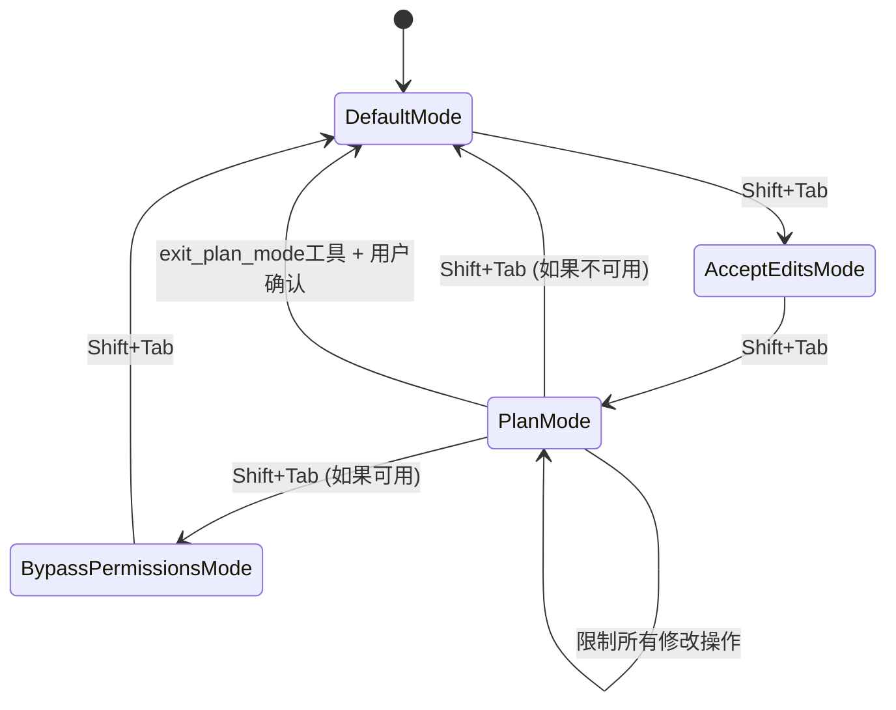
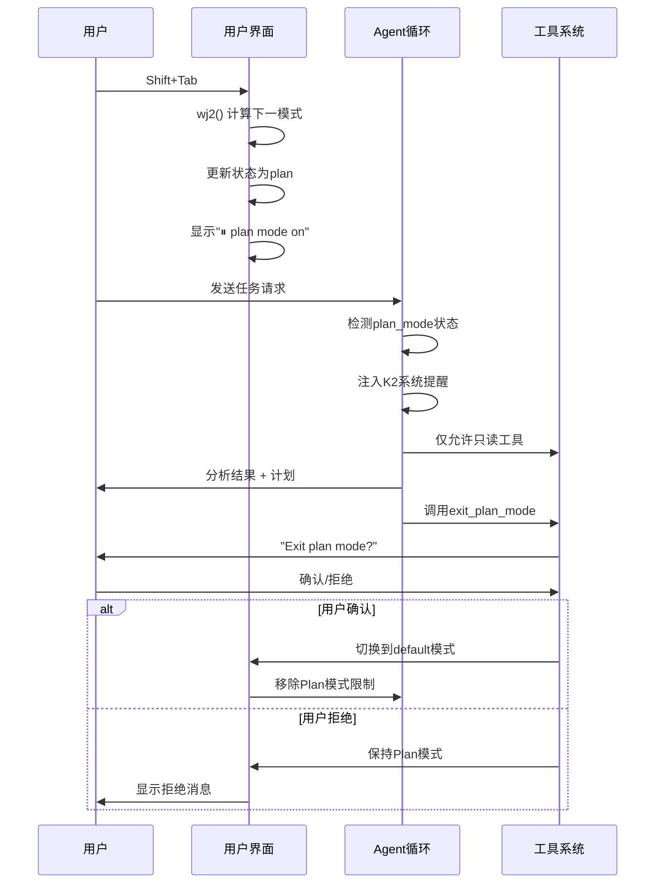

# Claude Code Plan模式完整机制深度分析

## 执行摘要

基于对Claude Code混淆源码的深度逆向分析，本文档详细解析了Plan模式的完整实现机制。Plan模式是Claude Code的核心安全特性之一，通过严格的执行限制和用户确认流程，确保AI在执行复杂任务前必须先制定计划并获得用户同意。

## 1. Plan模式激活机制

### 1.1 模式切换入口

**主要激活方式**：
- **快捷键切换**：`Shift + Tab` 键循环切换模式
- **位置**: `chunks.100.mjs:2628-2636`

```javascript
if (d0.tab && d0.shift) {
  let L9 = wj2(Q);
  if (E1("tengu_mode_cycle", {
      to: L9
    }), I({
      ...Q,
      mode: L9
    }), t) B1(!1);
  return
}
```

### 1.2 模式循环函数

**核心循环逻辑**：`chunks.100.mjs:1320-1331`

```javascript
function wj2(A) {
  switch (A.mode) {
    case "default":
      return "acceptEdits";
    case "acceptEdits":
      return "plan";
    case "plan":
      return A.isBypassPermissionsModeAvailable ? "bypassPermissions" : "default";
    case "bypassPermissions":
      return "default"
  }
}
```

**模式循环顺序**：
1. `default` → `acceptEdits`
2. `acceptEdits` → `plan`
3. `plan` → `bypassPermissions` (如果可用) / `default`
4. `bypassPermissions` → `default`

### 1.3 模式状态管理

**状态标识符**：
- Plan模式通过 `mode: "plan"` 状态标识
- 状态保存在全局应用状态中
- 支持会话级持久化

**事件追踪**：`chunks.100.mjs:2630-2631`
```javascript
E1("tengu_mode_cycle", {
  to: L9
})
```

## 2. Plan模式执行限制机制

### 2.1 系统提醒注入

**限制规则注入**：`chunks.93.mjs:711-717`

```javascript
case "plan_mode":
  return [K2({
    content: `<system-reminder>Plan mode is active. The user indicated that they do not want you to execute yet -- you MUST NOT make any edits, run any non-readonly tools (including changing configs or making commits), or otherwise make any changes to the system. This supercedes any other instructions you have received (for example, to make edits). Instead, you should:
1. Answer the user's query comprehensively
2. When you're done researching, present your plan by calling the ${hO.name} tool, which will prompt the user to confirm the plan. Do NOT make any file changes or run any tools that modify the system state in any way until the user has confirmed the plan.</system-reminder>`,
    isMeta: !0
  })]
```

### 2.2 严格的操作限制

**禁止操作清单**：
1. **文件编辑**：禁止所有文件修改操作
2. **配置更改**：禁止系统配置修改
3. **代码提交**：禁止Git提交操作
4. **非只读工具**：禁止运行修改系统状态的工具
5. **系统状态变更**：禁止任何影响系统状态的操作

**允许操作**：
- 文件读取和分析
- 代码搜索和检索
- 只读性质的信息收集
- 计划制定和展示

### 2.3 限制执行的技术实现

**系统级限制**：
- 通过`<system-reminder>`标签注入限制规则
- 使用`isMeta: !0`标记为元信息
- 优先级高于其他指令（"This supercedes any other instructions"）

**函数调用位置**：`chunks.93.mjs:712`
- 在Agent循环中的系统提醒生成阶段执行
- 通过`K2`函数包装系统提醒内容

## 3. exit_plan_mode工具深度分析

### 3.1 工具定义和标识

**工具名称定义**：`chunks.92.mjs:3242`
```javascript
tZ5 = "exit_plan_mode"
```

**输入Schema定义**：`chunks.92.mjs:3244-3246`
```javascript
eZ5 = n.strictObject({
  plan: n.string().describe("The plan you came up with, that you want to run by the user for approval. Supports markdown. The plan should be pretty concise.")
})
```

**工具提示内容**：`chunks.92.mjs:3234-3240`
```javascript
_w2 = `Use this tool when you are in plan mode and have finished presenting your plan and are ready to code. This will prompt the user to exit plan mode. 
IMPORTANT: Only use this tool when the task requires planning the implementation steps of a task that requires writing code. For research tasks where you're gathering information, searching files, reading files or in general trying to understand the codebase - do NOT use this tool.

Eg. 
1. Initial task: "Search for and understand the implementation of vim mode in the codebase" - Do not use the exit plan mode tool because you are not planning the implementation steps of a task.
2. Initial task: "Help me implement yank mode for vim" - Use the exit plan mode tool after you have finished planning the implementation steps of the task.
`
```

**使用场景区分**：
- **适用**：需要编写代码的实现任务计划
- **不适用**：信息收集、文件搜索、代码理解等研究任务

### 3.2 工具完整实现

**工具对象定义**：`chunks.93.mjs:3-100`

```javascript
hO = {
  name: tZ5,
  async description() {
    return "Prompts the user to exit plan mode and start coding"
  },
  async prompt() {
    return _w2  // 工具提示内容
  },
  inputSchema: eZ5,
  userFacingName() {
    return ""
  },
  isEnabled() {
    return !0
  },
  canBypassReadOnlyMode() {
    return !0
  },
  async checkPermissions(A) {
    return {
      behavior: "ask",
      message: "Exit plan mode?",
      updatedInput: A
    }
  },
  async * call({plan: A}, B) {
    let Q = B.agentId !== y9();
    yield {
      type: "result",
      data: {
        plan: A,
        isAgent: Q
      }
    }
  }
}
```

### 3.3 用户确认流程

**权限检查**：`chunks.93.mjs:24-30`
```javascript
async checkPermissions(A) {
  return {
    behavior: "ask",
    message: "Exit plan mode?",
    updatedInput: A
  }
}
```

**确认行为**：
1. **ask行为**：要求用户明确确认
2. **消息提示**：显示"Exit plan mode?"
3. **输入保持**：保留原始输入内容

### 3.4 Agent身份验证机制

**Agent身份验证**：`chunks.93.mjs:77-83`
```javascript
async * call({plan: A}, B) {
  let Q = B.agentId !== y9();
  yield {
    type: "result",
    data: {
      plan: A,
      isAgent: Q
    }
  }
}
```

**身份验证机制**：
- 通过`B.agentId !== y9()`检查调用者身份
- `isAgent`标记区分来源是否为Agent系统
- 影响后续的结果处理和UI显示

**Agent特殊处理**：`chunks.93.mjs:86-93`
```javascript
mapToolResultToToolResultBlockParam({
  isAgent: A
}, B) {
  if (A) return {
    type: "tool_result",
    content: 'User has approved the plan. There is nothing else needed from you now. Please respond with "ok"',
    tool_use_id: B
  }
}
```

**Agent模式下的响应**：
- 当检测到Agent调用时，返回特殊的确认消息
- 指示Agent无需进一步操作，只需回复"ok"
- 简化Agent与用户的交互流程

**完整的响应映射**：`chunks.93.mjs:86-99`
```javascript
mapToolResultToToolResultBlockParam({isAgent: A}, B) {
  if (A) return {
    type: "tool_result",
    content: 'User has approved the plan. There is nothing else needed from you now. Please respond with "ok"',
    tool_use_id: B
  };
  return {
    type: "tool_result",
    content: "User has approved your plan. You can now start coding. Start with updating your todo list if applicable",
    tool_use_id: B
  }
}
```

**响应内容区分**：
- **Agent调用**：简洁的确认消息，要求回复"ok"
- **直接调用**：详细的指导消息，建议更新todo list

**工具特殊属性**：`chunks.93.mjs:15-23`
```javascript
isEnabled() {
  return !0
},
isConcurrencySafe() {
  return !0
},
isReadOnly() {
  return !0
}
```

**安全设计要点**：
- **只读性质**：工具本身不修改系统状态
- **并发安全**：支持多个实例同时运行
- **始终可用**：不受其他条件限制

### 3.5 计划展示和结果处理

**平台特定图标**：`chunks.92.mjs:3232`
```javascript
FE = mA.platform === "darwin" ? "⏺" : "●"
```

**成功确认渲染**：`chunks.93.mjs:37-52`
```javascript
renderToolResultMessage({
  plan: A
}, {
  theme: Q
}) {
  return P3.createElement(w0, null, P3.createElement(h, {
    flexDirection: "column",
    marginTop: 1
  }, P3.createElement(h, {
    flexDirection: "row"
  }, P3.createElement(P, {
    color: "planMode"
  }, FE), P3.createElement(P, null, "User approved Claude's plan:")), P3.createElement(w0, null, P3.createElement(P, {
    color: "secondaryText"
  }, kK(A, Q)))))
}
```

**拒绝确认渲染**：`chunks.93.mjs:53-70`
```javascript
renderToolUseRejectedMessage({
  plan: A
}, {
  theme: B
}) {
  return P3.createElement(w0, null, P3.createElement(h, {
    flexDirection: "column"
  }, P3.createElement(P, {
    color: "error"
  }, "User rejected Claude's plan:"), P3.createElement(h, {
    borderStyle: "round",
    borderColor: "planMode",
    borderDimColor: !0,
    paddingX: 1
  }, P3.createElement(P, {
    color: "secondaryText"
  }, kK(A, B)))))
}
```

## 4. Plan模式UI表现机制

### 4.1 视觉指示器

**状态栏显示**：`chunks.100.mjs:1397-1403`
```javascript
if (B?.mode === "plan") return c4.createElement(P, {
  color: "planMode",
  key: "plan-mode"
}, "⏸ plan mode on", c4.createElement(P, {
  color: "secondaryText",
  dimColor: !0
}, " ", "(shift+tab to cycle)"));
```

**视觉元素**：
- **暂停图标**：`⏸` 表示暂停执行状态
- **状态文本**：`plan mode on` 明确显示当前模式
- **操作提示**：`(shift+tab to cycle)` 指导用户如何切换
- **颜色主题**：使用`planMode`专用颜色

### 4.2 用户提示系统

**模式切换提示**：`chunks.101.mjs:2019-2023`
```javascript
{
  id: "shift-tab",
  content: "Hit shift+tab to cycle between default mode, auto-accept edit mode, and plan mode",
  cooldownSessions: 20,
  isRelevant: () => !0
}
```

**提示特征**：
- **触发条件**：始终相关（`isRelevant: () => !0`）
- **冷却时间**：20个会话
- **内容说明**：详细解释三种模式的切换方式

### 4.3 主题和样式系统

**颜色定义**：
- `planMode`：Plan模式专用颜色
- `secondaryText`：次要文本颜色
- `error`：错误状态颜色

**布局组件**：
- `P`：文本组件
- `h`：容器组件
- `w0`：包装组件

## 5. Plan内容管理机制

### 5.1 计划内容结构

**数据结构**：
```javascript
{
  plan: string,  // Markdown格式的计划内容
  isAgent: boolean  // 是否来自Agent
}
```

**内容要求**：
- **格式支持**：支持Markdown格式
- **长度控制**：要求计划内容简洁（"pretty concise"）
- **结构化**：通过Markdown支持结构化展示

### 5.2 计划验证机制

**Schema验证**：`chunks.92.mjs:3244-3246`
```javascript
eZ5 = n.strictObject({
  plan: n.string().describe("The plan you came up with, that you want to run by the user for approval. Supports markdown. The plan should be pretty concise.")
})
```

**验证规则**：
- **类型检查**：必须为字符串类型
- **非空验证**：不允许空计划
- **格式验证**：支持Markdown语法

### 5.3 计划展示格式化

**格式化函数**：`kK(A, Q)` - 负责将计划内容格式化显示
- **参数A**：计划内容
- **参数Q**：主题配置
- **返回**：格式化后的React元素

**展示效果**：
- 支持Markdown渲染
- 适配主题样式
- 响应式布局

## 6. Plan模式与Agent循环集成

### 6.1 系统提醒注入点

**注入位置**：Agent循环的系统提醒生成阶段
**注入函数**：`K2` - 系统提醒包装函数
**触发条件**：检测到`plan_mode`状态时自动注入

### 6.2 模式状态传递

**状态流转**：
```
用户切换 → 状态更新 → Agent循环检测 → 系统提醒注入 → AI行为限制
```

**检测机制**：
```javascript
case "plan_mode":
  return [K2({...})]
```

### 6.3 上下文管理

**上下文注入**：
- Plan模式限制规则作为系统级上下文
- 优先级高于用户指令
- 持续生效直到模式切换

**上下文内容**：
- 操作禁令说明
- 允许操作范围
- 退出流程指导

## 7. 安全机制和边界强制

### 7.1 多层安全控制

**第一层 - 系统提醒**：
- 在Agent循环开始时注入限制规则
- 使用最高优先级的系统指令

**第二层 - 工具权限**：
- 通过`canBypassReadOnlyMode`控制工具可用性
- 只有特定工具可以在Plan模式下运行

**第三层 - 用户确认**：
- 强制用户确认才能退出Plan模式
- 支持计划的明确展示和审查

### 7.2 边界强制实现

**技术手段**：
1. **指令优先级**：系统提醒优先级高于用户指令
2. **工具限制**：只允许只读工具执行
3. **状态检查**：每次操作前检查当前模式
4. **用户控制**：用户完全控制模式切换

**防护范围**：
- 文件系统修改
- 系统配置变更
- 外部命令执行
- 状态持久化操作

## 8. 实现细节和技术要点

### 8.1 关键函数映射

| 功能模块 | 函数名 | 文件位置 | 功能描述 |
|---------|--------|----------|----------|
| 模式切换检测 | `d0.tab && d0.shift` | chunks.100.mjs:2628 | 检测Shift+Tab键组合 |
| 模式循环逻辑 | `wj2(A)` | chunks.100.mjs:1320 | 模式循环切换函数 |
| 系统提醒注入 | `K2({...})` | chunks.93.mjs:712 | 注入Plan模式限制 |
| 退出工具定义 | `hO` | chunks.93.mjs:3 | exit_plan_mode工具实现 |
| UI状态显示 | `B?.mode === "plan"` | chunks.100.mjs:1397 | Plan模式UI指示器 |
| 事件追踪 | `E1("tengu_mode_cycle")` | chunks.100.mjs:2630 | 模式切换事件记录 |

### 8.2 状态机设计



### 8.3 数据流分析



## 9. 错误处理和异常情况

### 9.1 模式切换失败

**处理机制**：
- 保持当前模式状态
- 记录错误事件
- 显示用户友好的错误消息

### 9.2 权限验证失败

**处理策略**：
- 阻止操作执行
- 提示用户权限不足
- 建议正确的操作方式

### 9.3 系统提醒注入失败

**容错机制**：
- 降级到只读模式
- 记录系统错误日志
- 通知用户系统状态异常

## 10. 性能优化和资源管理

### 10.1 事件处理优化

**键盘事件**：
- 使用事件委托减少监听器数量
- 防抖处理避免频繁模式切换
- 快速模式状态检测

### 10.2 状态管理优化

**内存使用**：
- 轻量级状态对象
- 避免深度状态拷贝
- 及时清理无用状态

### 10.3 UI渲染优化

**渲染策略**：
- 条件渲染减少DOM操作
- 虚拟化长列表内容
- 样式缓存和复用

## 11. 测试和验证策略

### 11.1 功能测试要点

1. **模式切换测试**：
   - Shift+Tab循环切换
   - 状态UI正确显示
   - 事件正确追踪

2. **限制机制测试**：
   - 编辑操作被阻止
   - 系统提醒正确注入
   - 只读操作正常运行

3. **退出流程测试**：
   - 计划正确展示
   - 用户确认流程
   - 模式正确切换

### 11.2 安全测试要点

1. **绕过限制测试**：
   - 尝试直接调用编辑工具
   - 测试系统提醒的覆盖
   - 验证优先级机制

2. **边界条件测试**：
   - 异常输入处理
   - 网络中断情况
   - 系统资源不足

## 12. 总结和技术洞察

### 12.1 设计优势

1. **安全第一**：多层安全机制确保用户完全控制
2. **用户友好**：直观的UI指示和操作流程
3. **技术严谨**：完整的状态管理和错误处理
4. **扩展性好**：模块化设计便于功能扩展

### 12.2 实现亮点

1. **系统级限制**：通过Agent循环的系统提醒实现最高优先级的操作限制
2. **用户确认机制**：强制用户审查和确认AI的执行计划
3. **状态可视化**：清晰的UI指示让用户随时了解当前模式
4. **快捷操作**：Shift+Tab的快速模式切换提升用户体验

### 12.3 技术创新

1. **混淆代码中的清晰逻辑**：即使在高度混淆的代码中，Plan模式的实现逻辑依然清晰可追踪
2. **React组件的深度集成**：UI状态与核心逻辑的紧密集成
3. **事件驱动的架构**：通过事件系统实现松耦合的模式管理
4. **Agent身份区分**：通过`agentId`验证实现不同调用来源的差异化处理
5. **平台适配**：根据操作系统平台选择合适的UI图标
6. **权限分层**：通过`canBypassReadOnlyMode`实现细粒度的权限控制

### 12.4 完整工作流程总结

```mermaid
graph TB
    A[用户按Shift+Tab] --> B[wj2()计算下一模式]
    B --> C{当前模式}
    C -->|default| D[切换到acceptEdits]
    C -->|acceptEdits| E[切换到plan]
    C -->|plan| F{是否有bypassPermissions}
    F -->|是| G[切换到bypassPermissions]
    F -->|否| H[切换到default]
    C -->|bypassPermissions| H
    
    E --> I[显示⏸ plan mode on]
    I --> J[用户发起任务]
    J --> K[Agent循环检测plan_mode]
    K --> L[注入K2系统提醒]
    L --> M[限制所有修改操作]
    M --> N[AI分析并制定计划]
    N --> O[调用exit_plan_mode工具]
    O --> P{用户确认?}
    P -->|确认| Q[切换到default模式]
    P -->|拒绝| R[保持plan模式]
    Q --> S[移除所有限制]
    R --> I
```

Plan模式的实现体现了Claude Code在AI安全性和用户控制方面的深度思考，通过技术手段确保AI助手在执行复杂任务时必须获得用户的明确授权，这种设计理念值得其他AI应用借鉴和学习。

## 13. 技术实现的深度洞察

### 13.1 安全架构的多层防护

Plan模式的安全实现采用了**纵深防御**策略：

1. **UI层防护**：通过视觉指示器明确告知用户当前处于受限模式
2. **输入层拦截**：通过快捷键控制模式切换，防止意外激活
3. **逻辑层限制**：通过系统提醒在Agent循环中注入强制性限制规则
4. **工具层控制**：只允许只读工具执行，阻止所有修改性操作
5. **确认层验证**：强制用户明确确认才能退出受限模式

### 13.2 状态管理的原子性保证

模式切换的实现确保了**原子性操作**：
- 状态检查、更新、UI反馈在单一事件循环中完成
- 通过`wj2()`函数的确定性逻辑避免状态不一致
- 事件追踪`E1("tengu_mode_cycle")`提供状态变更的可审计性

### 13.3 用户体验与安全的平衡

Plan模式在安全性和易用性之间找到了巧妙的平衡：
- **单键切换**：Shift+Tab的快速模式切换降低使用门槛
- **清晰反馈**：⏸图标和文字提示让用户始终知道当前状态
- **渐进确认**：从模式切换到计划确认的两步验证流程
- **智能区分**：根据任务性质自动判断是否需要使用退出工具

### 13.4 扩展性设计的前瞻思考

模式循环函数`wj2()`的设计体现了良好的扩展性：
- 支持动态添加新模式到循环中
- 通过`isBypassPermissionsModeAvailable`实现条件性模式
- 为未来的权限分层和角色管理预留了空间

这种设计使得Claude Code能够在保持简洁性的同时，为复杂的企业级权限管理需求提供基础支撑。

## 附录：关键代码片段完整索引

### A.1 模式切换核心代码
- **文件**: chunks.100.mjs
- **行号**: 2628-2636, 1320-1331
- **功能**: Shift+Tab检测和模式循环

### A.2 系统提醒注入代码
- **文件**: chunks.93.mjs
- **行号**: 711-717
- **功能**: Plan模式限制规则注入

### A.3 exit_plan_mode工具代码
- **文件**: chunks.93.mjs, chunks.92.mjs
- **行号**: 3-100, 3242-3246
- **功能**: 计划确认和模式退出

### A.4 UI指示器代码
- **文件**: chunks.100.mjs
- **行号**: 1397-1403
- **功能**: Plan模式视觉指示

这些代码片段构成了Plan模式的完整实现基础，通过它们的协同工作，实现了安全、可控、用户友好的AI计划执行机制。