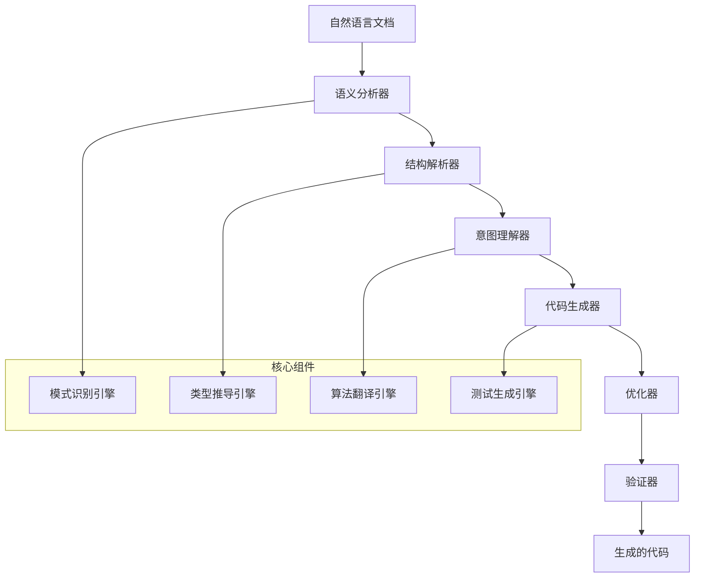

# AI编译器使用指南：从自然语言到代码的智能转换

## 🤖 指南概述

本指南详细说明了如何使用AI编译器将"文档即软件"3.0规范的自然语言描述转换为高质量的可执行代码。AI编译器是实现文档即软件3.0范式的核心工具，它能够理解精确的自然语言规范并生成相应的代码实现。

### AI编译器的核心能力

**智能理解能力**:
- 解析结构化的自然语言文档
- 识别组件定义、接口规范、算法描述
- 理解业务逻辑和技术实现要求
- 提取类型信息和约束条件

**代码生成能力**:
- 生成类型安全的TypeScript/JavaScript代码
- 创建完整的类结构和接口定义
- 实现复杂的算法逻辑
- 生成测试用例和文档

**质量保证能力**:
- 确保生成代码的语法正确性
- 验证类型安全和接口一致性
- 优化性能和资源使用
- 遵循代码规范和最佳实践

## 🎯 AI编译器工作原理

### 编译器架构设计



### 编译过程详解

#### 第1阶段：文档解析与语义分析
```typescript
// 文档解析器接口
interface DocumentParser {
  // 解析文档结构
  parseDocumentStructure(content: string): DocumentStructure;
  
  // 提取组件定义
  extractComponentDefinitions(structure: DocumentStructure): ComponentDefinition[];
  
  // 识别接口规范
  identifyInterfaceSpecs(definitions: ComponentDefinition[]): InterfaceSpec[];
  
  // 分析算法描述
  analyzeAlgorithmDescriptions(content: string): AlgorithmSpec[];
}

// 语义分析结果
interface SemanticAnalysisResult {
  components: ComponentDefinition[];     // 组件定义
  interfaces: InterfaceSpec[];          // 接口规范
  algorithms: AlgorithmSpec[];          // 算法规范
  dependencies: DependencyGraph;        // 依赖关系图
  types: TypeDefinition[];              // 类型定义
}
```

#### 第2阶段：意图理解与设计推导
```typescript
// 意图理解引擎
class IntentUnderstandingEngine {
  
  // 理解组件职责
  understandComponentResponsibilities(
    definition: ComponentDefinition
  ): ComponentIntent {
    return {
      primaryPurpose: this.extractPrimaryPurpose(definition),
      secondaryFunctions: this.extractSecondaryFunctions(definition),
      interactions: this.identifyInteractions(definition),
      constraints: this.extractConstraints(definition)
    };
  }
  
  // 推导设计模式
  inferDesignPatterns(
    components: ComponentDefinition[]
  ): DesignPattern[] {
    const patterns = [];
    
    // 识别常见设计模式
    if (this.isObserverPattern(components)) {
      patterns.push(new ObserverPattern());
    }
    
    if (this.isFactoryPattern(components)) {
      patterns.push(new FactoryPattern());
    }
    
    return patterns;
  }
}
```

#### 第3阶段：代码架构生成
```typescript
// 架构生成器
class ArchitectureGenerator {
  
  // 生成项目结构
  generateProjectStructure(
    components: ComponentDefinition[]
  ): ProjectStructure {
    return {
      directories: this.createDirectoryStructure(components),
      files: this.createFileManifest(components),
      dependencies: this.resolveDependencies(components),
      configuration: this.generateConfiguration(components)
    };
  }
  
  // 生成模块定义
  generateModuleDefinitions(
    components: ComponentDefinition[]
  ): ModuleDefinition[] {
    return components.map(component => ({
      name: component.name,
      exports: this.extractExports(component),
      imports: this.resolveImports(component),
      types: this.generateTypes(component)
    }));
  }
}
```

#### 第4阶段：具体代码实现生成
```typescript
// 代码生成器核心引擎
class CodeGenerationEngine {
  
  // 生成类定义
  generateClassDefinition(
    componentSpec: ComponentDefinition
  ): ClassDefinition {
    
    const classStructure = {
      name: componentSpec.name,
      extends: this.resolveInheritance(componentSpec),
      implements: this.resolveInterfaces(componentSpec),
      properties: this.generateProperties(componentSpec),
      methods: this.generateMethods(componentSpec),
      constructors: this.generateConstructors(componentSpec)
    };
    
    return this.buildClassCode(classStructure);
  }
  
  // 生成方法实现
  generateMethodImplementation(
    methodSpec: MethodSpecification
  ): MethodImplementation {
    
    // 解析算法描述
    const algorithm = this.parseAlgorithmDescription(methodSpec.description);
    
    // 生成实现代码
    const implementation = this.translateAlgorithmToCode(algorithm);
    
    // 添加错误处理
    const withErrorHandling = this.addErrorHandling(implementation, methodSpec.errorHandling);
    
    // 添加性能优化
    const optimized = this.optimizePerformance(withErrorHandling, methodSpec.performanceReqs);
    
    return optimized;
  }
}
```

## 🔧 AI编译器使用方法

### 命令行界面使用

#### 基础编译命令
```bash
# 编译单个文档
ai-compiler compile --input src/core/agent-core.md --output src/core/agent-core.ts

# 编译整个项目
ai-compiler compile-project --input-dir docs/specs --output-dir src --config ai-compiler.config.json

# 增量编译（只编译修改的文档）
ai-compiler compile --incremental --watch

# 验证编译结果
ai-compiler validate --output-dir src --run-tests
```

#### 高级编译选项
```bash
# 指定目标语言和框架
ai-compiler compile --target typescript --framework react --output-style modular

# 启用性能优化
ai-compiler compile --optimize --minify --tree-shake

# 生成测试文件
ai-compiler compile --generate-tests --test-framework jest

# 自定义编译器配置
ai-compiler compile --config custom-compiler.config.json
```

### 配置文件详解

#### ai-compiler.config.json
```json
{
  "compilation": {
    "target": "typescript",
    "outputStyle": "modular",
    "strictMode": true,
    "generateSourceMaps": true
  },
  "codeGeneration": {
    "framework": "react",
    "styleSystem": "styled-components",
    "stateManagement": "context",
    "asyncPattern": "async-await"
  },
  "optimization": {
    "enableTreeShaking": true,
    "enableMinification": false,
    "enableCodeSplitting": true,
    "performanceAnalysis": true
  },
  "testing": {
    "generateUnitTests": true,
    "generateIntegrationTests": true,
    "testFramework": "jest",
    "coverageThreshold": 80
  },
  "quality": {
    "enableLinting": true,
    "enableTypeChecking": true,
    "enableSecurityAnalysis": true,
    "codeStyleGuide": "airbnb"
  }
}
```

### API接口使用

#### 编程式API
```typescript
import { AICompiler } from '@claude-code/ai-compiler';

// 初始化编译器
const compiler = new AICompiler({
  target: 'typescript',
  framework: 'react',
  outputDirectory: './src/generated'
});

// 编译单个文档
async function compileSingleDocument() {
  const documentContent = await fs.readFile('./docs/agent-core.md', 'utf8');
  
  const compilationResult = await compiler.compile({
    content: documentContent,
    filename: 'agent-core.md',
    outputFilename: 'agent-core.ts'
  });
  
  if (compilationResult.success) {
    console.log('编译成功:', compilationResult.generatedFiles);
  } else {
    console.error('编译失败:', compilationResult.errors);
  }
}

// 批量编译项目
async function compileProject() {
  const projectConfig = {
    inputDirectory: './docs/specs',
    outputDirectory: './src/generated',
    includeTests: true,
    includeTypes: true
  };
  
  const result = await compiler.compileProject(projectConfig);
  
  // 处理编译结果
  for (const file of result.generatedFiles) {
    console.log(`生成文件: ${file.path}`);
  }
}
```

## 🎨 文档编写最佳实践

### 为AI编译器优化的文档结构

#### 1. 使用标准化的组件描述模板
```markdown
# [组件名称]实现文档

## 🎯 组件定位与职责
[明确的职责描述，包含具体的功能边界]

## 📋 核心功能定义
### 主要职责
1. **[功能1]**: [详细描述，包含输入输出]
2. **[功能2]**: [详细描述，包含处理逻辑]

## 🔧 内部工作逻辑
### 核心算法实现
```typescript
// 算法伪代码或实际实现
function coreAlgorithm(input: InputType): OutputType {
  // 详细的步骤描述
  // 第1步：[具体操作]
  // 第2步：[具体操作]
  // 第3步：[具体操作]
  return result;
}
```

## 🔌 对外接口关系
### 输入接口规范
```typescript
interface ComponentInput {
  property1: Type1;  // [属性描述]
  property2: Type2;  // [属性描述]
}
```

### 输出接口规范
```typescript
interface ComponentOutput {
  result: ResultType;  // [结果描述]
  status: StatusType;  // [状态描述]
}
```
```

#### 2. 提供明确的类型定义
```markdown
## 🏷️ 类型系统定义

### 核心数据类型
```typescript
// 基础类型定义
type UserId = string;  // UUID格式的用户标识
type Timestamp = number;  // Unix时间戳（毫秒）
type Status = 'active' | 'inactive' | 'pending';  // 状态枚举

// 复合类型定义
interface UserProfile {
  id: UserId;
  name: string;
  email: string;
  createdAt: Timestamp;
  status: Status;
}
```

### 函数签名规范
```typescript
// 异步函数签名
async function processUser(
  userId: UserId,
  options?: ProcessOptions
): Promise<ProcessResult>;

// 回调函数签名
type UserCallback = (user: UserProfile) => void;
type ErrorCallback = (error: Error) => void;
```
```

#### 3. 详细的算法描述
```markdown
## 🔬 算法实现详解

### 核心算法：消息处理流水线
```algorithm
输入：原始消息 (message: RawMessage)
输出：处理结果 (result: ProcessedMessage)

步骤：
1. 验证消息格式
   - 检查必需字段是否存在
   - 验证数据类型是否正确
   - 验证字段长度是否符合要求

2. 清理和标准化
   - 移除多余的空白字符
   - 转换为标准编码格式
   - 应用数据标准化规则

3. 业务逻辑处理
   - 根据消息类型路由到相应处理器
   - 执行特定的业务逻辑
   - 记录处理日志

4. 结果封装
   - 构建标准响应格式
   - 添加元数据信息
   - 返回处理结果
```

### 错误处理算法
```algorithm
错误处理流程：
1. 捕获异常
2. 分类错误类型
   - 输入验证错误 -> 返回400状态
   - 业务逻辑错误 -> 返回422状态
   - 系统错误 -> 返回500状态
3. 记录错误日志
4. 返回用户友好的错误消息
```
```

### 编译器指令的使用

#### 1. 优先级标记
```markdown
⭐ 核心机制 - 这个功能是系统的核心，必须优先实现
🔥 关键功能 - 这个功能对用户体验至关重要
📌 重要特性 - 这个功能提供了重要的系统能力
💡 增强功能 - 这个功能是系统的增强特性
```

#### 2. 代码生成指令
```markdown
```typescript:generate
// 这个代码块应该直接生成为TypeScript代码
interface ExactMapping {
  id: string;
  value: number;
}
```

```test-case:generate
// 这个测试用例应该生成为Jest测试
describe('UserService', () => {
  it('should validate user input correctly', () => {
    const input = { name: 'John', email: 'john@example.com' };
    const result = validateUser(input);
    expect(result.isValid).toBe(true);
  });
});
```
```

#### 3. 性能要求指令
```markdown
```performance:requirement
函数执行时间: < 100ms
内存使用: < 50MB
并发处理能力: 1000 req/s
错误率: < 0.1%
```
```

## 🔍 编译结果验证

### 自动化验证流程

#### 1. 语法验证
```typescript
// 自动生成的验证脚本
import { validateGeneratedCode } from '@claude-code/ai-compiler';

async function validateSyntax() {
  const validationResult = await validateGeneratedCode({
    sourceDirectory: './src/generated',
    includeTypeChecking: true,
    includeLinting: true
  });
  
  if (!validationResult.success) {
    console.error('语法验证失败:', validationResult.errors);
    process.exit(1);
  }
  
  console.log('语法验证通过');
}
```

#### 2. 功能验证
```typescript
// 自动生成的功能测试
describe('Generated Components', () => {
  test('AgentCore functionality', async () => {
    const agentCore = new AgentCore(mockConfig);
    await agentCore.initialize();
    
    const result = await agentCore.processMessage(testMessage);
    expect(result).toBeDefined();
    expect(result.success).toBe(true);
  });
  
  test('MessageQueue async iteration', async () => {
    const queue = new h2AAsyncMessageQueue();
    const testMessage = 'test';
    
    setTimeout(() => queue.enqueue(testMessage), 10);
    
    const iterator = queue[Symbol.asyncIterator]();
    const result = await iterator.next();
    
    expect(result.done).toBe(false);
    expect(result.value).toBe(testMessage);
  });
});
```

#### 3. 性能验证
```typescript
// 性能基准测试
import { performance } from 'perf_hooks';

describe('Performance Benchmarks', () => {
  test('MessageQueue throughput', async () => {
    const queue = new h2AAsyncMessageQueue();
    const messageCount = 10000;
    
    const startTime = performance.now();
    
    for (let i = 0; i < messageCount; i++) {
      queue.enqueue(`message-${i}`);
    }
    
    const endTime = performance.now();
    const throughput = messageCount / ((endTime - startTime) / 1000);
    
    expect(throughput).toBeGreaterThan(1000); // 要求 > 1000 msg/s
  });
});
```

### 质量保证检查清单

#### 编译成功标准
- [ ] 所有TypeScript文件编译通过
- [ ] 所有类型定义正确
- [ ] 所有接口实现完整
- [ ] 所有测试用例通过
- [ ] 性能基准达标
- [ ] 代码规范符合要求

#### 功能完整性检查
- [ ] 组件职责实现完整
- [ ] 接口规范完全对应
- [ ] 算法逻辑正确实现
- [ ] 错误处理机制完善
- [ ] 性能优化措施到位

## 🚀 高级特性使用

### 增量编译优化

#### 智能变更检测
```typescript
// 增量编译配置
const incrementalConfig = {
  enableChangeDetection: true,
  dependencyTrackingMode: 'full',
  cacheDirectory: './.ai-compiler-cache',
  parallelCompilation: true,
  maxWorkers: 4
};

// 执行增量编译
const result = await compiler.incrementalCompile({
  changedFiles: ['src/core/agent-core.md'],
  config: incrementalConfig
});
```

#### 依赖关系优化
```typescript
// 依赖图分析
class DependencyAnalyzer {
  analyzeDependencies(documents: Document[]): DependencyGraph {
    const graph = new DependencyGraph();
    
    for (const doc of documents) {
      const dependencies = this.extractDependencies(doc);
      graph.addNode(doc.name, dependencies);
    }
    
    return graph.optimize();
  }
  
  // 计算编译顺序
  calculateCompilationOrder(graph: DependencyGraph): string[] {
    return graph.topologicalSort();
  }
}
```

### 代码优化引擎

#### 性能优化器
```typescript
class PerformanceOptimizer {
  optimizeGeneratedCode(code: GeneratedCode): OptimizedCode {
    let optimized = code;
    
    // 应用优化策略
    optimized = this.eliminateDeadCode(optimized);
    optimized = this.optimizeLoops(optimized);
    optimized = this.inlineSmallFunctions(optimized);
    optimized = this.optimizeMemoryUsage(optimized);
    
    return optimized;
  }
  
  // 循环优化
  private optimizeLoops(code: GeneratedCode): GeneratedCode {
    return code.transformAST(node => {
      if (node.type === 'ForLoop') {
        return this.optimizeForLoop(node);
      }
      return node;
    });
  }
}
```

#### 内存优化器
```typescript
class MemoryOptimizer {
  optimizeMemoryUsage(code: GeneratedCode): GeneratedCode {
    // 对象池优化
    code = this.addObjectPooling(code);
    
    // 内存泄漏预防
    code = this.addMemoryLeakPrevention(code);
    
    // 垃圾回收优化
    code = this.optimizeGarbageCollection(code);
    
    return code;
  }
}
```

## 🔧 故障排除

### 常见编译错误解决

#### 1. 文档格式错误
```markdown
错误信息: "Unable to parse component definition"
解决方案:
- 检查文档标题格式是否正确
- 验证Markdown语法是否有误
- 确保代码块使用正确的语言标识符
```

#### 2. 类型推导失败
```markdown
错误信息: "Cannot infer type from description"
解决方案:
- 提供明确的类型定义
- 使用TypeScript接口定义
- 添加类型注释和约束
```

#### 3. 算法翻译错误
```markdown
错误信息: "Algorithm description too ambiguous"
解决方案:
- 使用更精确的算法描述
- 提供具体的步骤说明
- 添加输入输出示例
```

### 调试和诊断工具

#### 编译器诊断模式
```bash
# 启用详细调试信息
ai-compiler compile --debug --verbose --output-diagnostics

# 生成中间表示文件
ai-compiler compile --emit-ir --emit-ast

# 分析编译性能
ai-compiler compile --profile --trace-compilation
```

#### 实时诊断界面
```typescript
// 启动诊断服务器
const diagnosticServer = new DiagnosticServer({
  port: 3001,
  enableRealTimeMonitoring: true,
  logLevel: 'debug'
});

// 监控编译过程
diagnosticServer.onCompilationStart((context) => {
  console.log('开始编译:', context.inputFile);
});

diagnosticServer.onCompilationComplete((result) => {
  console.log('编译完成:', result.outputFiles);
});
```

---

*本AI编译器指南展现了"文档即软件"3.0时代的核心工具使用方法。通过AI编译器，开发者可以将精确的自然语言规范直接转换为高质量的可执行代码，实现从概念到实现的无缝转换，极大地提升开发效率和代码质量。*