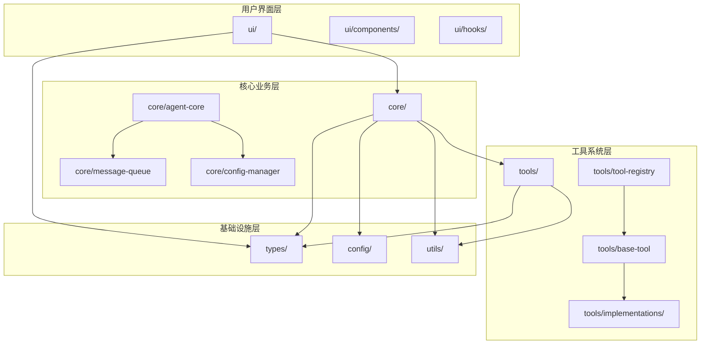

# 源代码自然语言描述系统

## 📁 模块概览

本目录包含了整个"文档即软件"3.0系统的核心组件描述。每个子目录都使用精确的自然语言来定义软件模块，确保AI编译器能够准确理解并转换为可执行代码。

## 🏗️ 目录结构

### [types/](./types/) - 类型定义系统
负责定义整个系统的数据类型、接口和契约规范。包含Agent、工具、配置等核心类型的完整定义。

**关键文件**:
- `agent-types.md` - Agent系统相关类型
- `tool-types.md` - 工具系统类型定义  
- `config-types.md` - 配置系统类型

### [core/](./core/) - 核心引擎模块
系统的核心业务逻辑和主要算法实现。基于Claude Code逆向分析的精确技术复现。

**关键组件**:
- `agent-core.md` - nO主Agent循环引擎
- `message-queue.md` - h2A异步消息队列
- `config-manager.md` - 分层配置管理器

### [ui/](./ui/) - 用户界面系统
基于React/Ink的命令行用户界面组件，支持实时交互和状态显示。

**主要模块**:
- `components/` - UI组件实现
- `hooks/` - React状态管理Hooks

### [tools/](./tools/) - 工具生态系统
完整的工具框架和具体工具实现，包含9层验证安全机制和MCP协议集成。

**核心功能**:
- `base-tool.md` - 工具基类和接口
- `tool-registry.md` - 工具注册发现机制
- `implementations/` - 具体工具实现

### [config/](./config/) - 配置管理系统
分层配置管理和运行时配置更新机制，支持多环境和动态配置。

### [utils/](./utils/) - 工具函数库
通用工具函数和辅助类，包含日志系统、错误处理等基础设施组件。

## 🎯 设计原则

### 1. 自然语言优先
- 所有模块首先用自然语言精确描述
- 代码是文档的衍生物，而非核心
- 确保AI编译器能够理解和转换

### 2. 接口驱动设计
- 明确定义每个模块的输入输出
- 标准化的数据流和控制流
- 清晰的依赖关系和耦合度控制

### 3. 分层解耦架构
- 严格的分层边界和职责划分
- 最小化模块间的直接依赖
- 支持独立开发和测试

### 4. 安全性内置
- 每个模块都包含安全验证机制
- 多层权限控制和资源限制
- 完整的错误处理和恢复策略

## 📊 模块关系图

## 🔄 数据流设计

### 主要数据流向
1. **用户输入** → UI组件 → Agent核心 → 工具系统
2. **工具结果** → Agent核心 → UI组件 → 用户显示
3. **配置变更** → 配置管理器 → 相关模块
4. **状态更新** → 状态管理 → UI组件

### 控制流机制
- **nO主循环**: Agent的核心执行循环
- **h2A消息队列**: 异步消息处理机制  
- **工具调度器**: 并发工具执行协调
- **权限验证器**: 多层安全检查流程

## 🛡️ 安全集成

### 跨模块安全策略
- **输入验证**: 所有模块边界都进行输入验证
- **权限传递**: 安全上下文在模块间安全传递
- **资源监控**: 全局资源使用监控和限制
- **错误隔离**: 错误不会跨模块传播

### 安全检查点
1. **UI输入验证**: 用户输入的初步过滤
2. **Agent权限检查**: 执行权限的验证
3. **工具安全验证**: 9层工具安全机制
4. **资源使用控制**: 系统资源的使用限制

## 📈 性能考虑

### 性能优化点
- **异步处理**: 非阻塞的消息处理机制
- **并发执行**: 安全工具的并发执行
- **缓存机制**: 配置和状态的智能缓存
- **资源复用**: 对象池和连接复用

### 监控指标
- **响应时间**: 每个模块的处理延迟
- **吞吐量**: 消息处理能力
- **资源使用**: CPU、内存、文件句柄
- **错误率**: 各模块的错误统计

## 🔧 开发指南

### 文档编写标准
1. **模块作用描述**: 明确模块职责和定位
2. **内部逻辑说明**: 详细的处理流程
3. **接口定义**: 输入输出和依赖关系
4. **状态管理**: 内部状态变化规则
5. **错误处理**: 异常情况的处理机制
6. **性能要求**: 响应时间和资源限制

### 命名约定
- **模块名**: 使用小写字母和连字符
- **函数名**: 使用驼峰命名法
- **常量名**: 使用大写字母和下划线
- **类型名**: 使用帕斯卡命名法

### 依赖管理
- **最小依赖原则**: 只依赖必要的模块
- **循环依赖检查**: 避免模块间的循环依赖
- **接口稳定性**: 保持公共接口的向后兼容
- **版本管理**: 明确的版本号和变更日志

## 🚀 扩展指南

### 添加新模块
1. 创建模块目录和README文档
2. 定义模块的类型和接口
3. 编写详细的实现文档
4. 更新依赖关系图
5. 添加测试和验证文档

### 修改现有模块
1. 保持接口的向后兼容性
2. 更新相关的文档和类型定义
3. 检查对其他模块的影响
4. 更新测试用例和验证流程

---

*本目录体现了"文档即软件"3.0的核心理念：通过精确的自然语言描述来定义软件系统，让代码成为文档的自然延伸。*