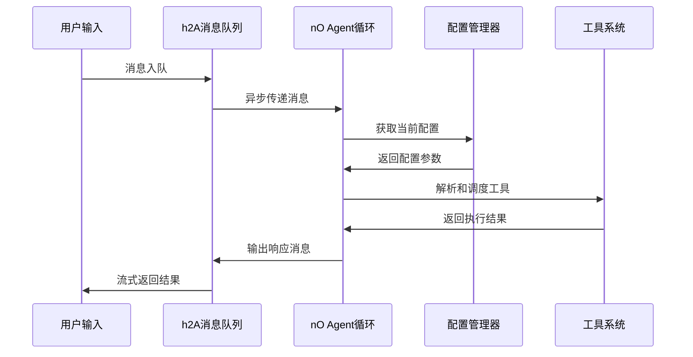

# 核心引擎模块总览

## 🎯 模块定位

核心引擎模块是整个"文档即软件"3.0系统的心脏，基于对Claude Code的深度逆向工程分析，精确复现了以下关键机制：

- **nO主Agent循环**: 可中断的异步执行引擎
- **h2A异步消息队列**: 实时Steering交互机制
- **分层多Agent架构**: 安全隔离的并发执行框架
- **配置管理系统**: 分层动态配置机制

## 📁 模块组成

### [agent-core.md](./agent-core.md) - Agent核心引擎
**核心职责**: 实现nO主Agent循环的完整逻辑

**主要功能**:
- 异步生成器驱动的执行循环
- 模型调用和响应处理  
- 工具解析和调度协调
- 上下文压缩和状态管理
- 错误处理和模型降级

**技术特征**:
- 基于async generator的非阻塞执行
- 支持AbortController的中断机制
- 智能的上下文压缩算法
- 完整的错误恢复策略

### [message-queue.md](./message-queue.md) - h2A异步消息队列  
**核心职责**: 实现实时Steering的非阻塞消息机制

**主要功能**:
- AsyncIterator接口的消息队列
- Promise-based的非阻塞读取
- 双重缓冲机制优化
- 完整的生命周期管理

**技术特征**:
- 零阻塞的消息入队和出队
- 支持背压控制和流量管理
- 优雅的错误传播机制
- 内存高效的缓冲策略

### [config-manager.md](./config-manager.md) - 配置管理器
**核心职责**: 提供分层的配置管理和运行时更新

**主要功能**:
- 多级配置文件加载
- 环境变量集成
- 运行时配置热更新
- 配置验证和模式检查

**技术特征**:
- 深度合并算法
- Zod模式验证
- 配置变更监听
- 原子性更新保证

## 🔄 模块间协作关系

### 核心协作流程


### 数据流向分析
1. **消息输入流**: 用户输入 → h2A队列 → nO循环
2. **工具执行流**: nO循环 → 工具调度 → 并发执行 → 结果聚合
3. **配置流**: 配置管理器 → 各模块配置注入
4. **状态流**: 执行状态 → 状态管理 → UI反馈

## 🧠 核心算法实现

### nO主循环算法伪代码
```typescript
async function* nOMainLoop(
  messages: Message[],
  systemPrompt: string,
  context: AgentContext
): AsyncGenerator<Response> {
  
  yield { type: "stream_request_start" };
  
  // 1. 上下文压缩检查
  const { messages: processedMessages, wasCompacted } = 
    await compressContext(messages, context);
  
  if (wasCompacted) {
    logCompactionEvent(messages.length, processedMessages.length);
    updateCompactionState(context);
  }
  
  let assistantMessages = [];
  let currentModel = context.options.mainLoopModel;
  let shouldRetry = true;
  
  try {
    // 2. 主执行循环 - 支持模型降级重试
    while (shouldRetry) {
      shouldRetry = false;
      
      try {
        // 3. 调用语言模型
        for await (let response of callLanguageModel(
          buildMessages(processedMessages),
          buildSystemPrompt(systemPrompt),
          context.options.maxThinkingTokens,
          context.options.tools,
          context.abortController.signal  // 传递中断信号
        )) {
          yield response;  // 流式输出
          
          if (response.type === "assistant") {
            assistantMessages.push(response);
          }
        }
      } catch (error) {
        // 4. 模型降级处理
        if (error instanceof ModelError && context.fallbackModel) {
          currentModel = context.fallbackModel;
          shouldRetry = true;
          assistantMessages = [];
          logModelFallback(error.originalModel, context.fallbackModel);
          continue;
        }
        throw error;
      }
    }
  } catch (error) {
    // 5. 错误处理 - 为每个工具调用生成错误结果
    yield* handleExecutionError(error, assistantMessages);
    return;
  }
  
  if (!assistantMessages.length) return;
  
  // 6. 提取工具调用
  const toolUses = extractToolUses(assistantMessages);
  if (!toolUses.length) return;
  
  // 7. 执行工具调用 - 并发/串行调度
  const toolResults = [];
  let preventContinuation = false;
  
  for await (let result of executeTools(toolUses, context)) {
    yield result;  // 流式输出工具结果
    
    if (result?.type === "system" && result.preventContinuation) {
      preventContinuation = true;
    }
    
    toolResults.push(result);
  }
  
  // 8. 检查中断信号
  if (context.abortController.signal.aborted) {
    yield createSystemMessage({ toolUse: true });
    return;
  }
  
  if (preventContinuation) return;
  
  // 9. 递归调用 - 继续对话循环
  yield* nOMainLoop(
    [...processedMessages, ...assistantMessages, ...toolResults],
    systemPrompt,
    context
  );
}
```

### h2A消息队列算法伪代码
```typescript
class h2AAsyncQueue implements AsyncIterable<Message> {
  private queue: Message[] = [];
  private readResolve?: (value: IteratorResult<Message>) => void;
  private readReject?: (reason: any) => void;
  private isDone = false;
  private hasError?: Error;
  private started = false;
  
  // 实现AsyncIterator接口
  [Symbol.asyncIterator](): AsyncIterator<Message> {
    if (this.started) {
      throw new Error("Stream can only be iterated once");
    }
    this.started = true;
    return this;
  }
  
  // 核心异步迭代方法
  async next(): Promise<IteratorResult<Message>> {
    // 优先从队列中取消息
    if (this.queue.length > 0) {
      return {
        done: false,
        value: this.queue.shift()!
      };
    }
    
    // 队列完成时返回结束标志
    if (this.isDone) {
      return { done: true, value: undefined };
    }
    
    // 有错误时拒绝Promise
    if (this.hasError) {
      throw this.hasError;
    }
    
    // 等待新消息 - 关键的非阻塞机制
    return new Promise<IteratorResult<Message>>((resolve, reject) => {
      this.readResolve = resolve;
      this.readReject = reject;
    });
  }
  
  // 消息入队 - 支持实时消息插入
  enqueue(message: Message): void {
    if (this.readResolve) {
      // 如果有等待的读取，直接返回消息
      const callback = this.readResolve;
      this.readResolve = undefined;
      this.readReject = undefined;
      callback({
        done: false,
        value: message
      });
    } else {
      // 否则推入队列缓冲
      this.queue.push(message);
    }
  }
  
  // 完成队列
  done(): void {
    this.isDone = true;
    if (this.readResolve) {
      const callback = this.readResolve;
      this.readResolve = undefined;
      this.readReject = undefined;
      callback({ done: true, value: undefined });
    }
  }
  
  // 错误处理
  error(error: Error): void {
    this.hasError = error;
    if (this.readReject) {
      const callback = this.readReject;
      this.readResolve = undefined;
      this.readReject = undefined;
      callback(error);
    }
  }
}
```

## 🛡️ 安全机制集成

### Agent执行安全控制
1. **中断机制**: 每个yield点检查AbortController信号
2. **资源限制**: 内存、时间、工具调用次数限制
3. **权限验证**: 工具调用前的权限检查
4. **状态隔离**: Agent间的状态完全隔离

### 消息队列安全保障
1. **输入验证**: 消息格式和类型验证
2. **缓冲区保护**: 防止内存溢出的缓冲区限制
3. **错误隔离**: 错误不会影响队列的其他消息
4. **资源回收**: 自动的内存和资源清理

## ⚡ 性能优化特性

### 上下文压缩优化
```typescript
interface ContextCompressionStrategy {
  // 压缩阈值控制
  compressionThreshold: number;  // 40000 tokens
  minCompressionSize: number;    // 1000 tokens
  
  // 关键信息保留策略
  preservedSections: string[];   // 用户指令、工具结果、错误信息
  
  // 智能压缩算法
  compress(messages: Message[]): Promise<CompressedContext>;
  
  // 渐进式压缩
  progressiveCompress(messages: Message[]): AsyncGenerator<CompressedChunk>;
}
```

### 并发执行优化
```typescript
interface ConcurrentExecutionOptimizer {
  // 工具并发安全评估
  assessConcurrencySafety(tool: Tool, params: any): boolean;
  
  // 动态负载均衡
  balanceWorkload(toolUses: ToolUse[]): ToolGroup[];
  
  // 资源池管理
  manageResourcePool(): ResourcePool;
  
  // 性能监控
  monitorPerformance(): PerformanceMetrics;
}
```

## 📊 监控和诊断

### 核心监控指标
```typescript
interface CoreModuleMetrics {
  // Agent循环指标
  agentLoop: {
    avgExecutionTime: number;
    messageProcessingRate: number;
    errorRate: percentage;
    modelFallbackCount: number;
  };
  
  // 消息队列指标
  messageQueue: {
    queueDepth: number;
    throughput: number;
    avgLatency: number;
    bufferUtilization: percentage;
  };
  
  // 配置管理指标
  configManager: {
    configReloadCount: number;
    validationErrors: number;
    hotUpdateLatency: number;
  };
}
```

### 诊断工具
```typescript
interface CoreDiagnostics {
  // Agent状态诊断
  diagnoseAgentState(): AgentDiagnosticReport;
  
  // 消息队列健康检查
  checkQueueHealth(): QueueHealthReport;
  
  // 配置一致性检查
  validateConfigConsistency(): ConfigConsistencyReport;
  
  // 性能瓶颈分析
  analyzePerformanceBottlenecks(): BottleneckAnalysisReport;
}
```

## 🔧 配置参数

### Agent核心配置
```typescript
interface AgentCoreConfig {
  // 模型配置
  mainLoopModel: string;
  fallbackModel?: string;
  maxThinkingTokens: number;
  
  // 执行控制
  maxTurns?: number;
  timeout: number;
  concurrencyLimit: number;
  
  // 压缩控制
  compressionThreshold: number;
  autoCompression: boolean;
  
  // 调试选项
  verbose: boolean;
  debug: boolean;
  enableSteering: boolean;
}
```

### 消息队列配置
```typescript
interface MessageQueueConfig {
  // 缓冲区配置
  maxBufferSize: number;
  bufferTimeout: number;
  
  // 性能配置
  batchSize: number;
  concurrency: number;
  
  // 监控配置
  enableMetrics: boolean;
  metricsInterval: number;
}
```

## 🚀 扩展指南

### 添加新的Agent类型
1. 扩展AgentContext接口
2. 实现新的Agent循环逻辑
3. 更新工具权限矩阵
4. 添加相应的配置选项

### 自定义消息处理器
1. 实现MessageProcessor接口
2. 注册到消息队列系统
3. 配置消息路由规则
4. 添加监控和日志

### 扩展配置源
1. 实现ConfigSource接口
2. 注册到配置管理器
3. 定义配置优先级
4. 添加验证规则

---

*核心引擎模块体现了"文档即软件"3.0的技术深度：通过精确的自然语言描述，完整定义了一个复杂分布式系统的核心组件，为AI编译器提供了准确的实现指导。*