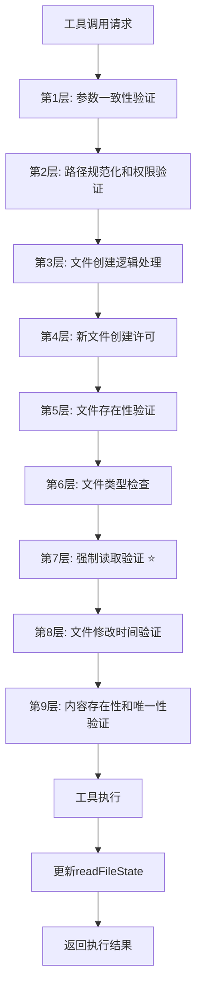
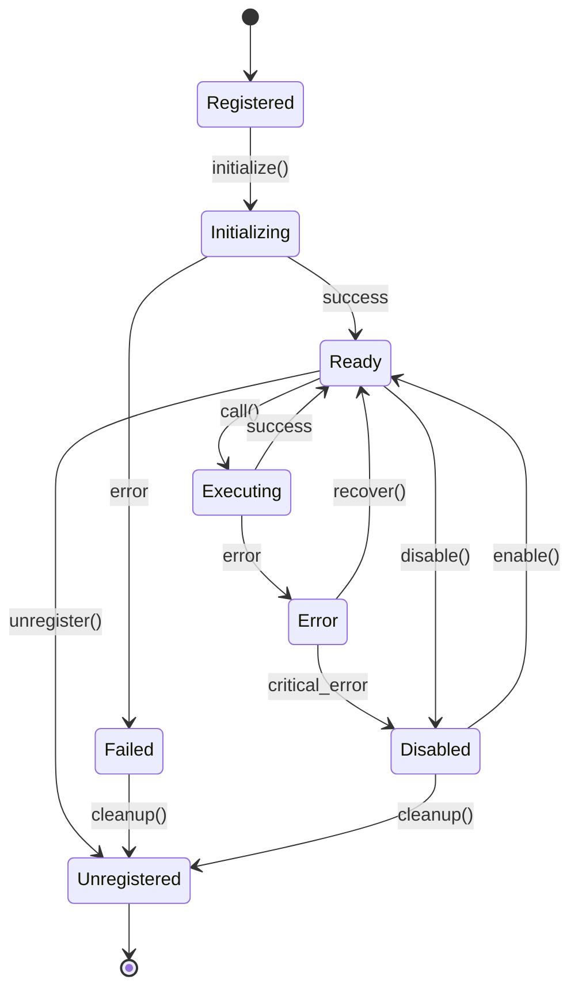

# 工具系统总览

## 🎯 系统定位与架构

工具系统是"文档即软件"3.0的执行引擎，基于对Claude Code的深度逆向分析，精确复现了其创新的9层验证安全机制、并发执行调度和MCP协议集成。本系统为AI Agent提供了安全、高效、可扩展的工具执行环境。

## 🏗️ 核心架构组件

### [base-tool.md](./base-tool.md) - 工具基类框架
**核心职责**: 定义统一的工具接口和行为规范

**主要功能**:
- 标准化的工具生命周期管理
- 统一的输入验证和输出格式化
- 权限检查和安全控制接口
- 性能监控和指标收集

**设计特点**:
- 面向接口的可扩展设计
- 基于装饰器的功能增强
- 支持异步生成器的流式输出
- 内置错误处理和恢复机制

### [tool-registry.md](./tool-registry.md) - 工具注册发现系统
**核心职责**: 管理工具的注册、发现和生命周期

**主要功能**:
- 动态工具注册和注销
- 工具元数据管理和查询
- 依赖关系解析和验证
- 版本兼容性检查

**技术特征**:
- 插件化的工具加载机制
- 智能的依赖注入系统
- 支持热插拔的动态更新
- 完整的工具监控和诊断

### [implementations/](./implementations/) - 具体工具实现
**包含模块**:
- `read-tool.md` - 文件读取工具（支持readFileState追踪）
- `write-tool.md` - 文件写入工具（强制读取验证）
- `edit-tool.md` - 文件编辑工具（9层验证机制）
- `bash-tool.md` - 命令执行工具（安全沙箱）

## 🛡️ 9层验证安全机制

基于Edit工具的深度分析，整个工具系统实现了完整的9层安全验证：



### 关键验证层详解

#### 第7层：强制读取验证（核心安全机制）
```typescript
// 强制读取验证算法
function validateForceReadRequirement(
  filePath: string,
  readFileState: FileStateTracker
): ValidationResult {
  
  // 检查readFileState中是否存在文件记录
  const fileState = readFileState[filePath];
  
  if (!fileState) {
    return {
      result: false,
      behavior: "ask",
      message: "File has not been read yet. Read it first before writing to it.",
      errorCode: 6  // 专用错误码
    };
  }
  
  // 验证文件修改时间一致性
  const currentMtime = fs.statSync(filePath).mtimeMs;
  if (currentMtime > fileState.timestamp) {
    return {
      result: false,
      behavior: "ask", 
      message: "File has been modified since read, either by the user or by a linter. Read it again before attempting to write it.",
      errorCode: 7
    };
  }
  
  return { result: true };
}
```

#### readFileState数据结构
```typescript
interface FileStateTracker {
  [absoluteFilePath: string]: {
    content: string;      // 文件完整内容
    timestamp: number;    // 文件读取时的修改时间戳
  };
}

// 不同工具的状态更新策略
class FileStateManager {
  // Read工具：使用逻辑时间
  updateFromRead(filePath: string, content: string): void {
    this.readFileState[filePath] = {
      content: content,
      timestamp: Date.now()  // 逻辑时间
    };
  }
  
  // Edit/Write工具：使用文件系统时间
  updateFromModification(filePath: string, content: string): void {
    this.readFileState[filePath] = {
      content: content,
      timestamp: fs.statSync(filePath).mtimeMs  // 文件系统时间
    };
  }
}
```

## ⚡ 并发执行调度机制

### 工具并发安全性评估
```typescript
// 工具分组策略
interface ToolConcurrencyAnalyzer {
  // 评估工具并发安全性
  assessConcurrencySafety(tool: Tool, params: any): boolean;
  
  // 按安全性分组工具
  groupToolsByCompatibility(toolUses: ToolUse[]): ToolGroup[];
  
  // 动态调整并发度
  adjustConcurrencyLevel(performance: PerformanceMetrics): number;
}

// 工具分组结果
interface ToolGroup {
  isConcurrencySafe: boolean;  // 是否可并发执行
  tools: ToolUse[];           // 该组内的工具
  priority: number;           // 执行优先级
  estimatedDuration: number;  // 预估执行时间
}
```

### 智能调度算法
```typescript
// 工具执行协调器
async function* coordinateToolExecution(
  toolUses: ToolUse[],
  context: ExecutionContext
): AsyncGenerator<ToolResult> {
  
  // 1. 按并发安全性分组
  const toolGroups = groupToolsByCompatibility(toolUses, context);
  
  // 2. 按组顺序执行
  for (const group of toolGroups) {
    if (group.isConcurrencySafe) {
      // 并发执行安全工具（最大并发数：10）
      yield* executeConcurrently(group.tools, context, MAX_CONCURRENT_TOOLS);
    } else {
      // 串行执行非安全工具
      yield* executeSequentially(group.tools, context);
    }
  }
}

// 并发执行实现
async function* executeConcurrently(
  toolUses: ToolUse[],
  context: ExecutionContext,
  maxConcurrency: number
): AsyncGenerator<ToolResult> {
  
  // 使用并发执行调度器
  yield* concurrentExecutor(
    toolUses.map(toolUse => executeIndividualTool(toolUse, context)),
    maxConcurrency
  );
}
```

## 🔌 MCP协议集成

### MCP服务器管理
```typescript
// MCP集成管理器
class MCPIntegrationManager {
  private servers: Map<string, MCPServerInstance> = new Map();
  private toolProxies: Map<string, MCPToolProxy> = new Map();
  
  // 启动MCP服务器
  async startMCPServer(config: MCPServerConfig): Promise<void> {
    const server = new MCPServerInstance(config);
    
    // 建立连接
    await server.connect();
    
    // 注册服务器工具
    const tools = await server.getAvailableTools();
    for (const tool of tools) {
      this.registerMCPTool(server.name, tool);
    }
    
    this.servers.set(config.name, server);
  }
  
  // 注册MCP工具代理
  private registerMCPTool(serverName: string, toolInfo: MCPToolInfo): void {
    const proxy = new MCPToolProxy(serverName, toolInfo);
    const toolName = `${serverName}:${toolInfo.name}`;
    
    // 注册到工具系统
    this.toolRegistry.register(toolName, proxy);
    this.toolProxies.set(toolName, proxy);
  }
  
  // MCP工具调用代理
  async executeMCPTool(
    serverName: string,
    toolName: string,
    parameters: any,
    context: ExecutionContext
  ): AsyncGenerator<ToolResult> {
    
    const server = this.servers.get(serverName);
    if (!server) {
      throw new Error(`MCP server not found: ${serverName}`);
    }
    
    // 通过MCP协议调用工具
    const response = await server.callTool(toolName, parameters);
    
    // 将MCP响应转换为标准工具结果
    yield this.convertMCPResponse(response);
  }
}
```

### MCP协议适配器
```typescript
// MCP协议适配器
class MCPProtocolAdapter {
  // 将标准工具调用转换为MCP请求
  convertToMCPRequest(toolCall: ToolCall): MCPRequest {
    return {
      jsonrpc: "2.0",
      id: toolCall.id,
      method: "tools/call",
      params: {
        name: toolCall.name,
        arguments: toolCall.parameters
      }
    };
  }
  
  // 将MCP响应转换为标准工具结果
  convertFromMCPResponse(mcpResponse: MCPResponse): ToolResult {
    if (mcpResponse.error) {
      return {
        toolCallId: mcpResponse.id,
        success: false,
        error: mcpResponse.error.message,
        duration: 0
      };
    }
    
    return {
      toolCallId: mcpResponse.id,
      success: true,
      data: mcpResponse.result,
      duration: this.calculateDuration(mcpResponse)
    };
  }
}
```

## 🔄 工具生命周期管理

### 生命周期状态图


### 生命周期管理器
```typescript
// 工具生命周期管理器
class ToolLifecycleManager {
  private toolStates: Map<string, ToolState> = new Map();
  private stateTransitions: Map<string, StateTransition[]> = new Map();
  
  // 管理工具状态转换
  async transitionToolState(
    toolName: string,
    targetState: ToolState,
    context?: any
  ): Promise<void> {
    
    const currentState = this.getToolState(toolName);
    
    // 验证状态转换的合法性
    if (!this.canTransition(currentState, targetState)) {
      throw new Error(
        `Invalid state transition: ${currentState} -> ${targetState} for tool ${toolName}`
      );
    }
    
    // 执行状态转换前的准备工作
    await this.prepareStateTransition(toolName, currentState, targetState, context);
    
    // 更新状态
    this.setToolState(toolName, targetState);
    
    // 记录状态变迁历史
    this.recordStateTransition(toolName, currentState, targetState, context);
    
    // 通知状态变更监听器
    this.notifyStateChange(toolName, currentState, targetState);
    
    // 执行状态转换后的清理工作
    await this.finalizeStateTransition(toolName, currentState, targetState, context);
  }
  
  // 工具健康检查
  async performHealthCheck(toolName: string): Promise<ToolHealthReport> {
    const tool = this.toolRegistry.get(toolName);
    if (!tool) {
      return {
        status: 'not_found',
        message: `Tool ${toolName} not found in registry`
      };
    }
    
    try {
      // 执行工具特定的健康检查
      const healthResult = await tool.healthCheck?.() || { healthy: true };
      
      return {
        status: healthResult.healthy ? 'healthy' : 'unhealthy',
        message: healthResult.message || 'Health check passed',
        details: healthResult.details
      };
    } catch (error) {
      return {
        status: 'error',
        message: `Health check failed: ${error.message}`,
        error: error
      };
    }
  }
}
```

## 📊 性能监控与优化

### 工具性能指标
```typescript
interface ToolPerformanceMetrics {
  // 执行性能
  execution: {
    totalCalls: number;           // 总调用次数
    successfulCalls: number;      // 成功调用次数
    failedCalls: number;          // 失败调用次数
    avgExecutionTime: number;     // 平均执行时间
    p95ExecutionTime: number;     // 95分位执行时间
    maxExecutionTime: number;     // 最大执行时间
  };
  
  // 资源使用
  resources: {
    avgMemoryUsage: number;       // 平均内存使用
    peakMemoryUsage: number;      // 峰值内存使用
    avgCpuUsage: number;          // 平均CPU使用率
    totalIOOperations: number;    // 总IO操作数
  };
  
  // 并发性能
  concurrency: {
    maxConcurrentCalls: number;   // 最大并发调用数
    avgConcurrencyLevel: number;  // 平均并发水平
    concurrencyBottlenecks: number; // 并发瓶颈次数
  };
  
  // 错误统计
  errors: {
    validationErrors: number;     // 验证错误次数
    executionErrors: number;      // 执行错误次数
    timeoutErrors: number;        // 超时错误次数
    permissionErrors: number;     // 权限错误次数
  };
}
```

### 性能优化策略
```typescript
// 工具性能优化器
class ToolPerformanceOptimizer {
  // 自适应超时调整
  adjustTimeouts(metrics: ToolPerformanceMetrics): void {
    const avgTime = metrics.execution.avgExecutionTime;
    const p95Time = metrics.execution.p95ExecutionTime;
    
    // 基于历史性能数据动态调整超时
    const recommendedTimeout = Math.max(
      p95Time * 1.5,  // 95分位时间的1.5倍
      avgTime * 3,    // 平均时间的3倍
      5000            // 最小5秒
    );
    
    this.updateToolTimeout(recommendedTimeout);
  }
  
  // 并发度优化
  optimizeConcurrency(metrics: ToolPerformanceMetrics): void {
    const bottleneckRate = metrics.concurrency.concurrencyBottlenecks / 
                          metrics.execution.totalCalls;
    
    if (bottleneckRate > 0.1) {
      // 瓶颈率过高，降低并发度
      this.decreaseConcurrencyLimit();
    } else if (bottleneckRate < 0.01) {
      // 瓶颈率很低，可以提高并发度
      this.increaseConcurrencyLimit();
    }
  }
  
  // 缓存策略优化
  optimizeCaching(metrics: ToolPerformanceMetrics): void {
    // 基于调用频率和执行时间决定缓存策略
    const callFrequency = metrics.execution.totalCalls / this.getTimeWindow();
    const avgExecutionTime = metrics.execution.avgExecutionTime;
    
    if (callFrequency > 10 && avgExecutionTime > 100) {
      // 高频调用且执行时间较长的工具适合缓存
      this.enableCaching();
    }
  }
}
```

## 🔧 工具配置与扩展

### 工具配置规范
```typescript
interface ToolConfiguration {
  // 基础配置
  enabled: boolean;               // 是否启用
  priority: number;              // 执行优先级
  timeout: number;               // 执行超时（毫秒）
  retryAttempts: number;         // 重试次数
  
  // 并发配置
  concurrency: {
    isConcurrencySafe: boolean;  // 是否并发安全
    maxConcurrentCalls: number;  // 最大并发调用数
    queueSize: number;          // 队列大小
  };
  
  // 权限配置
  permissions: {
    allowedPaths: string[];      // 允许访问的路径
    forbiddenPaths: string[];    // 禁止访问的路径
    requiredCapabilities: string[]; // 所需权限
    securityLevel: SecurityLevel; // 安全级别
  };
  
  // 监控配置
  monitoring: {
    enableMetrics: boolean;      // 启用指标收集
    enableTracing: boolean;      // 启用链路追踪
    logLevel: LogLevel;         // 日志级别
  };
  
  // 自定义配置
  custom: Record<string, any>;   // 工具特定配置
}
```

### 工具扩展机制
```typescript
// 工具扩展接口
interface ToolExtension {
  // 扩展信息
  name: string;
  version: string;
  description: string;
  
  // 扩展工具
  extendTool(tool: Tool, config: ExtensionConfig): ExtendedTool;
  
  // 生命周期钩子
  onToolRegister?(tool: Tool): void;
  onToolUnregister?(tool: Tool): void;
  onToolExecute?(tool: Tool, params: any): void;
  onToolComplete?(tool: Tool, result: ToolResult): void;
}

// 扩展管理器
class ToolExtensionManager {
  private extensions: Map<string, ToolExtension> = new Map();
  
  // 注册扩展
  registerExtension(extension: ToolExtension): void {
    this.extensions.set(extension.name, extension);
    this.notifyExtensionRegistered(extension);
  }
  
  // 应用扩展到工具
  applyExtensions(tool: Tool): ExtendedTool {
    let extendedTool = tool;
    
    // 按优先级应用所有扩展
    for (const extension of this.getSortedExtensions()) {
      if (this.shouldApplyExtension(extension, tool)) {
        extendedTool = extension.extendTool(extendedTool, this.getExtensionConfig(extension));
      }
    }
    
    return extendedTool;
  }
}
```

## 🚀 工具开发指南

### 新工具开发模板
```typescript
// 标准工具开发模板
class CustomTool implements Tool {
  name = "custom-tool";
  description = "Description of what this tool does";
  
  // 输入模式定义
  inputSchema = z.object({
    parameter1: z.string().describe("Description of parameter1"),
    parameter2: z.number().optional().describe("Optional parameter2"),
  });
  
  // 工具特性
  isReadOnly(): boolean { return false; }
  isConcurrencySafe(): boolean { return true; }
  isEnabled(): boolean { return true; }
  
  // 权限检查
  async checkPermissions(
    input: any, 
    context: PermissionContext
  ): Promise<PermissionResult> {
    // 实现权限检查逻辑
    return { behavior: "allow", updatedInput: input };
  }
  
  // 核心执行逻辑
  async *call(
    input: any,
    context: ExecutionContext
  ): AsyncGenerator<ToolResult> {
    try {
      // 1. 输入验证
      const validatedInput = this.validateInput(input);
      
      // 2. 执行核心逻辑
      const result = await this.executeCore(validatedInput, context);
      
      // 3. 输出格式化
      yield this.formatOutput(result);
      
    } catch (error) {
      // 4. 错误处理
      yield this.handleError(error, input, context);
    }
  }
  
  // 健康检查
  async healthCheck(): Promise<HealthCheckResult> {
    // 实现健康检查逻辑
    return { healthy: true };
  }
}
```

### 工具开发最佳实践

1. **遵循单一职责原则**: 每个工具只做一件事，但要做好
2. **实现完整的错误处理**: 包括验证错误、执行错误、超时错误等
3. **支持流式输出**: 使用AsyncGenerator提供实时反馈
4. **注重安全性**: 实现输入验证、权限检查、资源限制
5. **提供详细的元数据**: 包括描述、示例、使用限制等
6. **实现性能监控**: 记录执行时间、资源使用等指标
7. **支持配置化**: 提供必要的配置选项和默认值
8. **编写综合测试**: 包括单元测试、集成测试、性能测试

---

*工具系统体现了"文档即软件"3.0的核心价值：通过精确的自然语言描述，完整定义了一个复杂的工具执行环境。从9层安全验证到并发调度优化，每个技术细节都以文档形式呈现，为AI编译器提供了准确的实现指导。*