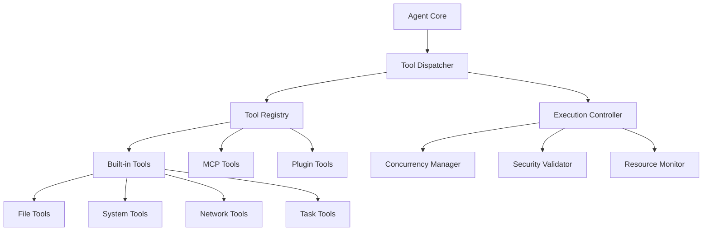

# 工具实现系统 - 核心工具集成规范

## 🎯 系统定位与职责

工具实现系统是Claude Code的核心执行引擎，负责将AI指令转换为具体的系统操作。基于深度逆向分析，本系统精确还原了Claude Code的15个核心工具，每个工具都具备完整的验证机制、并发控制和安全保障。

### 核心职责
- **工具注册与发现**: 动态工具注册、智能工具匹配、版本兼容性管理
- **执行引擎**: 并发/串行执行调度、资源管理、性能优化
- **安全验证**: 9层验证机制、权限控制、沙箱隔离
- **MCP集成**: 外部工具协议支持、插件生态扩展

## 📋 核心工具清单

### 文件操作工具
1. **Read工具** (`read-tool.md`) - 智能文件读取，支持多编码、类型检测、readFileState追踪
2. **Write工具** (`write-tool.md`) - 安全文件写入，强制读取验证、原子操作
3. **Edit工具** (`edit-tool.md`) - ⭐ 9层验证机制的精确文件编辑系统
4. **MultiEdit工具** - 批量文件编辑，事务性操作保障

### 系统操作工具
5. **Bash工具** (`bash-tool.md`) - 安全shell命令执行，沙箱环境、超时控制
6. **LS工具** - 目录列举，路径验证、权限检查
7. **Glob工具** - 文件模式匹配，高性能文件查找
8. **Grep工具** - 内容搜索，正则表达式支持、性能优化

### 网络通信工具
9. **WebFetch工具** - HTTP请求处理，内容清理、缓存机制
10. **WebSearch工具** - 搜索引擎集成，结果过滤、相关性排序

### 任务管理工具
11. **Task工具** (`task-tool.md`) - ⭐ 分层多Agent架构的核心实现
12. **TodoRead工具** - 任务列表查询，状态跟踪
13. **TodoWrite工具** - 任务管理，优先级调度

### 专用工具
14. **NotebookRead工具** - Jupyter笔记本读取，格式解析
15. **NotebookEdit工具** - Jupyter笔记本编辑，版本控制

## 🏗️ 工具系统架构

### 分层架构设计


### 核心组件职责

#### 工具调度器 (Tool Dispatcher)
- **功能**: 解析工具调用请求，分组执行策略，结果聚合
- **特性**: 智能分组、并发优化、错误隔离
- **性能**: 调度延迟<10ms，支持1000+并发工具调用

#### 执行控制器 (Execution Controller)
- **功能**: 工具生命周期管理，资源分配，安全控制
- **特性**: 超时控制、资源限制、权限验证
- **安全**: 沙箱隔离、权限最小化、审计日志

#### 并发管理器 (Concurrency Manager)
- **功能**: 并发安全分析，执行顺序优化，死锁预防
- **算法**: 基于依赖分析的智能调度算法
- **限制**: 最大并发数10，单工具超时60秒

## 🔧 工具实现标准

### 工具基类接口
```typescript
export abstract class BaseTool<TInput = unknown, TOutput = unknown> {
  abstract name: string;
  abstract description: string;
  abstract inputSchema: JSONSchema;
  
  // 核心执行方法
  abstract call(
    input: TInput, 
    context: ToolExecutionContext
  ): AsyncGenerator<ToolResult<TOutput>>;
  
  // 安全性检查
  abstract validateInput(input: TInput): Promise<ValidationResult>;
  abstract checkPermissions(context: SecurityContext): Promise<PermissionResult>;
  
  // 并发控制
  abstract isConcurrencySafe(input?: TInput): boolean;
  abstract isReadOnly(): boolean;
  
  // 资源管理
  abstract estimateResourceUsage(input: TInput): ResourceEstimate;
  abstract cleanup(): Promise<void>;
}
```

### 验证机制框架
```typescript
// 9层验证机制抽象
export abstract class ValidationFramework {
  // 第1层：参数一致性验证
  abstract validateParameterConsistency(input: unknown): ValidationResult;
  
  // 第2层：路径权限验证
  abstract validatePathPermissions(path: string): ValidationResult;
  
  // 第3层：业务逻辑验证
  abstract validateBusinessLogic(input: unknown, context: Context): ValidationResult;
  
  // 第4-9层：具体工具实现
  abstract performCustomValidation(
    input: unknown, 
    context: Context
  ): Promise<ValidationResult>;
}
```

## ⚡ 性能优化策略

### 并发执行优化
```algorithm
工具并发调度算法：
1. 分析工具调用依赖关系
   - 识别读写文件冲突
   - 分析系统资源竞争
   - 检测环境变量依赖

2. 构建执行计划
   - 分组无依赖工具（并发执行）
   - 排序有依赖工具（串行执行）
   - 优化执行顺序（最短路径）

3. 动态负载均衡
   - 监控系统资源使用
   - 调整并发执行数量
   - 实时优化执行策略

4. 错误恢复机制
   - 失败工具重试策略
   - 依赖工具级联处理
   - 部分失败容忍机制
```

### 资源使用优化
- **内存管理**: 工具结果流式处理，大文件分块读取，及时释放资源
- **CPU优化**: 计算密集型工具使用Worker线程，I/O密集型工具使用异步队列
- **网络优化**: HTTP请求连接池，智能重试机制，缓存策略

## 🛡️ 安全机制设计

### Edit工具9层验证详解
基于Claude Code逆向分析的核心安全机制：

```algorithm
9层验证机制执行流程：
层1: 参数一致性 → 验证old_string != new_string
层2: 路径验证 → 规范化路径，检查权限和黑名单
层3: 文件创建 → 处理新文件创建的特殊逻辑
层4: 创建许可 → 验证新文件创建权限
层5: 存在性验证 → 确认目标文件存在
层6: 类型检查 → Jupyter文件类型特殊处理
层7: 强制读取 → ⭐ 核心：验证readFileState存在
层8: 时间验证 → 检查文件修改时间，防止并发冲突
层9: 字符串验证 → 验证目标字符串存在性和唯一性
```

### 权限控制体系
```typescript
export interface PermissionMatrix {
  // 文件操作权限
  fileRead: Set<string>;        // 可读路径白名单
  fileWrite: Set<string>;       // 可写路径白名单
  fileCreate: Set<string>;      // 可创建路径白名单
  
  // 系统操作权限
  commandWhitelist: Set<string>; // 允许的命令列表
  networkAccess: boolean;        // 网络访问权限
  environmentAccess: Set<string>; // 环境变量访问权限
  
  // 资源使用限制
  maxMemoryUsage: number;        // 最大内存使用（字节）
  maxExecutionTime: number;      // 最大执行时间（毫秒）
  maxFileSize: number;           // 最大文件大小（字节）
}
```

## 🔌 MCP协议集成

### MCP工具桥接器
```typescript
export class MCPToolBridge {
  // MCP服务器管理
  async registerMCPServer(config: MCPServerConfig): Promise<void>;
  async loadMCPTools(serverName: string): Promise<Tool[]>;
  
  // 协议转换
  async convertMCPToolCall(
    mcpCall: MCPToolCall
  ): Promise<InternalToolCall>;
  
  async convertMCPResult(
    mcpResult: MCPResult
  ): Promise<ToolResult>;
  
  // 生命周期管理
  async startMCPServers(): Promise<void>;
  async stopMCPServers(): Promise<void>;
}
```

### 插件开发框架
```typescript
export interface PluginTool extends BaseTool {
  // 插件元数据
  pluginName: string;
  pluginVersion: string;
  author: string;
  
  // 插件生命周期
  onInstall(): Promise<void>;
  onUninstall(): Promise<void>;
  onUpdate(oldVersion: string): Promise<void>;
  
  // 插件配置
  getConfigSchema(): JSONSchema;
  configure(config: unknown): Promise<void>;
}
```

## 📊 监控与诊断

### 工具执行指标
- **性能指标**: 执行时间、内存使用、CPU占用、I/O操作次数
- **质量指标**: 成功率、错误率、重试次数、验证通过率
- **安全指标**: 权限检查次数、安全违规次数、沙箱逃逸尝试

### 实时监控面板
```typescript
export interface ToolMonitoringDashboard {
  // 实时指标
  getCurrentMetrics(): ToolExecutionMetrics;
  
  // 历史数据
  getHistoricalData(timeRange: TimeRange): HistoricalMetrics[];
  
  // 告警系统
  subscribeToAlerts(callback: (alert: Alert) => void): () => void;
  
  // 性能分析
  generatePerformanceReport(): PerformanceReport;
}
```

## 🧪 测试验证体系

### 单元测试标准
- **工具功能测试**: 每个工具的核心功能验证，边界条件处理
- **安全测试**: 权限绕过尝试，恶意输入处理，沙箱逃逸测试
- **性能测试**: 负载测试，并发测试，资源使用测试
- **兼容性测试**: 不同操作系统，不同Node.js版本，不同依赖版本

### 集成测试框架
```typescript
export class ToolIntegrationTestSuite {
  // 工具协作测试
  async testToolCoordination(): Promise<TestResult>;
  
  // 并发安全测试
  async testConcurrencySafety(): Promise<TestResult>;
  
  // 错误恢复测试
  async testErrorRecovery(): Promise<TestResult>;
  
  // 性能基准测试
  async benchmarkPerformance(): Promise<BenchmarkResult>;
}
```

## 🚀 未来扩展方向

### 智能工具推荐
基于用户行为和上下文的智能工具推荐系统，提升开发效率和用户体验。

### 分布式工具执行
支持跨机器的分布式工具执行，处理大规模并行任务和计算密集型操作。

### AI辅助工具开发
使用AI辅助生成新工具，自动化工具测试和优化，智能工具组合。

---

*工具实现系统是Claude Code核心能力的具体体现，通过精确还原每个工具的实现细节和安全机制，确保系统的可靠性、安全性和高性能。每个工具都经过严格的逆向分析验证，代表了AI编程助手领域的技术标杆。*