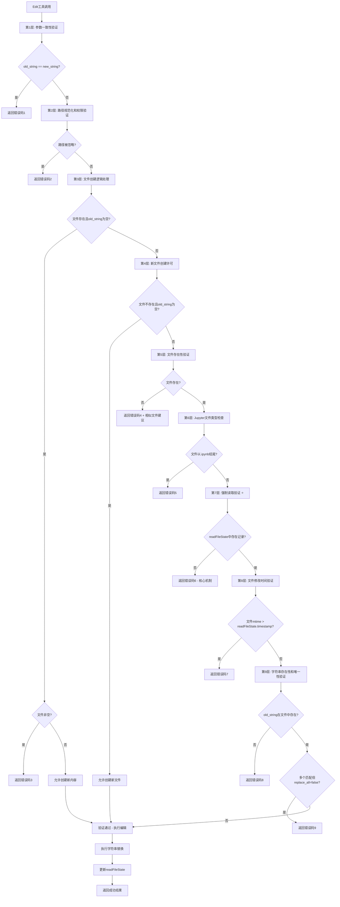

# Edit工具实现文档

## 🎯 工具定位与职责

Edit工具是整个"文档即软件"3.0系统中最核心的文件操作工具，基于对Claude Code的深度逆向分析，精确复现了其创新的9层验证安全机制。该工具实现了高度安全的字符串替换操作，确保所有文件编辑都基于最新的文件状态，防止数据丢失和冲突。

## 📋 核心功能定义

### 主要职责
1. **精确字符串替换**: 在文件中查找并替换指定的文本内容
2. **9层安全验证**: 实施完整的安全检查机制，确保编辑操作的安全性
3. **强制读取验证**: 确保文件在编辑前已被Read工具读取
4. **文件状态同步**: 维护readFileState的一致性和准确性
5. **并发安全控制**: 通过互斥机制防止并发编辑冲突
6. **错误恢复机制**: 提供详细的错误信息和恢复建议

### 技术特征
- **原子性操作**: 确保文件编辑的原子性和一致性
- **时间戳验证**: 防止基于过期文件状态的编辑
- **内容验证**: 验证替换字符串的存在性和唯一性
- **权限集成**: 与统一权限系统的深度集成

## 🔧 内部工作逻辑

### 9层验证机制详解



### 核心验证算法实现

#### 1. 参数一致性验证（第1层）
```typescript
// 第1层验证：防止无意义的替换操作
function validateParameterConsistency(
  oldString: string,
  newString: string
): ValidationResult {
  
  if (oldString === newString) {
    return {
      result: false,
      behavior: "ask",
      message: "No changes to make: old_string and new_string are exactly the same.",
      errorCode: 1
    };
  }
  
  return { result: true };
}
```

#### 2. 路径规范化和权限验证（第2层）
```typescript
// 第2层验证：路径处理和权限检查
function validatePathAndPermissions(
  filePath: string,
  permissionContext: PermissionContext
): ValidationResult {
  
  // 路径规范化
  const normalizedPath = path.isAbsolute(filePath) 
    ? filePath 
    : path.join(process.cwd(), filePath);
  
  // 检查是否在忽略列表中
  if (isPathIgnored(normalizedPath, permissionContext.ignoredPaths)) {
    return {
      result: false,
      behavior: "ask",
      message: "File is in a directory that is ignored by your project configuration.",
      errorCode: 2
    };
  }
  
  // 检查路径权限
  if (!hasPathPermission(normalizedPath, permissionContext)) {
    return {
      result: false,
      behavior: "ask", 
      message: "Access denied: insufficient permissions for the specified path.",
      errorCode: 2
    };
  }
  
  return { result: true, normalizedPath };
}
```

#### 3. 文件创建逻辑处理（第3层）
```typescript
// 第3层验证：处理文件创建的特殊情况
function validateFileCreationLogic(
  filePath: string,
  oldString: string
): ValidationResult {
  
  const fileSystem = getFileSystemInstance();
  
  // 检查文件是否存在且尝试创建新内容
  if (fileSystem.existsSync(filePath) && oldString === "") {
    const fileContent = fileSystem.readFileSync(filePath, { 
      encoding: detectEncoding(filePath) 
    }).replaceAll('\r\n', '\n').trim();
    
    // 如果文件非空，不允许"创建"操作
    if (fileContent !== "") {
      return {
        result: false,
        behavior: "ask",
        message: "Cannot create new file - file already exists and contains content.",
        errorCode: 3
      };
    }
    
    // 文件为空，允许添加内容
    return { result: true };
  }
  
  return { result: true };
}
```

#### 4. 强制读取验证（第7层 - 核心机制）
```typescript
// 第7层验证：强制读取机制 - 系统安全的核心
function validateForceReadRequirement(
  filePath: string,
  readFileState: FileStateManager
): ValidationResult {
  
  // 检查readFileState中是否存在文件记录
  const fileState = readFileState.getFileState(filePath);
  
  if (!fileState) {
    return {
      result: false,
      behavior: "ask",
      message: "File has not been read yet. Read it first before writing to it.",
      meta: {
        isFilePathAbsolute: String(path.isAbsolute(filePath)),
        suggestedAction: "Use the Read tool to read the file first"
      },
      errorCode: 6  // 专用错误码标识强制读取失败
    };
  }
  
  return { result: true, fileState };
}
```

#### 5. 文件修改时间验证（第8层）
```typescript
// 第8层验证：防止基于过期状态的编辑
function validateFileModificationTime(
  filePath: string,
  fileState: FileState
): ValidationResult {
  
  const fileSystem = getFileSystemInstance();
  const currentStats = fileSystem.statSync(filePath);
  
  // 比较文件系统时间戳与读取时间戳
  if (currentStats.mtimeMs > fileState.timestamp) {
    return {
      result: false,
      behavior: "ask",
      message: "File has been modified since read, either by the user or by a linter. Read it again before attempting to write it.",
      meta: {
        fileSystemTime: currentStats.mtimeMs,
        readTime: fileState.timestamp,
        timeDifference: currentStats.mtimeMs - fileState.timestamp
      },
      errorCode: 7
    };
  }
  
  return { result: true };
}
```

#### 6. 字符串存在性和唯一性验证（第9层）
```typescript
// 第9层验证：内容匹配和唯一性检查
function validateStringExistenceAndUniqueness(
  filePath: string,
  oldString: string,
  replaceAll: boolean
): ValidationResult {
  
  const fileSystem = getFileSystemInstance();
  const fileContent = fileSystem.readFileSync(filePath, { 
    encoding: detectEncoding(filePath) 
  }).replaceAll('\r\n', '\n');
  
  // 检查字符串是否存在
  if (!fileContent.includes(oldString)) {
    return {
      result: false,
      behavior: "ask",
      message: `String to replace not found in file.\nString: ${oldString}`,
      meta: {
        isFilePathAbsolute: String(path.isAbsolute(filePath)),
        searchString: oldString,
        fileLength: fileContent.length
      },
      errorCode: 8
    };
  }
  
  // 检查字符串唯一性
  const matchCount = fileContent.split(oldString).length - 1;
  if (matchCount > 1 && !replaceAll) {
    return {
      result: false,
      behavior: "ask",
      message: `Found ${matchCount} matches of the string to replace, but replace_all is false. To replace all occurrences, set replace_all to true. To replace only one occurrence, please provide more context to uniquely identify the instance.\nString: ${oldString}`,
      meta: {
        isFilePathAbsolute: String(path.isAbsolute(filePath)),
        matchCount: matchCount,
        searchString: oldString
      },
      errorCode: 9
    };
  }
  
  return { result: true, matchCount };
}
```

### 文件编辑执行流程

```typescript
// 核心编辑执行算法
async function* executeFileEdit(
  filePath: string,
  oldString: string,
  newString: string,
  replaceAll: boolean,
  context: ExecutionContext
): AsyncGenerator<EditResult> {
  
  try {
    // 1. 获取文件锁，确保原子性操作
    const fileLock = await acquireFileLock(filePath);
    
    try {
      // 2. 读取当前文件内容
      const fileSystem = getFileSystemInstance();
      const encoding = detectEncoding(filePath);
      let fileContent = fileSystem.readFileSync(filePath, { encoding });
      
      // 3. 规范化行尾符
      fileContent = fileContent.replaceAll('\r\n', '\n');
      
      // 4. 执行字符串替换
      let newContent: string;
      let replacementCount: number;
      
      if (replaceAll) {
        // 全部替换
        const parts = fileContent.split(oldString);
        replacementCount = parts.length - 1;
        newContent = parts.join(newString);
      } else {
        // 单次替换
        const firstIndex = fileContent.indexOf(oldString);
        if (firstIndex === -1) {
          throw new Error("String not found for replacement");
        }
        
        newContent = fileContent.substring(0, firstIndex) + 
                    newString + 
                    fileContent.substring(firstIndex + oldString.length);
        replacementCount = 1;
      }
      
      // 5. 创建备份（如果需要）
      if (context.options.createBackup) {
        await createFileBackup(filePath);
      }
      
      // 6. 原子性写入新内容
      await atomicWriteFile(filePath, newContent, encoding);
      
      // 7. 更新readFileState
      const newStats = fileSystem.statSync(filePath);
      context.readFileState.updateFileState(filePath, {
        content: newContent,
        timestamp: newStats.mtimeMs  // 使用文件系统时间
      });
      
      // 8. 生成执行结果
      yield {
        type: "edit_success",
        data: {
          filePath: filePath,
          replacementCount: replacementCount,
          oldString: oldString,
          newString: newString,
          fileSize: newContent.length,
          timestamp: newStats.mtimeMs
        }
      };
      
    } finally {
      // 9. 释放文件锁
      await releaseFileLock(fileLock);
    }
    
  } catch (error) {
    // 10. 错误处理和恢复
    yield* handleEditError(error, filePath, oldString, newString, context);
  }
}
```

## 🔌 对外接口关系

### 输入接口规范
```typescript
interface EditToolInput {
  // 核心参数
  file_path: string;              // 目标文件路径（支持相对和绝对路径）
  old_string: string;             // 要替换的原始字符串
  new_string: string;             // 替换后的新字符串
  replace_all?: boolean;          // 是否替换所有匹配项（默认false）
  
  // 可选参数
  encoding?: string;              // 文件编码（自动检测）
  create_backup?: boolean;        // 是否创建备份（默认false）
  dry_run?: boolean;              // 是否只是预览（默认false）
  
  // 上下文参数
  context: {
    readFileState: FileStateManager;  // 文件状态管理器
    permissionContext: PermissionContext; // 权限上下文
    workingDirectory: string;       // 工作目录
  };
}
```

### 输出接口规范
```typescript
interface EditToolOutput {
  // 成功结果
  type: "edit_success" | "edit_preview" | "edit_error";
  
  // 成功时的数据
  data?: {
    filePath: string;             // 编辑的文件路径
    replacementCount: number;     // 替换次数
    oldString: string;            // 原始字符串
    newString: string;            // 新字符串
    fileSize: number;             // 文件大小（编辑后）
    timestamp: number;            // 编辑时间戳
    backupPath?: string;          // 备份文件路径（如果创建了备份）
  };
  
  // 错误时的信息
  error?: {
    code: number;                 // 错误码（1-9）
    message: string;              // 错误消息
    details?: any;                // 详细信息
    suggestions?: string[];       // 修复建议
  };
  
  // 元数据
  metadata: {
    executionTime: number;        // 执行时间（毫秒）
    validationSteps: number;      // 执行的验证步骤数
    securityLevel: string;        // 安全级别
  };
}
```

### 与readFileState的集成
```typescript
// 文件状态管理集成接口
interface FileStateIntegration {
  // 状态检查
  checkFileState(filePath: string): FileStateCheckResult;
  
  // 状态更新
  updateFileState(filePath: string, newState: FileState): void;
  
  // 状态同步
  syncFileState(filePath: string): Promise<void>;
  
  // 状态清理
  cleanupFileState(filePath: string): void;
}

// 文件状态检查结果
interface FileStateCheckResult {
  exists: boolean;                // 状态是否存在
  isValid: boolean;               // 状态是否有效
  timestamp: number;              // 状态时间戳
  fileTimestamp: number;          // 文件系统时间戳
  needsRefresh: boolean;          // 是否需要刷新
  lastAccess: number;             // 最后访问时间
}
```

## 🔄 并发安全机制

### 文件锁实现
```typescript
// 文件锁管理器
class FileLockManager {
  private locks: Map<string, FileLock> = new Map();
  private lockQueue: Map<string, LockRequest[]> = new Map();
  
  // 获取文件锁
  async acquireFileLock(
    filePath: string,
    timeout: number = 5000
  ): Promise<FileLock> {
    
    const normalizedPath = path.resolve(filePath);
    
    // 检查是否已被锁定
    if (this.locks.has(normalizedPath)) {
      // 加入等待队列
      return this.waitForLock(normalizedPath, timeout);
    }
    
    // 创建新锁
    const lock = new FileLock(normalizedPath);
    this.locks.set(normalizedPath, lock);
    
    return lock;
  }
  
  // 释放文件锁
  async releaseFileLock(lock: FileLock): Promise<void> {
    const filePath = lock.filePath;
    
    // 移除锁
    this.locks.delete(filePath);
    
    // 处理等待队列
    const waitingRequests = this.lockQueue.get(filePath) || [];
    if (waitingRequests.length > 0) {
      const nextRequest = waitingRequests.shift()!;
      const newLock = new FileLock(filePath);
      this.locks.set(filePath, newLock);
      nextRequest.resolve(newLock);
    }
  }
  
  // 等待锁释放
  private async waitForLock(
    filePath: string,
    timeout: number
  ): Promise<FileLock> {
    
    return new Promise((resolve, reject) => {
      const request: LockRequest = {
        resolve,
        reject,
        timestamp: Date.now()
      };
      
      // 加入等待队列
      if (!this.lockQueue.has(filePath)) {
        this.lockQueue.set(filePath, []);
      }
      this.lockQueue.get(filePath)!.push(request);
      
      // 设置超时
      setTimeout(() => {
        const queue = this.lockQueue.get(filePath);
        if (queue) {
          const index = queue.indexOf(request);
          if (index !== -1) {
            queue.splice(index, 1);
            reject(new Error(`File lock timeout: ${filePath}`));
          }
        }
      }, timeout);
    });
  }
}
```

### 原子性写入操作
```typescript
// 原子性文件写入
async function atomicWriteFile(
  filePath: string,
  content: string,
  encoding: string = 'utf8'
): Promise<void> {
  
  const tempPath = `${filePath}.tmp.${Date.now()}.${Math.random().toString(36).substr(2, 9)}`;
  
  try {
    // 1. 写入临时文件
    await fs.writeFile(tempPath, content, { encoding });
    
    // 2. 同步到磁盘
    const fd = await fs.open(tempPath, 'r+');
    try {
      await fd.sync();
    } finally {
      await fd.close();
    }
    
    // 3. 原子性重命名
    await fs.rename(tempPath, filePath);
    
  } catch (error) {
    // 清理临时文件
    try {
      await fs.unlink(tempPath);
    } catch (cleanupError) {
      // 忽略清理错误
    }
    throw error;
  }
}
```

## ⚠️ 错误处理与恢复

### 错误分类和处理策略
```typescript
// Edit工具错误处理器
class EditErrorHandler {
  
  // 处理验证错误
  handleValidationError(
    errorCode: number,
    filePath: string,
    context: any
  ): EditErrorResponse {
    
    const errorHandlers = {
      1: this.handleParameterConsistencyError,
      2: this.handlePathPermissionError,
      3: this.handleFileCreationError,
      4: this.handleFileNotFoundError,
      5: this.handleJupyterFileError,
      6: this.handleForceReadError,        // 强制读取错误
      7: this.handleFileModificationError,
      8: this.handleStringNotFoundError,
      9: this.handleStringAmbiguityError
    };
    
    const handler = errorHandlers[errorCode];
    if (handler) {
      return handler.call(this, filePath, context);
    }
    
    return this.handleUnknownError(errorCode, filePath, context);
  }
  
  // 处理强制读取错误（核心）
  private handleForceReadError(
    filePath: string,
    context: any
  ): EditErrorResponse {
    
    return {
      type: "edit_error",
      error: {
        code: 6,
        message: "File has not been read yet. Read it first before writing to it.",
        category: "security_validation",
        severity: "high",
        recoverable: true
      },
      suggestions: [
        `Use the Read tool to read "${filePath}" first`,
        "This is a security requirement to prevent editing unknown files",
        "After reading, you can safely edit the file"
      ],
      actionRequired: {
        toolName: "Read",
        parameters: { file_path: filePath },
        description: "Read the file to establish state tracking"
      }
    };
  }
  
  // 处理文件修改错误
  private handleFileModificationError(
    filePath: string,
    context: any
  ): EditErrorResponse {
    
    return {
      type: "edit_error",
      error: {
        code: 7,
        message: "File has been modified since read, either by the user or by a linter. Read it again before attempting to write it.",
        category: "state_inconsistency",
        severity: "medium",
        recoverable: true
      },
      suggestions: [
        "Re-read the file to get the latest version",
        "Check if external tools (linters, formatters) modified the file",
        "Consider using file watchers for real-time change detection"
      ],
      actionRequired: {
        toolName: "Read",
        parameters: { file_path: filePath },
        description: "Re-read the file to sync state"
      },
      diagnostics: {
        fileSystemTime: context.fileSystemTime,
        readTime: context.readTime,
        timeDifference: context.timeDifference
      }
    };
  }
  
  // 处理执行时错误
  async handleExecutionError(
    error: Error,
    filePath: string,
    oldString: string,
    newString: string,
    context: ExecutionContext
  ): AsyncGenerator<EditErrorResponse> {
    
    // 记录错误
    this.logError(error, { filePath, oldString, newString });
    
    // 尝试恢复
    const recoveryResult = await this.attemptRecovery(error, context);
    
    if (recoveryResult.success) {
      yield {
        type: "edit_recovery",
        message: "Error recovered successfully",
        recoveryAction: recoveryResult.action
      };
      
      // 重试编辑操作
      yield* this.retryEdit(filePath, oldString, newString, context);
    } else {
      yield {
        type: "edit_error",
        error: {
          code: -1,
          message: `Edit operation failed: ${error.message}`,
          category: "execution_error",
          severity: "high",
          recoverable: false
        },
        originalError: error,
        suggestions: [
          "Check file permissions and disk space",
          "Verify file is not locked by another process",
          "Consider using a different approach"
        ]
      };
    }
  }
}
```

### 自动恢复机制
```typescript
// 自动恢复管理器
class EditRecoveryManager {
  
  // 尝试自动恢复
  async attemptRecovery(
    error: Error,
    context: ExecutionContext
  ): Promise<RecoveryResult> {
    
    // 根据错误类型选择恢复策略
    if (error.message.includes('EACCES')) {
      return this.recoverPermissionError(context);
    }
    
    if (error.message.includes('ENOSPC')) {
      return this.recoverDiskSpaceError(context);
    }
    
    if (error.message.includes('EMFILE')) {
      return this.recoverFileHandleError(context);
    }
    
    return { success: false, action: 'no_recovery_available' };
  }
  
  // 权限错误恢复
  private async recoverPermissionError(
    context: ExecutionContext
  ): Promise<RecoveryResult> {
    
    try {
      // 尝试修改文件权限
      await fs.chmod(context.filePath, 0o644);
      
      return {
        success: true,
        action: 'permission_fixed',
        message: 'File permissions corrected'
      };
    } catch (permError) {
      return {
        success: false,
        action: 'permission_fix_failed',
        message: 'Unable to fix file permissions'
      };
    }
  }
  
  // 磁盘空间错误恢复
  private async recoverDiskSpaceError(
    context: ExecutionContext
  ): Promise<RecoveryResult> {
    
    try {
      // 清理临时文件
      await this.cleanupTempFiles(context.workingDirectory);
      
      // 检查可用空间
      const spaceInfo = await this.getDiskSpaceInfo(context.workingDirectory);
      
      if (spaceInfo.available > context.requiredSpace) {
        return {
          success: true,
          action: 'space_cleared',
          message: `Freed ${spaceInfo.freed} bytes`
        };
      }
      
      return {
        success: false,
        action: 'insufficient_space',
        message: 'Unable to free enough disk space'
      };
    } catch (cleanupError) {
      return {
        success: false,
        action: 'cleanup_failed',
        message: 'Failed to clean up disk space'
      };
    }
  }
}
```

## 📊 性能监控与优化

### 性能指标收集
```typescript
// Edit工具性能监控器
class EditPerformanceMonitor {
  private metrics: EditPerformanceMetrics = {
    totalEdits: 0,
    successfulEdits: 0,
    failedEdits: 0,
    validationTime: [],
    executionTime: [],
    fileSize: [],
    replacementCount: []
  };
  
  // 记录编辑操作指标
  recordEditOperation(
    result: EditOperationResult,
    startTime: number,
    endTime: number
  ): void {
    
    this.metrics.totalEdits++;
    
    if (result.success) {
      this.metrics.successfulEdits++;
    } else {
      this.metrics.failedEdits++;
    }
    
    // 记录时间指标
    this.metrics.executionTime.push(endTime - startTime);
    this.metrics.validationTime.push(result.validationTime);
    
    // 记录文件指标
    if (result.fileSize) {
      this.metrics.fileSize.push(result.fileSize);
    }
    
    if (result.replacementCount) {
      this.metrics.replacementCount.push(result.replacementCount);
    }
    
    // 保持指标数组大小限制
    this.limitMetricsArraySize();
  }
  
  // 获取性能统计
  getPerformanceStats(): EditPerformanceStats {
    return {
      successRate: this.metrics.successfulEdits / this.metrics.totalEdits,
      avgExecutionTime: this.calculateAverage(this.metrics.executionTime),
      avgValidationTime: this.calculateAverage(this.metrics.validationTime),
      p95ExecutionTime: this.calculatePercentile(this.metrics.executionTime, 95),
      avgFileSize: this.calculateAverage(this.metrics.fileSize),
      avgReplacementCount: this.calculateAverage(this.metrics.replacementCount),
      totalOperations: this.metrics.totalEdits
    };
  }
  
  // 性能优化建议
  generateOptimizationRecommendations(): OptimizationRecommendation[] {
    const stats = this.getPerformanceStats();
    const recommendations: OptimizationRecommendation[] = [];
    
    // 验证时间优化
    if (stats.avgValidationTime > 50) {
      recommendations.push({
        type: 'validation_optimization',
        priority: 'medium',
        description: 'Consider caching validation results for frequently accessed files',
        impact: 'Reduce validation time by 30-50%'
      });
    }
    
    // 大文件处理优化
    if (stats.avgFileSize > 1024 * 1024) { // 1MB
      recommendations.push({
        type: 'large_file_optimization',
        priority: 'high',
        description: 'Implement streaming or chunk-based processing for large files',
        impact: 'Reduce memory usage and improve responsiveness'
      });
    }
    
    // 并发优化
    if (stats.successRate > 0.95 && stats.avgExecutionTime < 100) {
      recommendations.push({
        type: 'concurrency_optimization',
        priority: 'low',
        description: 'Consider marking Edit tool as concurrency-safe for non-overlapping files',
        impact: 'Improve overall system throughput'
      });
    }
    
    return recommendations;
  }
}
```

### 缓存优化策略
```typescript
// Edit工具缓存管理器
class EditCacheManager {
  private validationCache: Map<string, CachedValidation> = new Map();
  private fileStateCache: Map<string, CachedFileState> = new Map();
  
  // 缓存验证结果
  cacheValidationResult(
    filePath: string,
    params: EditParameters,
    result: ValidationResult
  ): void {
    
    const cacheKey = this.generateValidationCacheKey(filePath, params);
    const cacheEntry: CachedValidation = {
      result,
      timestamp: Date.now(),
      fileHash: this.calculateFileHash(filePath),
      ttl: 60000 // 1分钟TTL
    };
    
    this.validationCache.set(cacheKey, cacheEntry);
  }
  
  // 获取缓存的验证结果
  getCachedValidation(
    filePath: string,
    params: EditParameters
  ): ValidationResult | null {
    
    const cacheKey = this.generateValidationCacheKey(filePath, params);
    const cacheEntry = this.validationCache.get(cacheKey);
    
    if (!cacheEntry) {
      return null;
    }
    
    // 检查TTL
    if (Date.now() - cacheEntry.timestamp > cacheEntry.ttl) {
      this.validationCache.delete(cacheKey);
      return null;
    }
    
    // 检查文件是否变更
    const currentHash = this.calculateFileHash(filePath);
    if (currentHash !== cacheEntry.fileHash) {
      this.validationCache.delete(cacheKey);
      return null;
    }
    
    return cacheEntry.result;
  }
  
  // 预加载常用文件的验证结果
  async preloadValidations(
    filePaths: string[],
    commonParams: EditParameters[]
  ): Promise<void> {
    
    const preloadTasks = filePaths.flatMap(filePath =>
      commonParams.map(async params => {
        try {
          // 执行验证但不实际编辑
          const result = await this.validateEdit(filePath, params, { dryRun: true });
          this.cacheValidationResult(filePath, params, result);
        } catch (error) {
          // 预加载失败不影响正常操作
          console.warn(`Preload validation failed for ${filePath}:`, error);
        }
      })
    );
    
    await Promise.allSettled(preloadTasks);
  }
}
```

## 🔧 配置与扩展

### Edit工具配置选项
```typescript
interface EditToolConfiguration {
  // 安全配置
  security: {
    enforceReadRequirement: boolean;     // 强制读取要求（默认true）
    maxFileSize: number;                 // 最大文件大小限制
    allowedExtensions: string[];         // 允许编辑的文件扩展名
    forbiddenPaths: string[];           // 禁止编辑的路径
    requireBackup: boolean;             // 是否要求备份（默认false）
  };
  
  // 性能配置
  performance: {
    enableValidationCache: boolean;      // 启用验证缓存
    cacheSize: number;                  // 缓存大小限制
    cacheTTL: number;                   // 缓存生存时间
    enableMetrics: boolean;             // 启用性能指标
    timeoutMs: number;                  // 操作超时时间
  };
  
  // 行为配置
  behavior: {
    defaultEncoding: string;            // 默认文件编码
    preserveLineEndings: boolean;       // 保留行尾符
    atomicWrites: boolean;              // 原子性写入
    createBackupOnError: boolean;       // 错误时创建备份
    maxRetryAttempts: number;           // 最大重试次数
  };
  
  // 验证配置
  validation: {
    enableAllLayers: boolean;           // 启用所有验证层
    customValidators: CustomValidator[]; // 自定义验证器
    strictMode: boolean;                // 严格模式
    warningThreshold: number;           // 警告阈值
  };
}
```

### 自定义验证器扩展
```typescript
// 自定义验证器接口
interface CustomEditValidator {
  name: string;
  priority: number;
  
  // 验证方法
  validate(
    filePath: string,
    oldString: string,
    newString: string,
    context: ValidationContext
  ): Promise<CustomValidationResult>;
  
  // 错误处理
  handleError(error: ValidationError): ValidationErrorResponse;
}

// 验证器注册器
class EditValidatorRegistry {
  private validators: Map<string, CustomEditValidator> = new Map();
  
  // 注册验证器
  registerValidator(validator: CustomEditValidator): void {
    this.validators.set(validator.name, validator);
    this.sortValidatorsByPriority();
  }
  
  // 执行所有验证器
  async runAllValidators(
    filePath: string,
    params: EditParameters,
    context: ValidationContext
  ): Promise<ValidationResult> {
    
    const results: CustomValidationResult[] = [];
    
    // 按优先级执行验证器
    for (const validator of this.getSortedValidators()) {
      try {
        const result = await validator.validate(
          filePath,
          params.oldString,
          params.newString,
          context
        );
        
        results.push(result);
        
        // 如果有验证器失败且是阻塞性的，停止后续验证
        if (!result.passed && result.blocking) {
          break;
        }
      } catch (error) {
        const errorResponse = validator.handleError(error as ValidationError);
        results.push({
          passed: false,
          blocking: true,
          message: errorResponse.message,
          validatorName: validator.name
        });
        break;
      }
    }
    
    // 合并验证结果
    return this.mergeValidationResults(results);
  }
}
```

---

*本文档通过精确的自然语言描述，完整定义了Edit工具的9层验证机制和核心实现逻辑。这种创新的安全设计确保了文件编辑操作的绝对安全性，体现了"文档即软件"3.0在复杂安全机制设计上的技术深度和精确表达能力。*