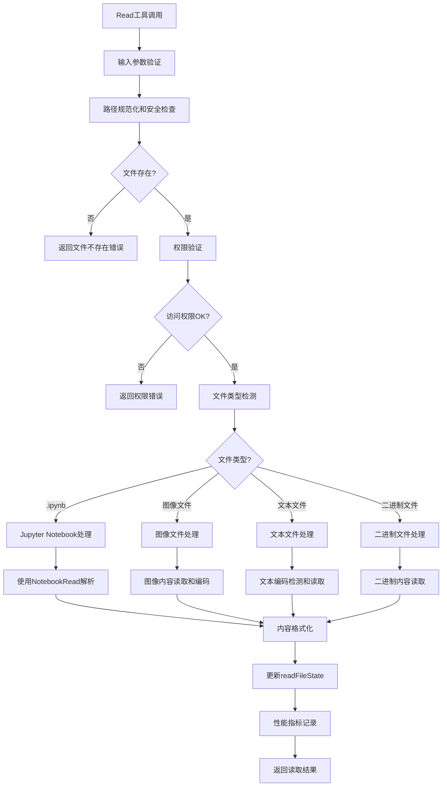

# Read工具实现文档

## 🎯 工具定位与职责

Read工具是整个"文档即软件"3.0系统中最基础但最关键的文件操作工具，负责安全地读取文件内容并维护readFileState状态追踪。基于对Claude Code的深度逆向分析，本工具实现了智能的内容读取、多格式支持、以及与9层验证机制深度集成的状态管理功能。

## 📋 核心功能定义

### 主要职责
1. **安全文件读取**: 读取各种格式的文件内容，包括文本、图像、Jupyter notebooks等
2. **readFileState维护**: 更新和维护文件状态追踪信息，为后续编辑操作提供基础
3. **智能内容处理**: 根据文件类型提供适当的内容处理和格式化
4. **权限验证集成**: 与统一权限系统集成，确保文件访问的安全性
5. **性能优化管理**: 支持大文件的分块读取和内存优化
6. **错误恢复机制**: 提供完整的错误处理和文件访问失败恢复

### 技术特征
- **多格式支持**: 支持文本、二进制、图像、Jupyter notebook等多种文件格式
- **流式读取**: 支持大文件的流式读取，避免内存溢出
- **编码自动检测**: 智能检测文件编码格式
- **状态同步**: 与Edit工具的强制读取验证机制完美配合

## 🔧 内部工作逻辑

### 核心读取流程设计


### 核心算法实现

#### 1. 智能文件类型检测
```typescript
// 文件类型检测算法
function detectFileType(filePath: string): FileTypeInfo {
  // 1. 基于扩展名的初步判断
  const extension = path.extname(filePath).toLowerCase();
  
  // 2. MIME类型检测
  const mimeType = mime.getType(filePath);
  
  // 3. 文件头魔数检测
  const fileSignature = readFileSignature(filePath);
  
  // 4. 综合判断文件类型
  const fileType = determineFileType(extension, mimeType, fileSignature);
  
  return {
    type: fileType,
    category: categorizeFileType(fileType),
    encoding: detectEncoding(filePath, fileType),
    readStrategy: selectReadStrategy(fileType),
    processingHints: getProcessingHints(fileType)
  };
}

// 文件类型分类
enum FileCategory {
  TEXT = 'text',           // 纯文本文件
  CODE = 'code',           // 代码文件
  BINARY = 'binary',       // 二进制文件
  IMAGE = 'image',         // 图像文件
  NOTEBOOK = 'notebook',   // Jupyter Notebook
  DOCUMENT = 'document',   // 文档文件
  ARCHIVE = 'archive',     // 压缩文件
  UNKNOWN = 'unknown'      // 未知类型
}
```

#### 2. 智能编码检测机制
```typescript
// 编码检测算法
function detectTextEncoding(filePath: string): EncodingInfo {
  // 1. 读取文件前几个字节进行BOM检测
  const bomResult = detectBOM(filePath);
  if (bomResult.hasBOM) {
    return {
      encoding: bomResult.encoding,
      confidence: 1.0,
      method: 'BOM'
    };
  }
  
  // 2. 统计分析法检测编码
  const sampleBuffer = readFileSample(filePath, 8192); // 读取8KB样本
  const encodingCandidates = [
    'utf-8',
    'utf-16le',
    'utf-16be', 
    'gbk',
    'gb2312',
    'shift_jis',
    'euc-kr',
    'iso-8859-1'
  ];
  
  // 3. 对每种编码计算置信度
  const encodingScores = encodingCandidates.map(encoding => ({
    encoding: encoding,
    confidence: calculateEncodingConfidence(sampleBuffer, encoding)
  }));
  
  // 4. 选择置信度最高的编码
  const bestEncoding = encodingScores.reduce((best, current) => 
    current.confidence > best.confidence ? current : best
  );
  
  return {
    encoding: bestEncoding.encoding,
    confidence: bestEncoding.confidence,
    method: 'statistical',
    alternatives: encodingScores.filter(s => s.confidence > 0.7)
  };
}
```

#### 3. 分块读取优化算法
```typescript
// 大文件分块读取策略
async function* readFileInChunks(
  filePath: string,
  options: ReadOptions
): AsyncGenerator<FileChunk> {
  
  const fileStats = await fs.stat(filePath);
  const fileSize = fileStats.size;
  
  // 动态计算最优块大小
  const chunkSize = calculateOptimalChunkSize(fileSize, options);
  
  // 创建读取流
  const readStream = fs.createReadStream(filePath, {
    encoding: options.encoding as BufferEncoding,
    highWaterMark: chunkSize
  });
  
  let bytesRead = 0;
  let chunkIndex = 0;
  
  try {
    for await (const chunk of readStream) {
      // 处理当前块
      const processedChunk = await processFileChunk(
        chunk,
        chunkIndex,
        bytesRead,
        fileSize,
        options
      );
      
      // 更新进度
      bytesRead += chunk.length;
      chunkIndex++;
      
      // 生成块结果
      yield {
        index: chunkIndex,
        data: processedChunk,
        bytesRead: bytesRead,
        totalBytes: fileSize,
        progress: bytesRead / fileSize,
        isLast: bytesRead >= fileSize
      };
      
      // 内存压力检查
      if (process.memoryUsage().heapUsed > options.maxMemoryUsage) {
        // 触发垃圾回收建议
        if (global.gc) {
          global.gc();
        }
        
        // 暂停读取，等待内存释放
        await waitForMemoryRelease(options.memoryPressureThreshold);
      }
    }
  } catch (error) {
    throw new ReadError(
      ReadErrorType.FILE_READ_ERROR,
      `Failed to read file in chunks: ${error.message}`,
      { filePath, bytesRead, chunkIndex }
    );
  }
}

// 最优块大小计算
function calculateOptimalChunkSize(
  fileSize: number,
  options: ReadOptions
): number {
  // 基础块大小配置
  const baseChunkSize = 64 * 1024; // 64KB
  const maxChunkSize = 2 * 1024 * 1024; // 2MB
  const minChunkSize = 4 * 1024; // 4KB
  
  // 根据文件大小调整
  let chunkSize: number;
  
  if (fileSize < 1024 * 1024) {
    // 小文件：一次性读取
    chunkSize = fileSize;
  } else if (fileSize < 10 * 1024 * 1024) {
    // 中等文件：使用基础块大小
    chunkSize = baseChunkSize;
  } else {
    // 大文件：动态调整块大小
    chunkSize = Math.min(
      maxChunkSize,
      Math.max(minChunkSize, fileSize / 100) // 分100块读取
    );
  }
  
  // 根据可用内存调整
  const availableMemory = options.maxMemoryUsage - process.memoryUsage().heapUsed;
  chunkSize = Math.min(chunkSize, availableMemory * 0.1); // 使用10%可用内存
  
  return Math.max(minChunkSize, chunkSize);
}
```

#### 4. readFileState状态管理
```typescript
// readFileState更新机制
function updateReadFileState(
  filePath: string,
  content: string | Buffer,
  options: ReadOptions,
  readFileState: FileStateTracker
): void {
  
  const absolutePath = path.resolve(filePath);
  
  // 获取文件统计信息
  const fileStats = fs.statSync(absolutePath);
  
  // 计算内容哈希（用于验证文件一致性）
  const contentHash = calculateContentHash(content);
  
  // 更新状态记录
  readFileState[absolutePath] = {
    content: typeof content === 'string' ? content : content.toString(options.encoding || 'utf8'),
    timestamp: Date.now(), // 使用逻辑时间戳
    fileSystemTimestamp: fileStats.mtimeMs, // 文件系统修改时间
    size: fileStats.size,
    encoding: options.encoding || 'utf8',
    contentHash: contentHash,
    readOptions: {
      offset: options.offset,
      limit: options.limit,
      encoding: options.encoding
    },
    metadata: {
      fileType: detectFileType(absolutePath),
      readCount: (readFileState[absolutePath]?.metadata?.readCount || 0) + 1,
      lastAccessTime: Date.now(),
      permissions: fileStats.mode
    }
  };
  
  // 清理过期的状态记录
  cleanupExpiredFileStates(readFileState, options.stateRetentionTime);
}

// 文件状态清理
function cleanupExpiredFileStates(
  readFileState: FileStateTracker,
  retentionTime: number
): void {
  
  const currentTime = Date.now();
  const expiredPaths: string[] = [];
  
  // 查找过期的状态记录
  for (const [filePath, state] of Object.entries(readFileState)) {
    if (currentTime - state.timestamp > retentionTime) {
      expiredPaths.push(filePath);
    }
  }
  
  // 删除过期记录
  for (const expiredPath of expiredPaths) {
    delete readFileState[expiredPath];
  }
  
  // 记录清理统计
  if (expiredPaths.length > 0) {
    logFileStateCleanup({
      cleanupTime: currentTime,
      expiredCount: expiredPaths.length,
      remainingCount: Object.keys(readFileState).length
    });
  }
}
```

#### 5. 特殊文件类型处理

##### Jupyter Notebook处理
```typescript
// Jupyter Notebook特殊处理
async function readJupyterNotebook(
  filePath: string,
  options: ReadOptions
): Promise<NotebookReadResult> {
  
  try {
    // 使用专用的Notebook读取工具
    const notebookContent = await NotebookRead({
      notebook_path: filePath,
      cell_id: options.cellId
    });
    
    // 格式化Notebook内容
    const formattedContent = formatNotebookContent(notebookContent);
    
    return {
      success: true,
      content: formattedContent,
      metadata: {
        cellCount: notebookContent.cells?.length || 0,
        notebookVersion: notebookContent.nbformat,
        kernelInfo: notebookContent.metadata?.kernelspec
      }
    };
  } catch (error) {
    throw new ReadError(
      ReadErrorType.NOTEBOOK_READ_ERROR,
      `Failed to read Jupyter notebook: ${error.message}`,
      { filePath, options }
    );
  }
}

// Notebook内容格式化
function formatNotebookContent(notebookData: any): string {
  const sections: string[] = [];
  
  // 添加notebook信息头
  sections.push(`# Jupyter Notebook: ${notebookData.metadata?.title || 'Untitled'}`);
  sections.push(`Kernel: ${notebookData.metadata?.kernelspec?.display_name || 'Unknown'}`);
  sections.push('---\n');
  
  // 处理每个cell
  if (notebookData.cells && Array.isArray(notebookData.cells)) {
    notebookData.cells.forEach((cell: any, index: number) => {
      sections.push(`## Cell ${index + 1} (${cell.cell_type})`);
      
      if (cell.source) {
        const source = Array.isArray(cell.source) 
          ? cell.source.join('') 
          : cell.source;
        sections.push(source);
      }
      
      // 添加输出（如果有）
      if (cell.outputs && cell.outputs.length > 0) {
        sections.push('\n### Output:');
        cell.outputs.forEach((output: any) => {
          if (output.text) {
            const text = Array.isArray(output.text) 
              ? output.text.join('') 
              : output.text;
            sections.push(text);
          }
        });
      }
      
      sections.push('\n---\n');
    });
  }
  
  return sections.join('\n');
}
```

##### 图像文件处理
```typescript
// 图像文件处理
async function readImageFile(
  filePath: string,
  options: ReadOptions
): Promise<ImageReadResult> {
  
  try {
    // 读取图像文件的二进制数据
    const imageBuffer = await fs.readFile(filePath);
    
    // 获取图像元数据
    const imageMetadata = await getImageMetadata(imageBuffer);
    
    // 根据选项决定是否返回base64编码
    const imageContent = options.returnBase64 
      ? `data:${imageMetadata.mimeType};base64,${imageBuffer.toString('base64')}`
      : imageBuffer;
    
    return {
      success: true,
      content: imageContent,
      metadata: {
        format: imageMetadata.format,
        width: imageMetadata.width,
        height: imageMetadata.height,
        size: imageBuffer.length,
        mimeType: imageMetadata.mimeType
      }
    };
  } catch (error) {
    throw new ReadError(
      ReadErrorType.IMAGE_READ_ERROR,
      `Failed to read image file: ${error.message}`,
      { filePath, options }
    );
  }
}

// 图像元数据提取
async function getImageMetadata(buffer: Buffer): Promise<ImageMetadata> {
  // 基于文件头判断图像格式
  const format = detectImageFormat(buffer);
  
  // 根据格式提取尺寸信息
  const dimensions = await extractImageDimensions(buffer, format);
  
  return {
    format: format,
    width: dimensions.width,
    height: dimensions.height,
    mimeType: `image/${format}`,
    hasAlpha: dimensions.hasAlpha || false,
    colorDepth: dimensions.colorDepth || 8
  };
}
```

## 🔌 对外接口关系

### 输入接口规范
```typescript
interface ReadToolInput {
  // 必需参数
  file_path: string;                    // 文件绝对路径
  
  // 可选参数
  offset?: number;                      // 读取起始位置（行号）
  limit?: number;                       // 读取行数限制
  encoding?: string;                    // 文件编码（自动检测如果未指定）
  
  // 特殊文件参数
  cell_id?: string;                     // Jupyter Notebook cell ID
  
  // 性能选项
  max_chunk_size?: number;              // 最大块大小
  enable_streaming?: boolean;           // 启用流式读取
  
  // 格式选项
  return_base64?: boolean;              // 图像文件返回base64编码
  include_metadata?: boolean;           // 包含文件元数据
  
  // 高级选项
  validate_encoding?: boolean;          // 验证编码正确性
  cache_result?: boolean;               // 缓存读取结果
}
```

### 输出接口规范
```typescript
interface ReadToolOutput {
  // 基础返回信息
  success: boolean;                     // 操作是否成功
  content: string | Buffer;             // 文件内容
  
  // 元数据信息
  metadata?: {
    file_size: number;                  // 文件大小
    encoding: string;                   // 使用的编码
    file_type: FileTypeInfo;            // 文件类型信息
    read_time: number;                  // 读取耗时（毫秒）
    chunk_count?: number;               // 分块数量（流式读取）
    
    // 特殊文件元数据
    notebook_info?: NotebookMetadata;   // Notebook元数据
    image_info?: ImageMetadata;         // 图像元数据
  };
  
  // 状态信息
  state_info: {
    updated_read_file_state: boolean;   // 是否更新了readFileState
    file_state_key: string;             // 在readFileState中的键
    timestamp: number;                  // 状态时间戳
  };
  
  // 性能信息
  performance?: {
    memory_usage: number;               // 内存使用量
    io_operations: number;              // IO操作次数
    cache_hit?: boolean;                // 是否命中缓存
  };
  
  // 错误信息（失败时）
  error?: {
    type: ReadErrorType;                // 错误类型
    message: string;                    // 错误描述
    context?: any;                      // 错误上下文
  };
}
```

### 与其他组件的接口
```typescript
// 与Edit工具的协作接口
interface ReadEditIntegration {
  // 为Edit工具提供强制读取验证支持
  validateFileReadState(filePath: string): FileStateValidation;
  
  // 更新文件状态以支持Edit操作
  updateStateForEdit(filePath: string, content: string): void;
  
  // 检查文件是否需要重新读取
  checkFileModification(filePath: string): ModificationStatus;
}

// 与配置管理器的接口
interface ReadConfigIntegration {
  // 获取读取相关配置
  getReadConfiguration(): ReadConfiguration;
  
  // 监听配置变更
  onConfigChange(callback: (config: ReadConfiguration) => void): void;
  
  // 应用新配置
  applyConfiguration(config: Partial<ReadConfiguration>): void;
}

// 与权限系统的接口
interface ReadPermissionIntegration {
  // 检查文件读取权限
  checkReadPermission(filePath: string, context: PermissionContext): Promise<PermissionResult>;
  
  // 获取安全访问路径
  getSecureAccessPath(filePath: string): Promise<string>;
  
  // 记录访问日志
  logFileAccess(filePath: string, result: AccessResult): void;
}
```

## 🔄 通信协议设计

### 文件读取协议
```typescript
// 读取请求协议
interface ReadRequest {
  // 请求标识
  requestId: string;                    // 请求唯一标识
  timestamp: number;                    // 请求时间戳
  
  // 读取参数
  filePath: string;                     // 目标文件路径
  options: ReadOptions;                 // 读取选项
  
  // 执行上下文
  context: {
    sessionId: string;                  // 会话标识
    userId?: string;                    // 用户标识
    permissions: Permission[];          // 权限列表
  };
  
  // 回调配置
  callbacks?: {
    onProgress?: (progress: ReadProgress) => void;
    onChunk?: (chunk: FileChunk) => void;
    onComplete?: (result: ReadResult) => void;
    onError?: (error: ReadError) => void;
  };
}

// 读取响应协议
interface ReadResponse {
  // 响应标识
  requestId: string;                    // 对应的请求ID
  timestamp: number;                    // 响应时间戳
  
  // 响应状态
  status: 'success' | 'error' | 'progress';
  
  // 响应数据
  data?: ReadToolOutput;
  error?: ReadError;
  progress?: ReadProgress;
  
  // 元数据
  metadata: {
    executionTime: number;              // 执行时间
    memoryUsed: number;                 // 内存使用
    cacheHit: boolean;                  // 缓存命中
  };
}
```

### 流式读取协议
```typescript
// 流式读取接口
interface StreamingReadProtocol {
  // 开始流式读取
  startStreaming(request: ReadRequest): Promise<ReadingStream>;
  
  // 暂停读取
  pauseStreaming(streamId: string): Promise<void>;
  
  // 恢复读取
  resumeStreaming(streamId: string): Promise<void>;
  
  // 停止读取
  stopStreaming(streamId: string): Promise<void>;
  
  // 获取流状态
  getStreamStatus(streamId: string): StreamStatus;
}

// 读取流状态
interface StreamStatus {
  streamId: string;                     // 流标识
  status: 'active' | 'paused' | 'completed' | 'error';
  progress: {
    bytesRead: number;                  // 已读取字节数
    totalBytes: number;                 // 总字节数
    percentage: number;                 // 完成百分比
    estimatedTimeRemaining: number;     // 预估剩余时间
  };
  performance: {
    readSpeed: number;                  // 读取速度（字节/秒）
    memoryUsage: number;                // 内存使用量
    errorCount: number;                 // 错误次数
  };
}
```

## 🏗️ 状态管理策略

### readFileState数据结构
```typescript
interface FileStateEntry {
  // 基础信息
  content: string;                      // 文件完整内容
  timestamp: number;                    // 逻辑时间戳（读取时间）
  fileSystemTimestamp: number;          // 文件系统修改时间
  
  // 文件属性
  size: number;                         // 文件大小
  encoding: string;                     // 文件编码
  contentHash: string;                  // 内容哈希
  
  // 读取选项
  readOptions: {
    offset?: number;                    // 读取起始位置
    limit?: number;                     // 读取限制
    encoding?: string;                  // 指定编码
  };
  
  // 元数据
  metadata: {
    fileType: FileTypeInfo;             // 文件类型信息
    readCount: number;                  // 读取次数
    lastAccessTime: number;             // 最后访问时间
    permissions: number;                // 文件权限
    
    // 性能统计
    avgReadTime: number;                // 平均读取时间
    totalReadTime: number;              // 总读取时间
    
    // 缓存信息
    isCached: boolean;                  // 是否被缓存
    cacheExpiryTime?: number;           // 缓存过期时间
  };
}

// 全局状态管理器
interface FileStateManager {
  // 状态存储
  readFileState: Record<string, FileStateEntry>;
  
  // 状态管理方法
  updateFileState(filePath: string, entry: FileStateEntry): void;
  getFileState(filePath: string): FileStateEntry | null;
  deleteFileState(filePath: string): boolean;
  clearExpiredStates(maxAge: number): number;
  
  // 状态查询
  getStateStatistics(): StateStatistics;
  findStatesByPattern(pattern: string): FileStateEntry[];
  
  // 状态持久化
  saveStateToDisk(filePath: string): Promise<void>;
  loadStateFromDisk(filePath: string): Promise<void>;
}
```

### 状态同步机制
```typescript
// 状态同步管理器
class FileStateSynchronizer {
  private syncQueue: SyncOperation[] = [];
  private isSyncing: boolean = false;
  
  // 添加同步操作
  async addSyncOperation(operation: SyncOperation): Promise<void> {
    this.syncQueue.push(operation);
    
    if (!this.isSyncing) {
      await this.processSyncQueue();
    }
  }
  
  // 处理同步队列
  private async processSyncQueue(): Promise<void> {
    this.isSyncing = true;
    
    try {
      while (this.syncQueue.length > 0) {
        const operation = this.syncQueue.shift()!;
        await this.executeSyncOperation(operation);
      }
    } finally {
      this.isSyncing = false;
    }
  }
  
  // 执行同步操作
  private async executeSyncOperation(operation: SyncOperation): Promise<void> {
    switch (operation.type) {
      case 'update':
        await this.updateFileSystemState(operation);
        break;
      case 'verify':
        await this.verifyFileConsistency(operation);
        break;
      case 'cleanup':
        await this.cleanupObsoleteStates(operation);
        break;
    }
  }
  
  // 文件一致性验证
  private async verifyFileConsistency(operation: SyncOperation): Promise<void> {
    const filePath = operation.filePath;
    const stateEntry = this.fileStateManager.getFileState(filePath);
    
    if (!stateEntry) {
      return; // 没有状态记录，无需验证
    }
    
    try {
      const currentStats = await fs.stat(filePath);
      
      // 检查文件修改时间
      if (currentStats.mtimeMs > stateEntry.fileSystemTimestamp) {
        // 文件已被外部修改，需要重新读取
        this.markStateAsStale(filePath);
        
        // 可选：自动重新读取
        if (operation.autoRefresh) {
          await this.refreshFileState(filePath);
        }
      }
    } catch (error) {
      // 文件不存在或访问失败
      this.markStateAsInvalid(filePath);
    }
  }
}
```

## ⚠️ 错误处理与恢复

### 错误分类体系
```typescript
enum ReadErrorType {
  FILE_NOT_FOUND = 'file_not_found',           // 文件不存在
  PERMISSION_DENIED = 'permission_denied',     // 权限拒绝
  FILE_TOO_LARGE = 'file_too_large',           // 文件过大
  ENCODING_ERROR = 'encoding_error',           // 编码错误
  IO_ERROR = 'io_error',                       // IO错误
  MEMORY_ERROR = 'memory_error',               // 内存不足
  TIMEOUT_ERROR = 'timeout_error',             // 读取超时
  NOTEBOOK_READ_ERROR = 'notebook_read_error', // Notebook读取错误
  IMAGE_READ_ERROR = 'image_read_error',       // 图像读取错误
  VALIDATION_ERROR = 'validation_error',       // 验证错误
  CONFIGURATION_ERROR = 'configuration_error'  // 配置错误
}

class ReadError extends Error {
  constructor(
    public readonly type: ReadErrorType,
    message: string,
    public readonly context?: any,
    public readonly recoverable: boolean = true
  ) {
    super(message);
    this.name = 'ReadError';
  }
  
  // 生成用户友好的错误消息
  toUserMessage(): string {
    switch (this.type) {
      case ReadErrorType.FILE_NOT_FOUND:
        return `File not found: ${this.context?.filePath || 'unknown'}`;
      case ReadErrorType.PERMISSION_DENIED:
        return `Permission denied: Cannot read file ${this.context?.filePath || 'unknown'}`;
      case ReadErrorType.FILE_TOO_LARGE:
        return `File too large: ${this.context?.filePath || 'unknown'} (${this.context?.size || 'unknown'} bytes)`;
      case ReadErrorType.ENCODING_ERROR:
        return `Encoding error: Cannot decode file ${this.context?.filePath || 'unknown'} with encoding ${this.context?.encoding || 'unknown'}`;
      default:
        return this.message;
    }
  }
}
```

### 错误恢复策略
```typescript
interface ErrorRecoveryStrategy {
  // 错误检测
  canRecover(error: ReadError): boolean;
  
  // 恢复操作
  recover(error: ReadError, context: RecoveryContext): Promise<RecoveryResult>;
  
  // 预防措施
  preventSimilarError(error: ReadError): void;
}

class ReadErrorRecoveryManager {
  private recoveryStrategies: Map<ReadErrorType, ErrorRecoveryStrategy> = new Map();
  
  constructor() {
    this.initializeRecoveryStrategies();
  }
  
  // 初始化恢复策略
  private initializeRecoveryStrategies(): void {
    // 编码错误恢复
    this.recoveryStrategies.set(ReadErrorType.ENCODING_ERROR, {
      canRecover: (error) => error.context?.alternatives?.length > 0,
      recover: async (error, context) => {
        // 尝试备选编码
        const alternatives = error.context.alternatives;
        for (const encoding of alternatives) {
          try {
            const result = await this.retryWithEncoding(context.filePath, encoding);
            return { success: true, result };
          } catch (retryError) {
            continue;
          }
        }
        return { success: false, error: new Error('All encoding alternatives failed') };
      },
      preventSimilarError: (error) => {
        // 更新编码检测规则
        this.updateEncodingDetectionRules(error.context);
      }
    });
    
    // 内存不足恢复
    this.recoveryStrategies.set(ReadErrorType.MEMORY_ERROR, {
      canRecover: (error) => error.context?.fileSize < this.maxRetryableFileSize,
      recover: async (error, context) => {
        // 强制垃圾回收
        if (global.gc) {
          global.gc();
        }
        
        // 等待内存释放
        await this.waitForMemoryAvailable();
        
        // 使用更小的块大小重试
        const reducedOptions = {
          ...context.options,
          max_chunk_size: Math.max(4096, (context.options.max_chunk_size || 65536) / 4)
        };
        
        try {
          const result = await this.retryWithOptions(context.filePath, reducedOptions);
          return { success: true, result };
        } catch (retryError) {
          return { success: false, error: retryError };
        }
      },
      preventSimilarError: (error) => {
        // 调整默认内存限制
        this.adjustMemoryLimits(error.context);
      }
    });
    
    // 文件过大恢复
    this.recoveryStrategies.set(ReadErrorType.FILE_TOO_LARGE, {
      canRecover: (error) => true, // 总是可以尝试分块读取
      recover: async (error, context) => {
        // 询问用户是否要分块读取
        const userChoice = await this.promptUserForLargeFileHandling(error.context.filePath);
        
        if (userChoice === 'chunk') {
          const chunkOptions = {
            ...context.options,
            enable_streaming: true,
            max_chunk_size: 1024 * 1024 // 1MB chunks
          };
          
          try {
            const result = await this.readFileInChunks(context.filePath, chunkOptions);
            return { success: true, result };
          } catch (chunkError) {
            return { success: false, error: chunkError };
          }
        } else {
          return { success: false, error: new Error('User declined large file processing') };
        }
      },
      preventSimilarError: (error) => {
        // 更新文件大小限制配置
        this.updateFileSizeLimits(error.context);
      }
    });
  }
  
  // 尝试错误恢复
  async attemptRecovery(
    error: ReadError,
    context: RecoveryContext
  ): Promise<RecoveryResult> {
    const strategy = this.recoveryStrategies.get(error.type);
    
    if (!strategy || !strategy.canRecover(error)) {
      return { success: false, error: new Error('No recovery strategy available') };
    }
    
    try {
      const result = await strategy.recover(error, context);
      
      if (result.success) {
        // 执行预防措施
        strategy.preventSimilarError(error);
      }
      
      return result;
    } catch (recoveryError) {
      return { 
        success: false, 
        error: new Error(`Recovery failed: ${recoveryError.message}`) 
      };
    }
  }
}
```

## 📊 性能监控与优化

### 性能指标定义
```typescript
interface ReadPerformanceMetrics {
  // 读取统计
  readStats: {
    totalReads: number;                 // 总读取次数
    successfulReads: number;            // 成功读取次数
    failedReads: number;                // 失败读取次数
    avgReadTime: number;                // 平均读取时间
    maxReadTime: number;                // 最大读取时间
    minReadTime: number;                // 最小读取时间
  };
  
  // 文件类型统计
  fileTypeStats: Record<FileCategory, {
    count: number;                      // 读取次数
    totalSize: number;                  // 总文件大小
    avgSize: number;                    // 平均文件大小
    avgReadTime: number;                // 平均读取时间
  }>;
  
  // 内存使用统计
  memoryStats: {
    peakMemoryUsage: number;            // 峰值内存使用
    avgMemoryUsage: number;             // 平均内存使用
    memoryEfficiency: number;           // 内存效率（处理字节数/内存使用）
    gcTriggerCount: number;             // GC触发次数
  };
  
  // 缓存统计
  cacheStats: {
    hitRate: number;                    // 缓存命中率
    missRate: number;                   // 缓存未命中率
    cacheSize: number;                  // 缓存大小
    evictionCount: number;              // 缓存驱逐次数
  };
  
  // 错误统计
  errorStats: Record<ReadErrorType, {
    count: number;                      // 错误次数
    recoveryRate: number;               // 恢复成功率
    avgRecoveryTime: number;            // 平均恢复时间
  }>;
}
```

### 性能优化策略
```typescript
class ReadPerformanceOptimizer {
  // 自适应块大小优化
  optimizeChunkSize(metrics: ReadPerformanceMetrics): number {
    const avgFileSize = this.calculateAverageFileSize(metrics);
    const avgReadTime = metrics.readStats.avgReadTime;
    const memoryEfficiency = metrics.memoryStats.memoryEfficiency;
    
    // 基于历史性能数据调整块大小
    let optimalChunkSize = 64 * 1024; // 64KB baseline
    
    if (avgReadTime > 1000 && memoryEfficiency > 0.8) {
      // 读取时间长但内存效率高，增加块大小
      optimalChunkSize *= 2;
    } else if (avgReadTime < 100 && memoryEfficiency < 0.3) {
      // 读取时间短但内存效率低，减少块大小
      optimalChunkSize /= 2;
    }
    
    return Math.max(4096, Math.min(2 * 1024 * 1024, optimalChunkSize));
  }
  
  // 缓存策略优化
  optimizeCacheStrategy(metrics: ReadPerformanceMetrics): CacheConfiguration {
    const hitRate = metrics.cacheStats.hitRate;
    const avgFileSize = this.calculateAverageFileSize(metrics);
    
    return {
      enableCache: hitRate > 0.1, // 命中率超过10%才启用缓存
      maxCacheSize: this.calculateOptimalCacheSize(avgFileSize, metrics),
      ttl: this.calculateOptimalTTL(metrics),
      evictionPolicy: hitRate > 0.5 ? 'lru' : 'lfu'
    };
  }
  
  // 编码检测优化
  optimizeEncodingDetection(metrics: ReadPerformanceMetrics): EncodingConfiguration {
    const errorStats = metrics.errorStats[ReadErrorType.ENCODING_ERROR];
    
    if (errorStats && errorStats.count > 0) {
      return {
        enableFastDetection: errorStats.recoveryRate > 0.8,
        fallbackEncodings: this.getMostSuccessfulEncodings(metrics),
        skipBOMCheck: false, // 保持安全性
        maxSampleSize: errorStats.avgRecoveryTime > 500 ? 16384 : 8192
      };
    }
    
    return this.getDefaultEncodingConfiguration();
  }
}
```

## 🔧 配置参数规范

### 基础配置
```typescript
interface ReadConfiguration {
  // 基础设置
  defaultEncoding: string;              // 默认编码（utf-8）
  autoDetectEncoding: boolean;          // 自动检测编码（true）
  maxFileSize: number;                  // 最大文件大小（100MB）
  readTimeout: number;                  // 读取超时（30秒）
  
  // 性能设置
  defaultChunkSize: number;             // 默认块大小（64KB）
  maxChunkSize: number;                 // 最大块大小（2MB）
  enableStreaming: boolean;             // 启用流式读取（true）
  memoryThreshold: number;              // 内存阈值（1GB）
  
  // 缓存设置
  enableCache: boolean;                 // 启用缓存（false）
  cacheSize: number;                    // 缓存大小（100MB）
  cacheTTL: number;                     // 缓存生存时间（1小时）
  
  // 安全设置
  allowedExtensions: string[];          // 允许的文件扩展名
  forbiddenPaths: string[];             // 禁止访问的路径
  enablePathValidation: boolean;        // 启用路径验证（true）
  
  // 调试设置
  enableMetrics: boolean;               // 启用性能指标（false）
  logLevel: 'error' | 'warn' | 'info' | 'debug'; // 日志级别
  verboseErrors: boolean;               // 详细错误信息（false）
}
```

### 高级配置
```typescript
interface AdvancedReadConfiguration {
  // 编码检测配置
  encodingDetection: {
    sampleSize: number;                 // 采样大小（8KB）
    confidenceThreshold: number;        // 置信度阈值（0.8）
    fallbackEncodings: string[];        // 备选编码列表
    enableStatisticalAnalysis: boolean; // 启用统计分析（true）
  };
  
  // 文件类型配置
  fileTypeHandling: {
    textFiles: TextFileConfig;          // 文本文件配置
    imageFiles: ImageFileConfig;        // 图像文件配置
    notebookFiles: NotebookFileConfig;  // Notebook文件配置
    binaryFiles: BinaryFileConfig;      // 二进制文件配置
  };
  
  // 性能调优
  performanceTuning: {
    enableAdaptiveChunking: boolean;    // 自适应分块（true）
    memoryPressureThreshold: number;    // 内存压力阈值（0.8）
    ioParallelism: number;              // IO并行度（4）
    enablePreallocation: boolean;       // 启用内存预分配（false）
  };
  
  // 错误处理配置
  errorHandling: {
    maxRetryAttempts: number;           // 最大重试次数（3）
    retryDelay: number;                 // 重试延迟（1秒）
    enableAutoRecovery: boolean;        // 启用自动恢复（true）
    fallbackStrategies: string[];       // 备选策略列表
  };
}
```

---

*本文档通过精确的自然语言描述，完整定义了Read工具的实现细节。从智能文件类型检测到readFileState状态维护，从多格式支持到性能优化，每个技术细节都以标准化的文档形式呈现，为AI编译器提供了准确的实现指导，体现了"文档即软件"3.0在基础工具设计上的精确表达能力。*