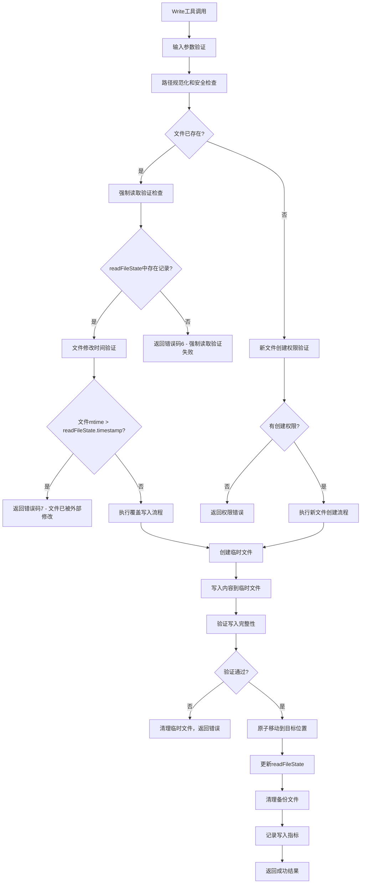

# Write工具实现文档

## 🎯 工具定位与职责

Write工具是"文档即软件"3.0系统中负责文件创建和内容写入的核心工具，与Edit工具共同构成完整的文件操作体系。基于对Claude Code的深度逆向分析，本工具严格遵循强制读取验证机制，确保所有写入操作都基于最新的文件状态，防止数据覆盖和冲突。

## 📋 核心功能定义

### 主要职责
1. **安全文件写入**: 创建新文件或覆盖现有文件内容，严格遵循安全验证机制
2. **强制读取验证**: 继承Edit工具的核心安全机制，确保写入前文件已被读取
3. **原子性操作**: 确保写入操作的原子性，防止部分写入造成的数据损坏
4. **备份恢复机制**: 提供自动备份和错误恢复功能
5. **编码智能处理**: 自动处理文件编码转换和BOM管理
6. **readFileState同步**: 写入后立即更新文件状态，保持与系统同步

### 安全特征
- **零覆盖风险**: 通过强制读取验证完全避免意外覆盖
- **原子写入**: 使用临时文件和原子移动确保数据完整性
- **权限集成**: 与统一权限系统深度集成
- **审计追踪**: 完整的写入操作日志和审计记录

## 🔧 内部工作逻辑

### 核心写入流程设计


### 核心算法实现

#### 1. 强制读取验证机制
```typescript
// 强制读取验证算法（继承自Edit工具）
function validateForceReadRequirement(
  filePath: string,
  readFileState: FileStateTracker
): ValidationResult {
  
  const absolutePath = path.resolve(filePath);
  
  // 检查readFileState中是否存在文件记录
  const fileState = readFileState[absolutePath];
  
  if (!fileState) {
    return {
      result: false,
      behavior: "ask",
      message: "File has not been read yet. Read it first before writing to it.",
      errorCode: 6  // 与Edit工具保持一致的错误码
    };
  }
  
  // 检查文件是否仍然存在
  if (!fs.existsSync(absolutePath)) {
    return {
      result: false,
      behavior: "ask",
      message: "File no longer exists. The readFileState may be stale.",
      errorCode: 4
    };
  }
  
  // 验证文件修改时间一致性
  const currentStats = fs.statSync(absolutePath);
  if (currentStats.mtimeMs > fileState.timestamp) {
    return {
      result: false,
      behavior: "ask",
      message: "File has been modified since read, either by the user or by a linter. Read it again before attempting to write it.",
      errorCode: 7
    };
  }
  
  return { result: true };
}
```

#### 2. 原子写入机制
```typescript
// 原子写入算法
async function performAtomicWrite(
  filePath: string,
  content: string,
  options: WriteOptions
): Promise<AtomicWriteResult> {
  
  const absolutePath = path.resolve(filePath);
  const tempPath = generateTempFilePath(absolutePath);
  const backupPath = options.createBackup ? generateBackupPath(absolutePath) : null;
  
  try {
    // 第1步：创建备份（如果文件存在且需要备份）
    if (backupPath && fs.existsSync(absolutePath)) {
      await fs.copyFile(absolutePath, backupPath);
    }
    
    // 第2步：写入临时文件
    await writeToTempFile(tempPath, content, options);
    
    // 第3步：验证临时文件完整性
    const verificationResult = await verifyTempFileIntegrity(tempPath, content, options);
    if (!verificationResult.isValid) {
      throw new WriteError(
        WriteErrorType.INTEGRITY_CHECK_FAILED,
        `Temporary file integrity check failed: ${verificationResult.reason}`,
        { tempPath, expectedSize: Buffer.byteLength(content, options.encoding) }
      );
    }
    
    // 第4步：原子移动到目标位置
    await atomicMove(tempPath, absolutePath);
    
    // 第5步：验证最终文件
    const finalVerification = await verifyFinalFile(absolutePath, content, options);
    if (!finalVerification.isValid) {
      // 恢复备份
      if (backupPath && fs.existsSync(backupPath)) {
        await fs.copyFile(backupPath, absolutePath);
      }
      throw new WriteError(
        WriteErrorType.FINAL_VERIFICATION_FAILED,
        `Final file verification failed: ${finalVerification.reason}`,
        { filePath: absolutePath }
      );
    }
    
    return {
      success: true,
      filePath: absolutePath,
      bytesWritten: Buffer.byteLength(content, options.encoding),
      backupPath: backupPath,
      tempPath: null // 临时文件已被移动
    };
    
  } catch (error) {
    // 清理临时文件
    if (fs.existsSync(tempPath)) {
      await fs.unlink(tempPath);
    }
    
    throw error;
  } finally {
    // 清理备份文件（如果配置为自动清理）
    if (backupPath && options.autoCleanupBackup && fs.existsSync(backupPath)) {
      setTimeout(() => {
        fs.unlink(backupPath).catch(console.error);
      }, options.backupRetentionTime || 3600000); // 默认1小时后清理
    }
  }
}

// 临时文件写入
async function writeToTempFile(
  tempPath: string,
  content: string,
  options: WriteOptions
): Promise<void> {
  
  // 确保临时文件目录存在
  const tempDir = path.dirname(tempPath);
  await fs.mkdir(tempDir, { recursive: true });
  
  // 根据编码处理内容
  const buffer = Buffer.from(content, options.encoding || 'utf8');
  
  // 添加BOM（如果需要）
  const finalBuffer = options.addBOM ? addBOMToBuffer(buffer, options.encoding) : buffer;
  
  // 写入临时文件
  await fs.writeFile(tempPath, finalBuffer, { 
    flag: 'w',
    mode: options.fileMode || 0o644
  });
}

// 原子移动操作
async function atomicMove(sourcePath: string, targetPath: string): Promise<void> {
  try {
    // 尝试原子重命名（同一文件系统）
    await fs.rename(sourcePath, targetPath);
  } catch (error) {
    // 如果重命名失败，则使用复制+删除（跨文件系统）
    if (error.code === 'EXDEV') {
      await fs.copyFile(sourcePath, targetPath);
      await fs.unlink(sourcePath);
    } else {
      throw error;
    }
  }
}
```

#### 3. 文件完整性验证
```typescript
// 文件完整性验证算法
async function verifyTempFileIntegrity(
  tempPath: string,
  expectedContent: string,
  options: WriteOptions
): Promise<IntegrityCheckResult> {
  
  try {
    // 1. 基础存在性检查
    if (!fs.existsSync(tempPath)) {
      return {
        isValid: false,
        reason: 'Temporary file does not exist'
      };
    }
    
    // 2. 文件大小验证
    const stats = await fs.stat(tempPath);
    const expectedSize = Buffer.byteLength(expectedContent, options.encoding || 'utf8');
    if (stats.size !== expectedSize) {
      return {
        isValid: false,
        reason: `Size mismatch: expected ${expectedSize}, got ${stats.size}`
      };
    }
    
    // 3. 内容哈希验证（可选，用于重要文件）
    if (options.enableHashVerification) {
      const actualContent = await fs.readFile(tempPath, { encoding: options.encoding || 'utf8' });
      const expectedHash = calculateContentHash(expectedContent);
      const actualHash = calculateContentHash(actualContent);
      
      if (expectedHash !== actualHash) {
        return {
          isValid: false,
          reason: `Content hash mismatch: expected ${expectedHash}, got ${actualHash}`
        };
      }
    }
    
    // 4. 编码验证
    if (options.validateEncoding) {
      const isValidEncoding = await validateFileEncoding(tempPath, options.encoding || 'utf8');
      if (!isValidEncoding) {
        return {
          isValid: false,
          reason: `Invalid encoding: file cannot be read as ${options.encoding}`
        };
      }
    }
    
    return {
      isValid: true,
      reason: 'All integrity checks passed'
    };
    
  } catch (error) {
    return {
      isValid: false,
      reason: `Integrity check failed: ${error.message}`
    };
  }
}

// 内容哈希计算
function calculateContentHash(content: string): string {
  return crypto.createHash('sha256').update(content, 'utf8').digest('hex');
}

// 编码验证
async function validateFileEncoding(filePath: string, encoding: string): Promise<boolean> {
  try {
    const buffer = await fs.readFile(filePath);
    const decodedContent = buffer.toString(encoding as BufferEncoding);
    const reEncodedBuffer = Buffer.from(decodedContent, encoding as BufferEncoding);
    
    // 检查重新编码后是否与原始内容一致
    return buffer.equals(reEncodedBuffer);
  } catch (error) {
    return false;
  }
}
```

#### 4. readFileState状态更新
```typescript
// readFileState状态更新机制
function updateReadFileStateAfterWrite(
  filePath: string,
  content: string,
  options: WriteOptions,
  readFileState: FileStateTracker
): void {
  
  const absolutePath = path.resolve(filePath);
  
  // 获取写入后的文件统计信息
  const fileStats = fs.statSync(absolutePath);
  
  // 计算新的内容哈希
  const contentHash = calculateContentHash(content);
  
  // 更新readFileState记录
  readFileState[absolutePath] = {
    content: content,
    timestamp: fileStats.mtimeMs, // 使用文件系统时间戳（而非逻辑时间）
    fileSystemTimestamp: fileStats.mtimeMs,
    size: fileStats.size,
    encoding: options.encoding || 'utf8',
    contentHash: contentHash,
    readOptions: {
      encoding: options.encoding
    },
    metadata: {
      fileType: detectFileType(absolutePath),
      readCount: (readFileState[absolutePath]?.metadata?.readCount || 0),
      lastAccessTime: Date.now(),
      permissions: fileStats.mode,
      
      // 写入相关元数据
      writeHistory: [
        ...(readFileState[absolutePath]?.metadata?.writeHistory || []),
        {
          timestamp: Date.now(),
          operation: 'write',
          bytesWritten: Buffer.byteLength(content, options.encoding || 'utf8'),
          encoding: options.encoding || 'utf8'
        }
      ].slice(-10), // 保留最近10次写入记录
      
      lastWriteTime: Date.now(),
      writeCount: (readFileState[absolutePath]?.metadata?.writeCount || 0) + 1
    }
  };
  
  // 记录状态更新事件
  logStateUpdateEvent({
    filePath: absolutePath,
    operation: 'write',
    newTimestamp: fileStats.mtimeMs,
    contentSize: content.length,
    encoding: options.encoding || 'utf8'
  });
}
```

#### 5. 新文件创建流程
```typescript
// 新文件创建算法
async function createNewFile(
  filePath: string,
  content: string,
  options: WriteOptions
): Promise<CreateFileResult> {
  
  const absolutePath = path.resolve(filePath);
  
  // 1. 验证父目录权限
  const parentDir = path.dirname(absolutePath);
  if (!fs.existsSync(parentDir)) {
    if (options.createDirectories) {
      await fs.mkdir(parentDir, { recursive: true });
    } else {
      throw new WriteError(
        WriteErrorType.PARENT_DIRECTORY_NOT_FOUND,
        `Parent directory does not exist: ${parentDir}`,
        { filePath: absolutePath, parentDir }
      );
    }
  }
  
  // 2. 检查文件是否已存在
  if (fs.existsSync(absolutePath)) {
    throw new WriteError(
      WriteErrorType.FILE_ALREADY_EXISTS,
      `File already exists: ${absolutePath}`,
      { filePath: absolutePath }
    );
  }
  
  // 3. 验证文件名合法性
  const fileName = path.basename(absolutePath);
  if (!isValidFileName(fileName)) {
    throw new WriteError(
      WriteErrorType.INVALID_FILE_NAME,
      `Invalid file name: ${fileName}`,
      { filePath: absolutePath, fileName }
    );
  }
  
  // 4. 执行原子写入
  const writeResult = await performAtomicWrite(absolutePath, content, options);
  
  // 5. 设置文件权限
  if (options.fileMode) {
    await fs.chmod(absolutePath, options.fileMode);
  }
  
  // 6. 更新readFileState（新文件也需要状态记录）
  const readFileState = options.readFileState || {};
  updateReadFileStateAfterWrite(absolutePath, content, options, readFileState);
  
  return {
    success: true,
    filePath: absolutePath,
    isNewFile: true,
    bytesWritten: writeResult.bytesWritten,
    encoding: options.encoding || 'utf8'
  };
}

// 文件名合法性验证
function isValidFileName(fileName: string): boolean {
  // 检查非法字符
  const illegalChars = /[<>:"/\\|?*\x00-\x1f]/;
  if (illegalChars.test(fileName)) {
    return false;
  }
  
  // 检查保留名称（Windows）
  const reservedNames = /^(CON|PRN|AUX|NUL|COM[1-9]|LPT[1-9])(\.|$)/i;
  if (reservedNames.test(fileName)) {
    return false;
  }
  
  // 检查长度限制
  if (fileName.length > 255) {
    return false;
  }
  
  // 检查特殊情况
  if (fileName === '.' || fileName === '..' || fileName.trim() === '') {
    return false;
  }
  
  return true;
}
```

## 🔌 对外接口关系

### 输入接口规范
```typescript
interface WriteToolInput {
  // 必需参数
  file_path: string;                    // 目标文件绝对路径
  content: string;                      // 要写入的内容
  
  // 编码选项
  encoding?: string;                    // 文件编码（默认utf-8）
  add_bom?: boolean;                    // 是否添加BOM（默认false）
  
  // 写入模式
  overwrite?: boolean;                  // 是否允许覆盖（默认true）
  create_directories?: boolean;         // 是否创建父目录（默认true）
  
  // 安全选项
  create_backup?: boolean;              // 是否创建备份（默认true）
  enable_hash_verification?: boolean;   // 是否启用哈希验证（默认false）
  validate_encoding?: boolean;          // 是否验证编码（默认true）
  
  // 权限选项
  file_mode?: number;                   // 文件权限模式（默认0o644）
  
  // 性能选项
  atomic_write?: boolean;               // 是否使用原子写入（默认true）
  sync_after_write?: boolean;           // 写入后是否同步到磁盘（默认false）
  
  // 清理选项
  auto_cleanup_backup?: boolean;        // 是否自动清理备份（默认true）
  backup_retention_time?: number;       // 备份保留时间（默认1小时）
}
```

### 输出接口规范
```typescript
interface WriteToolOutput {
  // 基础返回信息
  success: boolean;                     // 操作是否成功
  file_path: string;                    // 实际写入的文件路径
  
  // 操作结果
  bytes_written: number;                // 写入的字节数
  encoding_used: string;                // 实际使用的编码
  is_new_file: boolean;                 // 是否为新创建的文件
  
  // 文件信息
  file_info: {
    size: number;                       // 文件大小
    mode: number;                       // 文件权限
    mtime: number;                      // 修改时间戳
    content_hash: string;               // 内容哈希
  };
  
  // 操作详情
  operation_details: {
    backup_created: boolean;            // 是否创建了备份
    backup_path?: string;               // 备份文件路径
    atomic_write_used: boolean;         // 是否使用了原子写入
    verification_passed: boolean;       // 验证是否通过
  };
  
  // 状态更新信息
  state_update: {
    read_file_state_updated: boolean;   // 是否更新了readFileState
    state_key: string;                  // 状态键名
    timestamp: number;                  // 状态时间戳
  };
  
  // 性能信息
  performance: {
    write_time: number;                 // 写入耗时（毫秒）
    verification_time: number;          // 验证耗时（毫秒）
    total_time: number;                 // 总耗时（毫秒）
  };
  
  // 错误信息（失败时）
  error?: {
    type: WriteErrorType;               // 错误类型
    message: string;                    // 错误描述
    context?: any;                      // 错误上下文
    recovery_suggestions?: string[];    // 恢复建议
  };
}
```

### 与其他组件的接口
```typescript
// 与Read工具的协作接口
interface WriteReadIntegration {
  // 验证文件读取状态
  validateReadState(filePath: string): ReadStateValidation;
  
  // 检查文件是否需要重新读取
  requiresReRead(filePath: string): boolean;
  
  // 获取推荐的读取选项
  getRecommendedReadOptions(filePath: string): ReadOptions;
}

// 与Edit工具的协作接口
interface WriteEditIntegration {
  // 共享验证机制
  shareValidationMechanism(): ValidationMechanism;
  
  // 同步错误码体系
  syncErrorCodes(): ErrorCodeMapping;
  
  // 协调状态更新
  coordinateStateUpdate(filePath: string, operation: Operation): void;
}

// 与权限系统的接口
interface WritePermissionIntegration {
  // 检查写入权限
  checkWritePermission(filePath: string, context: PermissionContext): Promise<PermissionResult>;
  
  // 检查创建权限
  checkCreatePermission(parentDir: string, context: PermissionContext): Promise<PermissionResult>;
  
  // 记录写入操作日志
  logWriteOperation(filePath: string, result: WriteResult): void;
}
```

## 🔄 通信协议设计

### 写入请求协议
```typescript
// 写入请求格式
interface WriteRequest {
  // 请求标识
  requestId: string;                    // 请求唯一标识
  timestamp: number;                    // 请求时间戳
  sessionId: string;                    // 会话标识
  
  // 写入参数
  targetPath: string;                   // 目标文件路径
  content: string;                      // 写入内容
  options: WriteOptions;                // 写入选项
  
  // 安全上下文
  securityContext: {
    userId?: string;                    // 用户标识
    permissions: Permission[];          // 权限列表
    allowOverwrite: boolean;            // 是否允许覆盖
    requireBackup: boolean;             // 是否要求备份
  };
  
  // 验证要求
  validationRequirements: {
    enforceReadState: boolean;          // 是否强制验证读取状态
    requireIntegrityCheck: boolean;     // 是否要求完整性检查
    validateEncoding: boolean;          // 是否验证编码
  };
}

// 写入响应协议
interface WriteResponse {
  // 响应标识
  requestId: string;                    // 对应的请求ID
  timestamp: number;                    // 响应时间戳
  
  // 响应状态
  status: 'success' | 'error' | 'warning';
  
  // 响应数据
  data?: WriteToolOutput;
  error?: WriteError;
  warnings?: WriteWarning[];
  
  // 验证结果
  validationResults: {
    readStateValidation: ValidationResult;
    integrityCheck: IntegrityCheckResult;
    permissionCheck: PermissionResult;
  };
  
  // 操作追踪
  operationTrace: OperationStep[];
}
```

### 状态同步协议
```typescript
// 状态同步接口
interface WriteStateSynchronization {
  // 写入前状态检查
  preWriteStateCheck(filePath: string): Promise<StateCheckResult>;
  
  // 写入后状态更新
  postWriteStateUpdate(filePath: string, writeResult: WriteResult): Promise<void>;
  
  // 状态冲突解决
  resolveStateConflict(conflict: StateConflict): Promise<ConflictResolution>;
  
  // 状态广播
  broadcastStateChange(change: StateChange): void;
}

// 状态检查结果
interface StateCheckResult {
  isValid: boolean;                     // 状态是否有效
  readStateExists: boolean;             // 读取状态是否存在
  fileModified: boolean;                // 文件是否被修改
  conflictDetected: boolean;            // 是否检测到冲突
  
  recommendations: {
    requireReRead: boolean;             // 是否需要重新读取
    createBackup: boolean;              // 是否建议创建备份
    useAtomicWrite: boolean;            // 是否建议原子写入
  };
}
```

## 🏗️ 状态管理机制

### 写入状态跟踪
```typescript
enum WriteOperationState {
  INITIALIZING = 'initializing',        // 初始化中
  VALIDATING = 'validating',            // 验证中
  BACKING_UP = 'backing_up',            // 创建备份中
  WRITING = 'writing',                  // 写入中
  VERIFYING = 'verifying',              // 验证中
  FINALIZING = 'finalizing',            // 完成中
  COMPLETED = 'completed',              // 已完成
  FAILED = 'failed',                    // 失败
  ROLLED_BACK = 'rolled_back'           // 已回滚
}

interface WriteOperationTracker {
  // 操作标识
  operationId: string;                  // 操作唯一标识
  startTime: number;                    // 开始时间
  
  // 当前状态
  currentState: WriteOperationState;    // 当前状态
  stateHistory: StateTransition[];      // 状态历史
  
  // 操作信息
  filePath: string;                     // 目标文件路径
  contentSize: number;                  // 内容大小
  options: WriteOptions;                // 写入选项
  
  // 进度信息
  progress: {
    bytesWritten: number;               // 已写入字节数
    percentage: number;                 // 完成百分比
    estimatedTimeRemaining: number;     // 预估剩余时间
  };
  
  // 资源使用
  resources: {
    tempFilePath?: string;              // 临时文件路径
    backupFilePath?: string;            // 备份文件路径
    memoryUsed: number;                 // 内存使用量
  };
}

// 状态管理器
class WriteStateManager {
  private activeOperations: Map<string, WriteOperationTracker> = new Map();
  private completedOperations: WriteOperationTracker[] = [];
  
  // 开始写入操作跟踪
  startOperation(
    filePath: string,
    content: string,
    options: WriteOptions
  ): string {
    const operationId = generateOperationId();
    
    const tracker: WriteOperationTracker = {
      operationId: operationId,
      startTime: Date.now(),
      currentState: WriteOperationState.INITIALIZING,
      stateHistory: [],
      filePath: path.resolve(filePath),
      contentSize: Buffer.byteLength(content, options.encoding || 'utf8'),
      options: options,
      progress: {
        bytesWritten: 0,
        percentage: 0,
        estimatedTimeRemaining: 0
      },
      resources: {
        memoryUsed: 0
      }
    };
    
    this.activeOperations.set(operationId, tracker);
    this.transitionState(operationId, WriteOperationState.VALIDATING);
    
    return operationId;
  }
  
  // 状态转换
  transitionState(operationId: string, newState: WriteOperationState): void {
    const tracker = this.activeOperations.get(operationId);
    if (!tracker) {
      return;
    }
    
    const transition: StateTransition = {
      from: tracker.currentState,
      to: newState,
      timestamp: Date.now()
    };
    
    tracker.stateHistory.push(transition);
    tracker.currentState = newState;
    
    // 更新进度
    this.updateProgress(operationId, newState);
    
    // 通知状态变更
    this.notifyStateChange(operationId, transition);
  }
  
  // 更新进度信息
  updateProgress(operationId: string, state: WriteOperationState): void {
    const tracker = this.activeOperations.get(operationId);
    if (!tracker) {
      return;
    }
    
    // 根据状态估算进度百分比
    const progressMap = {
      [WriteOperationState.INITIALIZING]: 0,
      [WriteOperationState.VALIDATING]: 10,
      [WriteOperationState.BACKING_UP]: 25,
      [WriteOperationState.WRITING]: 60,
      [WriteOperationState.VERIFYING]: 85,
      [WriteOperationState.FINALIZING]: 95,
      [WriteOperationState.COMPLETED]: 100,
      [WriteOperationState.FAILED]: 0,
      [WriteOperationState.ROLLED_BACK]: 0
    };
    
    tracker.progress.percentage = progressMap[state] || 0;
    
    // 估算剩余时间
    const elapsedTime = Date.now() - tracker.startTime;
    if (tracker.progress.percentage > 0) {
      const totalEstimatedTime = elapsedTime / (tracker.progress.percentage / 100);
      tracker.progress.estimatedTimeRemaining = totalEstimatedTime - elapsedTime;
    }
  }
}
```

### 错误状态恢复
```typescript
// 错误恢复状态管理
interface WriteErrorRecoveryState {
  // 错误信息
  originalError: WriteError;            // 原始错误
  recoveryAttempts: number;             // 恢复尝试次数
  maxRecoveryAttempts: number;          // 最大恢复次数
  
  // 恢复状态
  isRecovering: boolean;                // 是否正在恢复
  recoveryStrategy: RecoveryStrategy;   // 恢复策略
  recoveryStartTime: number;            // 恢复开始时间
  
  // 备份信息
  backupAvailable: boolean;             // 是否有备份可用
  backupPath?: string;                  // 备份文件路径
  
  // 用户交互
  requiresUserInput: boolean;           // 是否需要用户输入
  userChoices?: UserChoice[];           // 用户选择项
}

class WriteErrorRecoveryManager {
  // 尝试自动恢复
  async attemptAutoRecovery(
    operationId: string,
    error: WriteError
  ): Promise<RecoveryResult> {
    
    const recoveryState: WriteErrorRecoveryState = {
      originalError: error,
      recoveryAttempts: 0,
      maxRecoveryAttempts: 3,
      isRecovering: true,
      recoveryStrategy: this.selectRecoveryStrategy(error),
      recoveryStartTime: Date.now(),
      backupAvailable: false,
      requiresUserInput: false
    };
    
    // 根据错误类型选择恢复策略
    switch (error.type) {
      case WriteErrorType.PERMISSION_DENIED:
        return await this.recoverFromPermissionError(operationId, recoveryState);
        
      case WriteErrorType.DISK_FULL:
        return await this.recoverFromDiskFullError(operationId, recoveryState);
        
      case WriteErrorType.FILE_LOCKED:
        return await this.recoverFromFileLockError(operationId, recoveryState);
        
      case WriteErrorType.INTEGRITY_CHECK_FAILED:
        return await this.recoverFromIntegrityError(operationId, recoveryState);
        
      default:
        return { success: false, requiresManualIntervention: true };
    }
  }
  
  // 权限错误恢复
  async recoverFromPermissionError(
    operationId: string,
    recoveryState: WriteErrorRecoveryState
  ): Promise<RecoveryResult> {
    
    // 尝试提升权限
    try {
      const tracker = this.getOperationTracker(operationId);
      if (!tracker) {
        return { success: false, error: new Error('Operation tracker not found') };
      }
      
      // 检查是否可以通过修改文件权限解决
      const filePath = tracker.filePath;
      const parentDir = path.dirname(filePath);
      
      if (await this.canModifyPermissions(parentDir)) {
        // 尝试修改权限
        await this.adjustFilePermissions(filePath);
        
        // 重新尝试写入
        return await this.retryWriteOperation(operationId);
      }
      
      // 需要管理员权限或用户干预
      return {
        success: false,
        requiresManualIntervention: true,
        suggestedActions: [
          'Check file and directory permissions',
          'Run with administrator privileges',
          'Choose a different file location'
        ]
      };
      
    } catch (error) {
      return { success: false, error: error };
    }
  }
}
```

## ⚠️ 错误处理策略

### 错误分类体系
```typescript
enum WriteErrorType {
  // 验证错误
  FORCE_READ_VALIDATION_FAILED = 'force_read_validation_failed',  // 强制读取验证失败（错误码6）
  FILE_MODIFIED_EXTERNALLY = 'file_modified_externally',          // 文件被外部修改（错误码7）
  VALIDATION_ERROR = 'validation_error',                          // 一般验证错误
  
  // 文件系统错误
  FILE_NOT_FOUND = 'file_not_found',                             // 文件不存在
  FILE_ALREADY_EXISTS = 'file_already_exists',                   // 文件已存在
  PARENT_DIRECTORY_NOT_FOUND = 'parent_directory_not_found',     // 父目录不存在
  PERMISSION_DENIED = 'permission_denied',                       // 权限拒绝
  DISK_FULL = 'disk_full',                                       // 磁盘空间不足
  FILE_LOCKED = 'file_locked',                                   // 文件被锁定
  
  // 内容错误
  INVALID_CONTENT = 'invalid_content',                           // 内容无效
  ENCODING_ERROR = 'encoding_error',                             // 编码错误
  CONTENT_TOO_LARGE = 'content_too_large',                       // 内容过大
  
  // 操作错误
  ATOMIC_WRITE_FAILED = 'atomic_write_failed',                   // 原子写入失败
  BACKUP_CREATION_FAILED = 'backup_creation_failed',             // 备份创建失败
  INTEGRITY_CHECK_FAILED = 'integrity_check_failed',             // 完整性检查失败
  FINAL_VERIFICATION_FAILED = 'final_verification_failed',       // 最终验证失败
  
  // 系统错误
  IO_ERROR = 'io_error',                                         // IO错误
  MEMORY_ERROR = 'memory_error',                                 // 内存错误
  TIMEOUT_ERROR = 'timeout_error',                               // 超时错误
  SYSTEM_ERROR = 'system_error'                                  // 系统错误
}

class WriteError extends Error {
  constructor(
    public readonly type: WriteErrorType,
    message: string,
    public readonly context?: any,
    public readonly recoverable: boolean = true,
    public readonly errorCode?: number
  ) {
    super(message);
    this.name = 'WriteError';
  }
  
  // 获取错误码（与Edit工具保持一致）
  getErrorCode(): number {
    if (this.errorCode !== undefined) {
      return this.errorCode;
    }
    
    // 映射到标准错误码
    const errorCodeMap = {
      [WriteErrorType.FORCE_READ_VALIDATION_FAILED]: 6,
      [WriteErrorType.FILE_MODIFIED_EXTERNALLY]: 7,
      [WriteErrorType.FILE_NOT_FOUND]: 4,
      [WriteErrorType.PERMISSION_DENIED]: 2,
      [WriteErrorType.VALIDATION_ERROR]: 1
    };
    
    return errorCodeMap[this.type] || 999; // 默认错误码
  }
  
  // 生成用户友好消息
  toUserMessage(): string {
    switch (this.type) {
      case WriteErrorType.FORCE_READ_VALIDATION_FAILED:
        return `File has not been read yet. Read it first before writing to it. (Error code: ${this.getErrorCode()})`;
      case WriteErrorType.FILE_MODIFIED_EXTERNALLY:
        return `File has been modified since read, either by the user or by a linter. Read it again before attempting to write it. (Error code: ${this.getErrorCode()})`;
      case WriteErrorType.PERMISSION_DENIED:
        return `Permission denied: Cannot write to file ${this.context?.filePath || 'unknown'}`;
      case WriteErrorType.DISK_FULL:
        return `Insufficient disk space: Cannot write file ${this.context?.filePath || 'unknown'}`;
      case WriteErrorType.FILE_LOCKED:
        return `File is locked: Cannot write to ${this.context?.filePath || 'unknown'}`;
      default:
        return this.message;
    }
  }
}
```

### 错误恢复策略
```typescript
interface WriteErrorRecoveryStrategy {
  // 错误检测
  canRecover(error: WriteError): boolean;
  
  // 恢复操作
  recover(error: WriteError, context: RecoveryContext): Promise<RecoveryResult>;
  
  // 预防措施
  preventSimilarError(error: WriteError): void;
}

class WriteErrorRecoveryRegistry {
  private strategies: Map<WriteErrorType, WriteErrorRecoveryStrategy> = new Map();
  
  constructor() {
    this.initializeRecoveryStrategies();
  }
  
  private initializeRecoveryStrategies(): void {
    // 强制读取验证失败恢复
    this.strategies.set(WriteErrorType.FORCE_READ_VALIDATION_FAILED, {
      canRecover: () => true,
      recover: async (error, context) => {
        // 建议用户先读取文件
        return {
          success: false,
          requiresUserAction: true,
          suggestedActions: [
            `Read the file first using the Read tool: ${error.context?.filePath}`,
            'Then retry the write operation'
          ],
          nextSteps: [
            {
              tool: 'Read',
              parameters: { file_path: error.context?.filePath }
            }
          ]
        };
      },
      preventSimilarError: (error) => {
        // 记录常见的违规模式
        this.recordViolationPattern(error.context);
      }
    });
    
    // 文件被外部修改恢复
    this.strategies.set(WriteErrorType.FILE_MODIFIED_EXTERNALLY, {
      canRecover: () => true,
      recover: async (error, context) => {
        return {
          success: false,
          requiresUserAction: true,
          suggestedActions: [
            'The file has been modified since you last read it',
            'Read the file again to see the latest changes',
            'Then retry the write operation'
          ],
          nextSteps: [
            {
              tool: 'Read',
              parameters: { file_path: error.context?.filePath }
            }
          ]
        };
      },
      preventSimilarError: (error) => {
        // 建议启用文件监控
        this.suggestFileMonitoring(error.context?.filePath);
      }
    });
    
    // 磁盘空间不足恢复
    this.strategies.set(WriteErrorType.DISK_FULL, {
      canRecover: (error) => error.context?.availableSpace > 0,
      recover: async (error, context) => {
        // 尝试清理临时文件
        const cleanupResult = await this.cleanupTempFiles();
        
        if (cleanupResult.spaceFreed > error.context?.requiredSpace) {
          // 重试写入操作
          return await this.retryWriteOperation(context.operationId);
        }
        
        return {
          success: false,
          requiresUserAction: true,
          suggestedActions: [
            'Free up disk space',
            'Choose a different location with more space',
            `Required: ${error.context?.requiredSpace} bytes, Available: ${error.context?.availableSpace} bytes`
          ]
        };
      },
      preventSimilarError: (error) => {
        // 启用磁盘空间监控
        this.enableDiskSpaceMonitoring();
      }
    });
  }
}
```

## 📊 性能监控与优化

### 性能指标定义
```typescript
interface WritePerformanceMetrics {
  // 写入统计
  writeStats: {
    totalWrites: number;                // 总写入次数
    successfulWrites: number;           // 成功写入次数
    failedWrites: number;               // 失败写入次数
    avgWriteTime: number;               // 平均写入时间
    avgFileSize: number;                // 平均文件大小
    throughputBytesPerSecond: number;   // 吞吐量（字节/秒）
  };
  
  // 操作分解统计
  operationBreakdown: {
    validationTime: number;             // 验证耗时
    backupTime: number;                 // 备份耗时
    actualWriteTime: number;            // 实际写入耗时
    verificationTime: number;           // 验证耗时
    stateUpdateTime: number;            // 状态更新耗时
  };
  
  // 原子操作统计
  atomicOperationStats: {
    tempFileCreationTime: number;       // 临时文件创建时间
    atomicMoveTime: number;             // 原子移动时间
    integrityCheckTime: number;         // 完整性检查时间
    rollbackTime: number;               // 回滚时间
  };
  
  // 错误恢复统计
  recoveryStats: {
    recoveryAttempts: number;           // 恢复尝试次数
    successfulRecoveries: number;       // 成功恢复次数
    avgRecoveryTime: number;            // 平均恢复时间
    userInterventionRequired: number;   // 需要用户干预次数
  };
  
  // 资源使用统计
  resourceUsage: {
    peakMemoryUsage: number;            // 峰值内存使用
    temporaryDiskUsage: number;         // 临时磁盘使用
    fileDescriptorUsage: number;        // 文件描述符使用
  };
}
```

### 性能优化策略
```typescript
class WritePerformanceOptimizer {
  // 自适应写入缓冲区优化
  optimizeWriteBuffer(metrics: WritePerformanceMetrics): BufferConfiguration {
    const avgFileSize = metrics.writeStats.avgFileSize;
    const avgWriteTime = metrics.writeStats.avgWriteTime;
    
    // 根据文件大小和写入时间调整缓冲区
    let bufferSize = 64 * 1024; // 64KB baseline
    
    if (avgFileSize > 1024 * 1024 && avgWriteTime < 100) {
      // 大文件快速写入：增加缓冲区
      bufferSize = Math.min(2 * 1024 * 1024, avgFileSize / 10);
    } else if (avgFileSize < 10 * 1024 && avgWriteTime > 50) {
      // 小文件慢写入：减少缓冲区开销
      bufferSize = Math.max(4096, avgFileSize);
    }
    
    return {
      bufferSize: bufferSize,
      enableBuffering: avgFileSize > bufferSize,
      flushPolicy: avgWriteTime > 200 ? 'immediate' : 'batch'
    };
  }
  
  // 原子操作优化
  optimizeAtomicOperations(metrics: WritePerformanceMetrics): AtomicConfiguration {
    const tempFileTime = metrics.atomicOperationStats.tempFileCreationTime;
    const moveTime = metrics.atomicOperationStats.atomicMoveTime;
    
    return {
      // 如果临时文件创建很快，可以启用更积极的原子操作
      enableAggressiveAtomic: tempFileTime < 10,
      
      // 如果移动操作很慢，可能需要考虑不同的策略
      preferCopyMove: moveTime > 100,
      
      // 临时文件位置优化
      tempFileLocation: moveTime > 50 ? 'same_filesystem' : 'default',
      
      // 并发写入限制
      maxConcurrentWrites: tempFileTime > 50 ? 2 : 5
    };
  }
  
  // 验证优化
  optimizeValidation(metrics: WritePerformanceMetrics): ValidationConfiguration {
    const validationTime = metrics.operationBreakdown.validationTime;
    const verificationTime = metrics.operationBreakdown.verificationTime;
    const totalTime = metrics.writeStats.avgWriteTime;
    
    // 如果验证时间占总时间比例过高，需要优化
    const validationRatio = (validationTime + verificationTime) / totalTime;
    
    return {
      enableHashVerification: validationRatio < 0.3, // 验证时间少于30%才启用哈希
      skipEncodingValidation: validationRatio > 0.5,  // 验证时间超过50%则跳过编码验证
      enableQuickValidation: validationRatio > 0.2,   // 启用快速验证模式
      batchValidation: true                            // 批量验证
    };
  }
}
```

## 🔧 配置参数规范

### 基础配置
```typescript
interface WriteConfiguration {
  // 安全设置
  enforceReadState: boolean;            // 强制读取状态验证（true）
  enableAtomicWrite: boolean;           // 启用原子写入（true）
  createBackupByDefault: boolean;       // 默认创建备份（true）
  enableIntegrityCheck: boolean;        // 启用完整性检查（false）
  
  // 性能设置
  writeBufferSize: number;              // 写入缓冲区大小（64KB）
  maxFileSize: number;                  // 最大文件大小（100MB）
  writeTimeout: number;                 // 写入超时（30秒）
  enableParallelValidation: boolean;    // 启用并行验证（true）
  
  // 编码设置
  defaultEncoding: string;              // 默认编码（utf-8）
  autoDetectEncoding: boolean;          // 自动检测编码（true）
  addBOMByDefault: boolean;             // 默认添加BOM（false）
  validateEncoding: boolean;            // 验证编码（true）
  
  // 权限设置
  defaultFileMode: number;              // 默认文件权限（0o644）
  createDirectories: boolean;           // 自动创建目录（true）
  allowOverwrite: boolean;              // 允许覆盖（true）
  
  // 错误处理
  maxRetryAttempts: number;             // 最大重试次数（3）
  enableAutoRecovery: boolean;          // 启用自动恢复（true）
  rollbackOnFailure: boolean;           // 失败时回滚（true）
}
```

### 高级配置
```typescript
interface AdvancedWriteConfiguration {
  // 原子操作配置
  atomicOperations: {
    tempFilePrefix: string;             // 临时文件前缀（.tmp_）
    tempFileLocation: 'same_dir' | 'temp_dir' | 'memory'; // 临时文件位置
    enableTransactions: boolean;        // 启用事务（false）
    transactionLogPath?: string;        // 事务日志路径
  };
  
  // 备份配置
  backup: {
    backupDirectory?: string;           // 备份目录
    backupNamingScheme: 'timestamp' | 'sequential' | 'hash'; // 备份命名方案
    maxBackupsPerFile: number;          // 每个文件最大备份数（5）
    backupCompression: boolean;         // 备份压缩（false）
    autoCleanupOldBackups: boolean;     // 自动清理旧备份（true）
  };
  
  // 验证配置
  validation: {
    enableCRC32Check: boolean;          // 启用CRC32检查（false）
    enableSHA256Check: boolean;         // 启用SHA256检查（false）
    enableContentTypeValidation: boolean; // 启用内容类型验证（true）
    enablePathSafetyCheck: boolean;     // 启用路径安全检查（true）
  };
  
  // 监控配置
  monitoring: {
    enablePerformanceMetrics: boolean;  // 启用性能指标（false）
    enableOperationTracing: boolean;    // 启用操作追踪（false）
    enableErrorReporting: boolean;      // 启用错误报告（true）
    metricsExportInterval: number;      // 指标导出间隔（60秒）
  };
}
```

---

*本文档通过精确的自然语言描述，完整定义了Write工具的实现细节。从强制读取验证机制到原子写入算法，从状态同步管理到错误恢复策略，每个技术细节都以标准化的文档形式呈现，与Edit和Read工具形成完整的文件操作体系，体现了"文档即软件"3.0在核心工具设计上的系统性和精确性。*