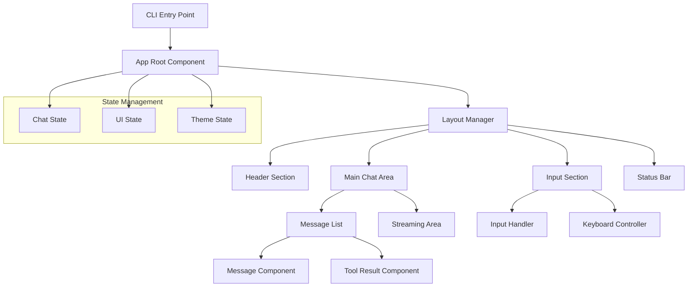

# UI组件系统 - React/Ink界面组件规范

## 🎯 系统定位与职责

UI组件系统是Claude Code用户交互的核心界面层，基于React和Ink技术栈构建现代化的命令行界面。本系统精确还原了Claude Code的交互体验，包括实时消息流、进度显示、状态管理和键盘交互等核心特性。

### 核心职责
- **实时交互界面**: 流式消息显示、实时状态更新、响应式布局
- **用户输入处理**: 智能输入解析、快捷键支持、历史记录管理
- **状态可视化**: Agent状态指示、工具执行进度、错误信息展示
- **主题与样式**: 可定制主题系统、自适应布局、无障碍访问

## 📋 核心组件清单

### 主要界面组件
1. **ChatComponent** (`chat-component.md`) - ⭐ 主聊天界面，消息渲染、输入处理
2. **MessageComponent** - 单条消息显示，支持多种内容类型
3. **StreamingComponent** - 流式消息渲染，实时内容更新
4. **InputComponent** - 智能输入框，自动补全、历史记录

### 状态显示组件
5. **StatusComponent** - 系统状态指示器，连接状态、模式显示
6. **ProgressComponent** - 进度条组件，任务进度、加载指示
7. **ToolStatusComponent** - 工具执行状态，并发任务显示
8. **ErrorComponent** - 错误信息展示，错误分类、恢复建议

### 交互控制组件
9. **KeyboardHandler** - 键盘事件处理，快捷键绑定、模式切换
10. **ScrollController** - 滚动控制，自动滚动、位置记忆
11. **ContextMenu** - 右键菜单，操作快捷入口
12. **HelpOverlay** - 帮助信息覆盖层，使用指南、快捷键列表

### 布局容器组件
13. **LayoutManager** - 布局管理器，响应式布局、窗口适配
14. **SplitPane** - 分割面板，多窗格显示、大小调整
15. **TabContainer** - 标签容器，多会话管理、标签切换

## 🏗️ 组件架构设计

### React/Ink集成架构


### 状态管理层次
```typescript
// 全局UI状态接口
export interface UIGlobalState {
  // 主题配置
  theme: ThemeConfig;
  
  // 布局状态
  layout: {
    windowSize: { width: number; height: number };
    splitRatios: number[];
    activePane: string;
    isFullscreen: boolean;
  };
  
  // 交互状态
  interaction: {
    isInputFocused: boolean;
    currentMode: 'normal' | 'plan' | 'help';
    selectedMessage?: string;
    contextMenuVisible: boolean;
  };
  
  // 显示设置
  display: {
    showTimestamps: boolean;
    showLineNumbers: boolean;
    wordWrap: boolean;
    fontSize: 'small' | 'medium' | 'large';
  };
}
```

## 🎨 主题系统设计

### 主题配置接口
```typescript
export interface ThemeConfig {
  // 基础颜色
  colors: {
    primary: string;      // 主色调
    secondary: string;    // 次要色调
    background: string;   // 背景色
    surface: string;      // 表面色
    text: string;         // 文本色
    textSecondary: string; // 次要文本色
    border: string;       // 边框色
    accent: string;       // 强调色
    success: string;      // 成功色
    warning: string;      // 警告色
    error: string;        // 错误色
  };
  
  // 字体配置
  fonts: {
    primary: string;      // 主字体
    monospace: string;    // 等宽字体
    sizes: {
      small: number;
      medium: number;
      large: number;
    };
  };
  
  // 间距配置
  spacing: {
    xs: number;
    sm: number;
    md: number;
    lg: number;
    xl: number;
  };
  
  // 动画配置
  animations: {
    duration: {
      fast: number;
      normal: number;
      slow: number;
    };
    easing: string;
  };
}
```

### 预定义主题
```typescript
// 内置主题配置
export const themes: Record<string, ThemeConfig> = {
  // 深色主题（默认）
  dark: {
    colors: {
      primary: '#3B82F6',
      secondary: '#6B7280',
      background: '#0F172A',
      surface: '#1E293B',
      text: '#F8FAFC',
      textSecondary: '#CBD5E1',
      border: '#334155',
      accent: '#06B6D4',
      success: '#10B981',
      warning: '#F59E0B',
      error: '#EF4444'
    }
    // ... 其他配置
  },
  
  // 浅色主题
  light: {
    colors: {
      primary: '#2563EB',
      secondary: '#6B7280',
      background: '#FFFFFF',
      surface: '#F8FAFC',
      text: '#0F172A',
      textSecondary: '#475569',
      border: '#E2E8F0',
      accent: '#0891B2',
      success: '#059669',
      warning: '#D97706',
      error: '#DC2626'
    }
    // ... 其他配置
  }
};
```

## 🎮 交互体验设计

### 键盘快捷键系统
```typescript
export interface KeyboardShortcuts {
  // 全局快捷键
  global: {
    'Ctrl+C': 'interrupt_current_task';
    'Ctrl+D': 'exit_application';
    'Ctrl+L': 'clear_screen';
    'Ctrl+R': 'refresh_session';
    'F1': 'show_help';
    'F11': 'toggle_fullscreen';
  };
  
  // 输入区快捷键
  input: {
    'Enter': 'send_message';
    'Shift+Enter': 'new_line';
    'Ctrl+Enter': 'send_with_mode';
    'Tab': 'auto_complete';
    'Ctrl+Z': 'undo_input';
    'Ctrl+Y': 'redo_input';
    'Up': 'history_previous';
    'Down': 'history_next';
  };
  
  // 消息区快捷键
  messages: {
    'Ctrl+Up': 'scroll_to_top';
    'Ctrl+Down': 'scroll_to_bottom';
    'PageUp': 'scroll_page_up';
    'PageDown': 'scroll_page_down';
    'Ctrl+F': 'search_messages';
    'Escape': 'cancel_selection';
  };
  
  // 模式切换快捷键
  modes: {
    'Shift+Tab': 'cycle_plan_mode';
    'Ctrl+P': 'toggle_plan_mode';
    'Ctrl+N': 'new_session';
    'Ctrl+S': 'save_session';
  };
}
```

### 鼠标/触控交互
```typescript
export interface MouseInteractions {
  // 消息交互
  messageActions: {
    'click': 'select_message';
    'double-click': 'copy_message';
    'right-click': 'show_context_menu';
    'ctrl+click': 'multi_select';
  };
  
  // 工具结果交互
  toolResultActions: {
    'click': 'expand_collapse';
    'ctrl+click': 'copy_result';
    'right-click': 'show_tool_menu';
  };
  
  // 输入区交互
  inputActions: {
    'focus': 'enable_input_mode';
    'blur': 'disable_input_mode';
    'paste': 'handle_paste_content';
  };
}
```

## ⚡ 性能优化策略

### 虚拟化渲染
```typescript
// 大列表虚拟化组件
export class VirtualizedMessageList extends React.Component {
  private virtualizer: VirtualizerInstance;
  
  // 计算可见区域
  calculateVisibleRange(): { start: number; end: number } {
    const scrollTop = this.containerRef.current?.scrollTop || 0;
    const containerHeight = this.containerRef.current?.clientHeight || 0;
    
    const start = Math.floor(scrollTop / this.itemHeight);
    const end = Math.min(
      start + Math.ceil(containerHeight / this.itemHeight) + 1,
      this.props.messages.length
    );
    
    return { start, end };
  }
  
  // 渲染可见项目
  renderVisibleItems(): ReactElement[] {
    const { start, end } = this.calculateVisibleRange();
    const visibleMessages = this.props.messages.slice(start, end);
    
    return visibleMessages.map((message, index) => (
      <MessageComponent
        key={message.id}
        message={message}
        index={start + index}
        style={{
          position: 'absolute',
          top: (start + index) * this.itemHeight,
          height: this.itemHeight
        }}
      />
    ));
  }
}
```

### 流式渲染优化
```typescript
// 流式内容渲染器
export class StreamingRenderer {
  private buffer: string = '';
  private renderQueue: Array<RenderTask> = [];
  private isRendering: boolean = false;
  
  // 批量渲染优化
  async batchRender(content: string): Promise<void> {
    this.buffer += content;
    
    if (!this.isRendering) {
      this.isRendering = true;
      
      // 使用 requestAnimationFrame 优化渲染时机
      requestAnimationFrame(() => {
        this.flushBuffer();
        this.isRendering = false;
      });
    }
  }
  
  // 智能内容分块
  private flushBuffer(): void {
    const chunks = this.splitIntoRenderableChunks(this.buffer);
    
    chunks.forEach(chunk => {
      this.renderChunk(chunk);
    });
    
    this.buffer = '';
  }
  
  // 增量DOM更新
  private renderChunk(chunk: ContentChunk): void {
    const element = this.createElement(chunk);
    this.appendToContainer(element);
    this.optimizeScrollPosition();
  }
}
```

### 内存管理策略
```typescript
// 内存优化管理器
export class MemoryOptimizer {
  private messageCache: LRUCache<string, MessageComponent>;
  private renderCache: WeakMap<Message, RenderedContent>;
  
  // 智能缓存策略
  optimizeCacheUsage(): void {
    // 清理旧的消息缓存
    this.messageCache.prune();
    
    // 释放不可见组件内存
    this.releaseOffscreenComponents();
    
    // 压缩历史消息
    this.compressOldMessages();
  }
  
  // 组件回收机制
  recycleComponent(component: MessageComponent): void {
    component.cleanup();
    this.componentPool.release(component);
  }
}
```

## 🧩 组件开发规范

### 基础组件接口
```typescript
// 基础组件抽象类
export abstract class BaseUIComponent<TProps = {}> extends React.Component<TProps> {
  // 组件ID
  abstract componentId: string;
  
  // 组件元数据
  abstract metadata: ComponentMetadata;
  
  // 生命周期钩子
  abstract onMount(): void;
  abstract onUnmount(): void;
  abstract onUpdate(prevProps: TProps): void;
  
  // 事件处理
  abstract handleKeyPress(event: KeyboardEvent): boolean;
  abstract handleMouseEvent(event: MouseEvent): boolean;
  
  // 状态管理
  abstract getState(): ComponentState;
  abstract setState(newState: Partial<ComponentState>): void;
  
  // 主题支持
  abstract applyTheme(theme: ThemeConfig): void;
  
  // 无障碍访问
  abstract getAccessibilityProps(): AccessibilityProps;
}
```

### 消息组件规范
```typescript
// 消息组件接口
export interface MessageComponentProps {
  message: Message;
  index: number;
  isSelected?: boolean;
  isHighlighted?: boolean;
  showTimestamp?: boolean;
  showSender?: boolean;
  onSelect?: (message: Message) => void;
  onAction?: (action: MessageAction) => void;
  theme: ThemeConfig;
}

// 消息渲染器接口
export interface MessageRenderer {
  // 渲染不同类型的消息内容
  renderTextContent(content: TextContent): ReactElement;
  renderCodeContent(content: CodeContent): ReactElement;
  renderImageContent(content: ImageContent): ReactElement;
  renderFileContent(content: FileContent): ReactElement;
  renderTableContent(content: TableContent): ReactElement;
  
  // 渲染特殊格式
  renderMarkdown(markdown: string): ReactElement;
  renderSyntaxHighlighting(code: string, language: string): ReactElement;
  renderDiff(oldContent: string, newContent: string): ReactElement;
}
```

## 🔧 开发工具集成

### 热重载支持
```typescript
// 开发模式热重载
export class DevModeManager {
  private watcher: FileWatcher;
  private componentRegistry: Map<string, ComponentConstructor>;
  
  // 监听组件变化
  watchComponentChanges(): void {
    this.watcher.on('change', (filePath: string) => {
      if (this.isComponentFile(filePath)) {
        this.reloadComponent(filePath);
      }
    });
  }
  
  // 组件热替换
  async reloadComponent(filePath: string): Promise<void> {
    const componentName = this.extractComponentName(filePath);
    const newComponent = await this.loadComponent(filePath);
    
    this.componentRegistry.set(componentName, newComponent);
    this.triggerRerender(componentName);
  }
}
```

### 调试工具
```typescript
// UI调试工具
export class UIDebugger {
  private elementInspector: ElementInspector;
  private performanceProfiler: PerformanceProfiler;
  
  // 组件树可视化
  generateComponentTree(): ComponentTreeNode {
    return this.traverseComponentTree(this.rootComponent);
  }
  
  // 性能分析
  profileRenderPerformance(): PerformanceReport {
    return this.performanceProfiler.analyze({
      renderTimes: this.getRenderTimes(),
      memoryUsage: this.getMemoryUsage(),
      reRenderCount: this.getReRenderCount()
    });
  }
  
  // 状态检查器
  inspectComponentState(componentId: string): ComponentStateReport {
    const component = this.findComponent(componentId);
    return {
      props: component.props,
      state: component.state,
      context: component.context,
      hooks: this.extractHooksState(component)
    };
  }
}
```

## 🧪 测试策略

### 组件单元测试
```typescript
// 组件测试套件
describe('ChatComponent', () => {
  let component: ChatComponent;
  let mockProps: ChatComponentProps;
  
  beforeEach(() => {
    mockProps = createMockProps();
    component = new ChatComponent(mockProps);
  });
  
  test('should render messages correctly', () => {
    const messages = [createMockMessage(), createMockMessage()];
    component.props.messages = messages;
    
    const rendered = component.render();
    expect(rendered.props.children).toHaveLength(messages.length);
  });
  
  test('should handle keyboard events', () => {
    const keyEvent = createMockKeyEvent('Enter');
    const handled = component.handleKeyPress(keyEvent);
    
    expect(handled).toBe(true);
    expect(mockProps.onSendMessage).toHaveBeenCalled();
  });
  
  test('should apply theme correctly', () => {
    const darkTheme = themes.dark;
    component.applyTheme(darkTheme);
    
    expect(component.state.appliedTheme).toEqual(darkTheme);
  });
});
```

### 交互测试
```typescript
// 用户交互测试
describe('User Interactions', () => {
  test('should handle message sending flow', async () => {
    const user = userEvent.setup();
    render(<ChatComponent {...defaultProps} />);
    
    const input = screen.getByRole('textbox');
    const sendButton = screen.getByRole('button', { name: 'Send' });
    
    await user.type(input, 'Hello, world!');
    await user.click(sendButton);
    
    expect(screen.getByText('Hello, world!')).toBeInTheDocument();
  });
  
  test('should navigate message history with keyboard', async () => {
    const user = userEvent.setup();
    render(<ChatComponent {...propsWithHistory} />);
    
    const input = screen.getByRole('textbox');
    await user.click(input);
    await user.keyboard('{ArrowUp}');
    
    expect(input).toHaveValue(previousMessage.content);
  });
});
```

## 🚀 未来增强方向

### 高级UI特性
- **多窗口支持**: 支持多个聊天会话窗口，窗口间拖拽操作
- **可视化编程**: 拖拽式工具组合界面，可视化工作流编辑
- **AI辅助界面**: 智能布局建议，自适应界面优化

### 可访问性增强
- **屏幕阅读器支持**: 完整的ARIA标签，语义化HTML结构
- **键盘导航**: 全键盘操作支持，焦点管理优化
- **高对比度模式**: 视觉障碍友好的高对比度主题

---

*UI组件系统是用户与Claude Code交互的重要界面，通过现代化的React/Ink技术栈，提供流畅、直观、高性能的用户体验。每个组件都经过精心设计，确保最佳的可用性和可维护性。*