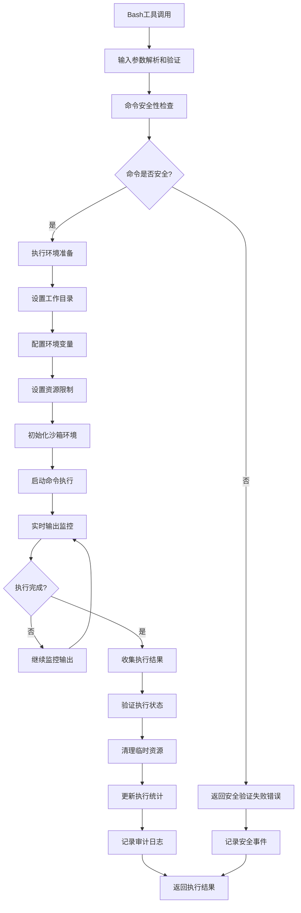

# Bash工具实现文档

## 🎯 工具定位与职责

Bash工具是"文档即软件"3.0系统中负责命令执行的核心工具，提供安全、可控的shell命令执行环境。基于对Claude Code的深度逆向分析，本工具实现了完整的安全沙箱机制、命令验证体系、以及与系统状态的深度集成，确保命令执行的安全性和可追踪性。

## 📋 核心功能定义

### 主要职责
1. **安全命令执行**: 在受控沙箱环境中执行shell命令，防止恶意操作
2. **命令验证与过滤**: 实施多层命令安全验证，阻止危险命令执行
3. **实时输出流式传输**: 提供命令执行的实时输出反馈
4. **执行环境管理**: 管理命令执行的工作目录、环境变量和资源限制
5. **审计与监控**: 完整记录命令执行历史和性能指标
6. **错误处理与恢复**: 提供命令执行失败的恢复和清理机制

### 安全特征
- **沙箱隔离**: 严格的命令执行环境隔离
- **白名单机制**: 基于白名单的命令和参数验证
- **资源限制**: CPU、内存、磁盘和网络资源的精确控制
- **权限最小化**: 最小权限原则的执行环境

## 🔧 内部工作逻辑

### 命令执行流程设计


### 核心算法实现

#### 1. 命令安全验证算法
```typescript
// 命令安全验证核心算法
function validateCommandSecurity(
  command: string,
  args: string[],
  options: BashOptions,
  securityContext: SecurityContext
): SecurityValidationResult {
  
  const validationResults: ValidationCheck[] = [];
  
  // 第1层：命令白名单检查
  const whitelistResult = checkCommandWhitelist(command, securityContext.allowedCommands);
  validationResults.push(whitelistResult);
  
  if (!whitelistResult.passed) {
    return {
      allowed: false,
      reason: 'Command not in whitelist',
      blockedBy: 'whitelist_check',
      riskLevel: 'high',
      validationResults: validationResults
    };
  }
  
  // 第2层：危险操作检测
  const dangerousOpsResult = detectDangerousOperations(command, args);
  validationResults.push(dangerousOpsResult);
  
  if (!dangerousOpsResult.passed) {
    return {
      allowed: false,
      reason: `Dangerous operation detected: ${dangerousOpsResult.details}`,
      blockedBy: 'dangerous_ops_check',
      riskLevel: 'critical',
      validationResults: validationResults
    };
  }
  
  // 第3层：路径安全检查
  const pathSecurityResult = validatePathSecurity(command, args, securityContext.allowedPaths);
  validationResults.push(pathSecurityResult);
  
  if (!pathSecurityResult.passed) {
    return {
      allowed: false,
      reason: `Path access violation: ${pathSecurityResult.details}`,
      blockedBy: 'path_security_check',
      riskLevel: 'medium',
      validationResults: validationResults
    };
  }
  
  // 第4层：参数注入检测
  const injectionResult = detectInjectionAttempts(args);
  validationResults.push(injectionResult);
  
  if (!injectionResult.passed) {
    return {
      allowed: false,
      reason: `Injection attempt detected: ${injectionResult.details}`,
      blockedBy: 'injection_check',
      riskLevel: 'high',
      validationResults: validationResults
    };
  }
  
  // 第5层：资源访问检查
  const resourceResult = validateResourceAccess(command, args, securityContext.resourceLimits);
  validationResults.push(resourceResult);
  
  if (!resourceResult.passed) {
    return {
      allowed: false,
      reason: `Resource access violation: ${resourceResult.details}`,
      blockedBy: 'resource_access_check',
      riskLevel: 'medium',
      validationResults: validationResults
    };
  }
  
  // 所有检查通过
  return {
    allowed: true,
    reason: 'All security checks passed',
    riskLevel: 'low',
    validationResults: validationResults,
    sanitizedCommand: sanitizeCommand(command, args)
  };
}

// 危险操作检测
function detectDangerousOperations(command: string, args: string[]): ValidationCheck {
  const fullCommand = `${command} ${args.join(' ')}`;
  
  // 危险命令模式
  const dangerousPatterns = [
    // 系统管理命令
    /\b(rm\s+-rf\s+\/|dd\s+if=.*of=|mkfs|fdisk|format)\b/i,
    
    // 网络相关
    /\b(wget|curl|nc|netcat|ssh|scp|rsync).*\b/i,
    
    // 进程管理
    /\b(kill\s+-9|killall|pkill|sudo|su)\b/i,
    
    // 系统配置
    /\b(passwd|chown|chmod\s+777|mount|umount)\b/i,
    
    // 脚本执行
    /\b(eval|exec|source|\.|sh\s+.*\||bash\s+.*\|)\b/i,
    
    // 重定向和管道滥用
    /[>;|&]\s*(\/dev\/null|\/etc\/|\/bin\/|\/usr\/)/i,
    
    // 环境变量操作
    /\$\(.*\)|`.*`|\$\{.*\}/,
    
    // 特殊字符组合
    /[;&|`$(){}]/
  ];
  
  for (const pattern of dangerousPatterns) {
    if (pattern.test(fullCommand)) {
      return {
        passed: false,
        checkType: 'dangerous_operations',
        details: `Dangerous pattern detected: ${pattern.source}`,
        matchedPattern: pattern.source
      };
    }
  }
  
  return {
    passed: true,
    checkType: 'dangerous_operations',
    details: 'No dangerous operations detected'
  };
}

// 路径安全验证
function validatePathSecurity(
  command: string,
  args: string[],
  allowedPaths: string[]
): ValidationCheck {
  
  const allArgs = [command, ...args];
  
  for (const arg of allArgs) {
    // 检查是否包含路径
    if (arg.includes('/') || arg.includes('\\')) {
      const resolvedPath = path.resolve(arg);
      
      // 检查是否在允许的路径内
      const isAllowed = allowedPaths.some(allowedPath => 
        resolvedPath.startsWith(path.resolve(allowedPath))
      );
      
      if (!isAllowed) {
        return {
          passed: false,
          checkType: 'path_security',
          details: `Path not allowed: ${resolvedPath}`,
          violatingPath: resolvedPath
        };
      }
      
      // 检查路径遍历攻击
      if (arg.includes('..') || arg.includes('~')) {
        return {
          passed: false,
          checkType: 'path_security',
          details: `Path traversal attempt detected: ${arg}`,
          violatingPath: arg
        };
      }
    }
  }
  
  return {
    passed: true,
    checkType: 'path_security',
    details: 'All paths are within allowed boundaries'
  };
}
```

#### 2. 沙箱执行环境
```typescript
// 沙箱执行环境实现
class SecureBashSandbox {
  private sandboxId: string;
  private workingDirectory: string;
  private environmentVariables: Record<string, string>;
  private resourceLimits: ResourceLimits;
  private activeProcesses: Map<number, ProcessInfo> = new Map();
  
  constructor(options: SandboxOptions) {
    this.sandboxId = generateSandboxId();
    this.workingDirectory = this.setupSecureWorkingDirectory(options.workingDirectory);
    this.environmentVariables = this.sanitizeEnvironmentVariables(options.env);
    this.resourceLimits = this.configureResourceLimits(options.resourceLimits);
  }
  
  // 执行命令
  async executeCommand(
    command: string,
    args: string[],
    options: ExecutionOptions
  ): Promise<CommandExecutionResult> {
    
    const executionId = generateExecutionId();
    const startTime = Date.now();
    
    try {
      // 1. 创建执行上下文
      const executionContext = await this.createExecutionContext(executionId, options);
      
      // 2. 配置进程限制
      const processOptions = this.buildProcessOptions(executionContext);
      
      // 3. 启动进程
      const childProcess = spawn(command, args, processOptions);
      
      // 4. 注册进程监控
      this.registerProcessMonitoring(childProcess, executionId);
      
      // 5. 处理输出流
      const outputHandler = this.createOutputHandler(childProcess, options);
      
      // 6. 等待执行完成
      const result = await this.waitForCompletion(childProcess, outputHandler, options);
      
      // 7. 清理资源
      await this.cleanupExecution(executionId);
      
      return {
        success: true,
        exitCode: result.exitCode,
        stdout: result.stdout,
        stderr: result.stderr,
        executionTime: Date.now() - startTime,
        resourceUsage: result.resourceUsage,
        executionId: executionId
      };
      
    } catch (error) {
      // 错误处理和清理
      await this.handleExecutionError(executionId, error);
      
      return {
        success: false,
        error: error.message,
        executionTime: Date.now() - startTime,
        executionId: executionId
      };
    }
  }
  
  // 配置进程选项
  private buildProcessOptions(context: ExecutionContext): SpawnOptions {
    return {
      // 工作目录
      cwd: this.workingDirectory,
      
      // 环境变量
      env: {
        ...this.environmentVariables,
        // 安全相关环境变量
        PATH: this.buildSecurePath(),
        HOME: this.workingDirectory,
        TMPDIR: path.join(this.workingDirectory, '.tmp'),
        // 禁用历史记录
        HISTFILE: '/dev/null',
        HISTSIZE: '0'
      },
      
      // 输入输出配置
      stdio: ['pipe', 'pipe', 'pipe'],
      
      // 进程组隔离
      detached: false,
      
      // Shell配置
      shell: false, // 禁用shell解释以防止注入
      
      // 资源限制（在支持的系统上）
      uid: context.uid,
      gid: context.gid,
      
      // 超时设置
      timeout: this.resourceLimits.executionTimeout
    };
  }
  
  // 资源监控和限制
  private async enforceResourceLimits(pid: number): Promise<void> {
    // CPU限制
    if (this.resourceLimits.maxCpuUsage) {
      await this.setCpuLimit(pid, this.resourceLimits.maxCpuUsage);
    }
    
    // 内存限制
    if (this.resourceLimits.maxMemoryUsage) {
      await this.setMemoryLimit(pid, this.resourceLimits.maxMemoryUsage);
    }
    
    // 文件描述符限制
    if (this.resourceLimits.maxFileDescriptors) {
      await this.setFileDescriptorLimit(pid, this.resourceLimits.maxFileDescriptors);
    }
    
    // 进程数限制
    if (this.resourceLimits.maxProcesses) {
      await this.setProcessLimit(pid, this.resourceLimits.maxProcesses);
    }
  }
  
  // 实时输出处理
  private createOutputHandler(
    childProcess: ChildProcess,
    options: ExecutionOptions
  ): OutputHandler {
    
    const outputBuffer = {
      stdout: [] as string[],
      stderr: [] as string[]
    };
    
    const outputHandler = {
      onData: async (data: Buffer, stream: 'stdout' | 'stderr') => {
        const text = data.toString('utf8');
        outputBuffer[stream].push(text);
        
        // 实时输出反馈
        if (options.streamOutput) {
          await this.emitStreamOutput({
            type: stream,
            data: text,
            timestamp: Date.now()
          });
        }
        
        // 输出长度限制
        const totalLength = outputBuffer.stdout.join('').length + outputBuffer.stderr.join('').length;
        if (totalLength > this.resourceLimits.maxOutputSize) {
          throw new Error(`Output size limit exceeded: ${totalLength} > ${this.resourceLimits.maxOutputSize}`);
        }
      },
      
      getOutput: () => ({
        stdout: outputBuffer.stdout.join(''),
        stderr: outputBuffer.stderr.join('')
      })
    };
    
    // 绑定输出流
    childProcess.stdout?.on('data', (data) => outputHandler.onData(data, 'stdout'));
    childProcess.stderr?.on('data', (data) => outputHandler.onData(data, 'stderr'));
    
    return outputHandler;
  }
}
```

#### 3. 命令执行监控
```typescript
// 命令执行监控系统
class CommandExecutionMonitor {
  private activeExecutions: Map<string, ExecutionMonitorInfo> = new Map();
  private executionHistory: ExecutionRecord[] = [];
  private resourceUsageTracker: ResourceUsageTracker;
  
  // 开始监控执行
  startMonitoring(
    executionId: string,
    command: string,
    args: string[],
    pid: number
  ): void {
    
    const monitorInfo: ExecutionMonitorInfo = {
      executionId: executionId,
      command: command,
      args: args,
      pid: pid,
      startTime: Date.now(),
      status: 'running',
      resourceUsage: {
        cpuUsage: 0,
        memoryUsage: 0,
        diskIO: 0,
        networkIO: 0
      },
      outputSize: 0,
      lastUpdate: Date.now()
    };
    
    this.activeExecutions.set(executionId, monitorInfo);
    
    // 启动资源监控定时器
    this.startResourceMonitoring(executionId);
  }
  
  // 资源使用监控
  private async startResourceMonitoring(executionId: string): Promise<void> {
    const monitorInfo = this.activeExecutions.get(executionId);
    if (!monitorInfo) return;
    
    const monitor = setInterval(async () => {
      try {
        const currentInfo = this.activeExecutions.get(executionId);
        if (!currentInfo || currentInfo.status !== 'running') {
          clearInterval(monitor);
          return;
        }
        
        // 获取进程资源使用情况
        const resourceUsage = await this.getProcessResourceUsage(currentInfo.pid);
        
        // 更新监控信息
        currentInfo.resourceUsage = resourceUsage;
        currentInfo.lastUpdate = Date.now();
        
        // 检查资源限制
        await this.checkResourceLimits(executionId, resourceUsage);
        
        // 发送监控事件
        this.emitMonitoringEvent({
          executionId: executionId,
          type: 'resource_update',
          data: resourceUsage,
          timestamp: Date.now()
        });
        
      } catch (error) {
        console.error(`Resource monitoring error for ${executionId}:`, error);
        clearInterval(monitor);
      }
    }, 1000); // 每秒监控一次
  }
  
  // 检查资源限制
  private async checkResourceLimits(
    executionId: string,
    resourceUsage: ResourceUsage
  ): Promise<void> {
    
    const monitorInfo = this.activeExecutions.get(executionId);
    if (!monitorInfo) return;
    
    const limits = this.getResourceLimits(executionId);
    
    // CPU使用率检查
    if (resourceUsage.cpuUsage > limits.maxCpuUsage) {
      await this.handleResourceViolation(executionId, 'cpu_limit', {
        current: resourceUsage.cpuUsage,
        limit: limits.maxCpuUsage
      });
    }
    
    // 内存使用检查
    if (resourceUsage.memoryUsage > limits.maxMemoryUsage) {
      await this.handleResourceViolation(executionId, 'memory_limit', {
        current: resourceUsage.memoryUsage,
        limit: limits.maxMemoryUsage
      });
    }
    
    // 执行时间检查
    const executionTime = Date.now() - monitorInfo.startTime;
    if (executionTime > limits.maxExecutionTime) {
      await this.handleResourceViolation(executionId, 'time_limit', {
        current: executionTime,
        limit: limits.maxExecutionTime
      });
    }
  }
  
  // 处理资源违规
  private async handleResourceViolation(
    executionId: string,
    violationType: string,
    details: any
  ): Promise<void> {
    
    const monitorInfo = this.activeExecutions.get(executionId);
    if (!monitorInfo) return;
    
    // 记录违规事件
    this.recordViolationEvent({
      executionId: executionId,
      violationType: violationType,
      details: details,
      timestamp: Date.now(),
      action: 'terminate'
    });
    
    // 终止进程
    try {
      process.kill(monitorInfo.pid, 'SIGTERM');
      
      // 如果进程没有及时响应，强制终止
      setTimeout(() => {
        try {
          process.kill(monitorInfo.pid, 'SIGKILL');
        } catch (error) {
          // 进程可能已经终止
        }
      }, 5000);
      
    } catch (error) {
      console.error(`Failed to terminate process ${monitorInfo.pid}:`, error);
    }
    
    // 更新状态
    monitorInfo.status = 'terminated';
    monitorInfo.terminationReason = violationType;
  }
}
```

#### 4. 智能命令解析
```typescript
// 智能命令解析器
class IntelligentCommandParser {
  
  // 解析复合命令
  parseComplexCommand(commandLine: string): ParsedCommand {
    // 1. 词法分析
    const tokens = this.tokenizeCommand(commandLine);
    
    // 2. 语法分析
    const ast = this.parseTokensToAST(tokens);
    
    // 3. 安全性分析
    const securityAnalysis = this.analyzeCommandSecurity(ast);
    
    // 4. 生成执行计划
    const executionPlan = this.generateExecutionPlan(ast, securityAnalysis);
    
    return {
      originalCommand: commandLine,
      tokens: tokens,
      ast: ast,
      securityAnalysis: securityAnalysis,
      executionPlan: executionPlan,
      isSecure: securityAnalysis.riskLevel === 'low'
    };
  }
  
  // 命令词法分析
  private tokenizeCommand(commandLine: string): CommandToken[] {
    const tokens: CommandToken[] = [];
    let current = 0;
    
    while (current < commandLine.length) {
      let char = commandLine[current];
      
      // 跳过空白字符
      if (/\s/.test(char)) {
        current++;
        continue;
      }
      
      // 处理引号字符串
      if (char === '"' || char === "'") {
        const quote = char;
        let value = '';
        current++; // 跳过开始引号
        
        while (current < commandLine.length && commandLine[current] !== quote) {
          if (commandLine[current] === '\\' && current + 1 < commandLine.length) {
            // 处理转义字符
            current++;
            value += commandLine[current];
          } else {
            value += commandLine[current];
          }
          current++;
        }
        
        if (current < commandLine.length) {
          current++; // 跳过结束引号
        }
        
        tokens.push({
          type: 'string',
          value: value,
          quoted: true,
          quoteType: quote
        });
        continue;
      }
      
      // 处理操作符
      if (/[|&;<>]/.test(char)) {
        let operator = char;
        current++;
        
        // 处理双字符操作符
        if (current < commandLine.length) {
          const nextChar = commandLine[current];
          if ((char === '|' && nextChar === '|') ||
              (char === '&' && nextChar === '&') ||
              (char === '<' && nextChar === '<') ||
              (char === '>' && nextChar === '>')) {
            operator += nextChar;
            current++;
          }
        }
        
        tokens.push({
          type: 'operator',
          value: operator
        });
        continue;
      }
      
      // 处理普通单词
      let word = '';
      while (current < commandLine.length && 
             !/[\s|&;<>"']/.test(commandLine[current])) {
        word += commandLine[current];
        current++;
      }
      
      if (word) {
        tokens.push({
          type: this.determineWordType(word),
          value: word
        });
      }
    }
    
    return tokens;
  }
  
  // 确定单词类型
  private determineWordType(word: string): TokenType {
    // 检查是否为命令
    if (this.isKnownCommand(word)) {
      return 'command';
    }
    
    // 检查是否为选项
    if (word.startsWith('-')) {
      return 'option';
    }
    
    // 检查是否为文件路径
    if (word.includes('/') || word.includes('\\')) {
      return 'path';
    }
    
    // 检查是否为环境变量
    if (word.startsWith('$')) {
      return 'variable';
    }
    
    // 默认为参数
    return 'argument';
  }
  
  // 语法分析生成AST
  private parseTokensToAST(tokens: CommandToken[]): CommandAST {
    const ast: CommandAST = {
      type: 'pipeline',
      commands: []
    };
    
    let currentCommand: Command | null = null;
    let i = 0;
    
    while (i < tokens.length) {
      const token = tokens[i];
      
      switch (token.type) {
        case 'command':
          // 如果已有当前命令，保存它
          if (currentCommand) {
            ast.commands.push(currentCommand);
          }
          
          // 开始新命令
          currentCommand = {
            name: token.value,
            args: [],
            options: {},
            redirections: []
          };
          break;
          
        case 'option':
          if (currentCommand) {
            // 解析选项值
            const optionName = token.value;
            let optionValue = true; // 默认布尔选项
            
            // 检查下一个token是否为选项值
            if (i + 1 < tokens.length && 
                tokens[i + 1].type === 'argument') {
              optionValue = tokens[i + 1].value;
              i++; // 跳过选项值token
            }
            
            currentCommand.options[optionName] = optionValue;
          }
          break;
          
        case 'argument':
        case 'path':
        case 'string':
          if (currentCommand) {
            currentCommand.args.push(token.value);
          }
          break;
          
        case 'operator':
          if (currentCommand) {
            ast.commands.push(currentCommand);
            currentCommand = null;
          }
          
          // 处理管道和重定向
          if (token.value === '|') {
            ast.type = 'pipeline';
          } else if (token.value.includes('>') || token.value.includes('<')) {
            // 处理重定向
            const redirectionType = this.parseRedirection(token.value);
            if (currentCommand) {
              currentCommand.redirections.push(redirectionType);
            }
          }
          break;
      }
      
      i++;
    }
    
    // 保存最后一个命令
    if (currentCommand) {
      ast.commands.push(currentCommand);
    }
    
    return ast;
  }
}
```

## 🔌 对外接口关系

### 输入接口规范
```typescript
interface BashToolInput {
  // 必需参数
  command: string;                      // 要执行的命令
  
  // 可选参数
  args?: string[];                      // 命令参数数组
  description?: string;                 // 命令描述（用于日志）
  
  // 执行环境
  cwd?: string;                         // 工作目录
  env?: Record<string, string>;         // 环境变量
  timeout?: number;                     // 执行超时（毫秒）
  
  // 输出控制
  capture_output?: boolean;             // 是否捕获输出（默认true）
  stream_output?: boolean;              // 是否流式输出（默认false）
  max_output_size?: number;             // 最大输出大小
  
  // 安全选项
  allowed_commands?: string[];          // 允许的命令白名单
  allowed_paths?: string[];             // 允许的路径列表
  require_confirmation?: boolean;       // 是否需要确认（危险命令）
  
  // 资源限制
  max_memory?: number;                  // 最大内存使用（字节）
  max_cpu_usage?: number;               // 最大CPU使用率（百分比）
  max_execution_time?: number;          // 最大执行时间（毫秒）
  max_file_operations?: number;         // 最大文件操作数
  
  // 高级选项
  enable_sandbox?: boolean;             // 启用沙箱（默认true）
  preserve_environment?: boolean;       // 保留环境变量（默认false）
  enable_shell_features?: boolean;      // 启用shell特性（默认false）
}
```

### 输出接口规范
```typescript
interface BashToolOutput {
  // 基础执行结果
  success: boolean;                     // 执行是否成功
  exit_code: number;                    // 退出码
  
  // 输出内容
  stdout: string;                       // 标准输出
  stderr: string;                       // 错误输出
  
  // 执行信息
  execution_info: {
    command: string;                    // 实际执行的命令
    args: string[];                     // 实际使用的参数
    execution_time: number;             // 执行时间（毫秒）
    working_directory: string;          // 工作目录
    environment_variables: Record<string, string>; // 环境变量
  };
  
  // 资源使用情况
  resource_usage: {
    max_memory_used: number;            // 峰值内存使用
    cpu_time: number;                   // CPU时间
    wall_time: number;                  // 墙上时间
    disk_io_read: number;               // 磁盘读取字节
    disk_io_write: number;              // 磁盘写入字节
    file_operations: number;            // 文件操作次数
  };
  
  // 安全信息
  security_info: {
    validation_passed: boolean;         // 安全验证是否通过
    risk_level: 'low' | 'medium' | 'high' | 'critical'; // 风险级别
    blocked_operations?: string[];      // 被阻止的操作
    sandbox_used: boolean;              // 是否使用了沙箱
  };
  
  // 进程信息
  process_info: {
    pid: number;                        // 进程ID
    parent_pid: number;                 // 父进程ID
    child_processes?: number[];         // 子进程ID列表
    signal?: string;                    // 终止信号（如果有）
  };
  
  // 错误信息（失败时）
  error?: {
    type: BashErrorType;                // 错误类型
    message: string;                    // 错误描述
    details?: any;                      // 错误详情
    recovery_suggestions?: string[];    // 恢复建议
  };
  
  // 调试信息
  debug_info?: {
    command_parsing: ParsedCommand;     // 命令解析结果
    security_checks: SecurityValidationResult[]; // 安全检查结果
    execution_timeline: ExecutionEvent[]; // 执行时间线
  };
}
```

### 与其他组件的接口
```typescript
// 与文件操作工具的协作
interface BashFileToolsIntegration {
  // 检查命令是否涉及文件操作
  analyzesFileOperations(command: string, args: string[]): FileOperationAnalysis;
  
  // 验证文件操作权限
  validateFileOperationPermissions(
    operations: FileOperation[],
    context: PermissionContext
  ): Promise<PermissionResult>;
  
  // 同步文件状态
  syncFileStateAfterExecution(
    operations: FileOperation[],
    result: CommandExecutionResult
  ): void;
}

// 与配置管理器的接口
interface BashConfigIntegration {
  // 获取Bash工具配置
  getBashConfiguration(): BashConfiguration;
  
  // 获取安全策略
  getSecurityPolicy(): SecurityPolicy;
  
  // 更新命令白名单
  updateCommandWhitelist(commands: string[]): void;
  
  // 配置资源限制
  configureResourceLimits(limits: ResourceLimits): void;
}

// 与监控系统的接口
interface BashMonitoringIntegration {
  // 注册命令执行监控
  registerExecutionMonitoring(executionId: string, metadata: ExecutionMetadata): void;
  
  // 报告执行指标
  reportExecutionMetrics(metrics: ExecutionMetrics): void;
  
  // 触发安全告警
  triggerSecurityAlert(alert: SecurityAlert): void;
  
  // 记录审计日志
  recordAuditLog(entry: AuditLogEntry): void;
}
```

## 🔄 通信协议设计

### 命令执行协议
```typescript
// 命令执行请求协议
interface CommandExecutionRequest {
  // 请求标识
  requestId: string;                    // 请求唯一标识
  timestamp: number;                    // 请求时间戳
  
  // 命令信息
  command: string;                      // 要执行的命令
  args: string[];                       // 命令参数
  options: BashToolInput;               // 执行选项
  
  // 执行上下文
  context: {
    sessionId: string;                  // 会话标识
    userId?: string;                    // 用户标识
    workingDirectory: string;           // 工作目录
    environmentVariables: Record<string, string>; // 环境变量
  };
  
  // 安全上下文
  securityContext: {
    permissions: Permission[];          // 权限列表
    securityLevel: SecurityLevel;       // 安全级别
    allowedCommands: string[];          // 允许的命令
    allowedPaths: string[];             // 允许的路径
  };
  
  // 监控配置
  monitoring: {
    enableResourceMonitoring: boolean;  // 启用资源监控
    enableOutputCapture: boolean;       // 启用输出捕获
    enableSecurityLogging: boolean;     // 启用安全日志
  };
}

// 命令执行响应协议
interface CommandExecutionResponse {
  // 响应标识
  requestId: string;                    // 对应的请求ID
  timestamp: number;                    // 响应时间戳
  
  // 执行状态
  status: 'running' | 'completed' | 'failed' | 'terminated';
  
  // 响应数据
  data?: BashToolOutput;
  error?: BashError;
  
  // 实时更新（流式）
  streamData?: {
    type: 'stdout' | 'stderr' | 'resource_update' | 'status_change';
    content: string | ResourceUsage | StatusChange;
    timestamp: number;
  };
  
  // 执行统计
  statistics: {
    startTime: number;                  // 开始时间
    endTime?: number;                   // 结束时间
    resourceUsage: ResourceUsage;       // 资源使用情况
    securityEvents: SecurityEvent[];    // 安全事件
  };
}
```

### 流式输出协议
```typescript
// 流式输出接口
interface StreamingOutputProtocol {
  // 开始流式输出
  startStreaming(requestId: string): Promise<OutputStreamHandle>;
  
  // 发送输出数据
  sendOutput(streamId: string, data: StreamOutputData): Promise<void>;
  
  // 更新执行状态
  updateStatus(streamId: string, status: ExecutionStatus): Promise<void>;
  
  // 结束流式输出
  endStreaming(streamId: string, finalResult: CommandExecutionResult): Promise<void>;
}

// 流式输出数据
interface StreamOutputData {
  streamId: string;                     // 流标识
  sequenceNumber: number;               // 序列号
  timestamp: number;                    // 时间戳
  
  // 输出内容
  type: 'stdout' | 'stderr' | 'status' | 'resource' | 'error';
  content: string | object;             // 内容数据
  
  // 元数据
  metadata?: {
    lineNumber?: number;                // 行号
    byteOffset?: number;                // 字节偏移
    encoding?: string;                  // 编码
  };
}
```

## 🏗️ 安全策略体系

### 多层安全防护
```typescript
// 多层安全防护架构
class MultiLayerSecurityFramework {
  
  // 第一层：输入验证和清理
  async validateAndSanitizeInput(
    command: string,
    args: string[],
    options: BashToolInput
  ): Promise<SanitizationResult> {
    
    const result: SanitizationResult = {
      originalCommand: command,
      originalArgs: args,
      sanitizedCommand: '',
      sanitizedArgs: [],
      modifications: [],
      securityWarnings: []
    };
    
    // 1. 命令名称验证
    const commandValidation = this.validateCommandName(command);
    if (!commandValidation.isValid) {
      throw new SecurityError(
        SecurityErrorType.INVALID_COMMAND,
        `Invalid command: ${commandValidation.reason}`,
        { command }
      );
    }
    result.sanitizedCommand = commandValidation.sanitizedCommand;
    
    // 2. 参数清理
    const argsValidation = this.sanitizeArguments(args);
    result.sanitizedArgs = argsValidation.sanitizedArgs;
    result.modifications.push(...argsValidation.modifications);
    
    // 3. 特殊字符检查
    const specialCharCheck = this.checkSpecialCharacters(command, args);
    if (specialCharCheck.hasRiskyChars) {
      result.securityWarnings.push({
        type: 'special_characters',
        message: 'Command contains potentially risky special characters',
        details: specialCharCheck.riskyChars
      });
    }
    
    return result;
  }
  
  // 第二层：权限验证
  async validatePermissions(
    command: string,
    args: string[],
    context: SecurityContext
  ): Promise<PermissionValidationResult> {
    
    // 1. 用户权限检查
    const userPermissions = await this.getUserPermissions(context.userId);
    
    // 2. 命令权限检查
    const commandPermission = this.checkCommandPermission(command, userPermissions);
    if (!commandPermission.allowed) {
      return {
        allowed: false,
        reason: `Insufficient permissions for command: ${command}`,
        requiredPermissions: commandPermission.requiredPermissions,
        userPermissions: userPermissions
      };
    }
    
    // 3. 路径权限检查
    const pathPermissions = await this.validatePathPermissions(args, context);
    if (!pathPermissions.allowed) {
      return {
        allowed: false,
        reason: `Insufficient permissions for path access: ${pathPermissions.violatingPath}`,
        requiredPermissions: pathPermissions.requiredPermissions,
        userPermissions: userPermissions
      };
    }
    
    return {
      allowed: true,
      effectivePermissions: userPermissions,
      grantedAccess: this.calculateGrantedAccess(command, args, userPermissions)
    };
  }
  
  // 第三层：沙箱隔离
  async createSecureSandbox(
    command: string,
    options: BashToolInput,
    context: SecurityContext
  ): Promise<SandboxEnvironment> {
    
    const sandboxConfig = {
      // 文件系统隔离
      filesystem: {
        mountPoints: this.calculateAllowedMountPoints(context.allowedPaths),
        readOnlyPaths: this.getReadOnlyPaths(),
        tempDirectory: await this.createSecureTempDirectory(),
        homeDirectory: await this.createSecureHomeDirectory()
      },
      
      // 网络隔离
      network: {
        enabled: this.isNetworkAccessAllowed(command, context),
        allowedHosts: context.allowedNetworkHosts || [],
        allowedPorts: context.allowedNetworkPorts || [],
        proxySettings: this.getProxySettings()
      },
      
      // 进程隔离
      process: {
        namespace: await this.createProcessNamespace(),
        uidMapping: this.createUidMapping(context.userId),
        gidMapping: this.createGidMapping(context.groupId),
        capabilities: this.calculateRequiredCapabilities(command)
      },
      
      // 资源限制
      resources: this.createResourceLimits(options, context)
    };
    
    return await this.initializeSandbox(sandboxConfig);
  }
  
  // 第四层：运行时监控
  async startRuntimeMonitoring(
    sandboxId: string,
    pid: number,
    securityPolicy: SecurityPolicy
  ): Promise<RuntimeMonitor> {
    
    const monitor = new RuntimeSecurityMonitor({
      sandboxId: sandboxId,
      targetPid: pid,
      policy: securityPolicy,
      alertThresholds: this.getAlertThresholds()
    });
    
    // 系统调用监控
    await monitor.enableSyscallMonitoring({
      blacklistedSyscalls: this.getBlacklistedSyscalls(),
      monitoredSyscalls: this.getMonitoredSyscalls(),
      alertOnUnexpectedSyscalls: true
    });
    
    // 文件访问监控
    await monitor.enableFileAccessMonitoring({
      monitoredPaths: this.getMonitoredPaths(),
      alertOnUnauthorizedAccess: true,
      logAllFileOperations: securityPolicy.auditLevel >= AuditLevel.DETAILED
    });
    
    // 网络活动监控
    await monitor.enableNetworkMonitoring({
      monitorConnections: true,
      alertOnUnauthorizedConnections: true,
      logNetworkActivity: securityPolicy.auditLevel >= AuditLevel.BASIC
    });
    
    return monitor;
  }
}
```

### 威胁检测与响应
```typescript
// 威胁检测系统
class ThreatDetectionSystem {
  private detectionRules: ThreatDetectionRule[] = [];
  private alertHandlers: AlertHandler[] = [];
  
  // 添加检测规则
  addDetectionRule(rule: ThreatDetectionRule): void {
    this.detectionRules.push(rule);
  }
  
  // 分析命令威胁
  async analyzeCommandThreat(
    command: string,
    args: string[],
    context: ExecutionContext
  ): Promise<ThreatAnalysisResult> {
    
    const threats: DetectedThreat[] = [];
    
    for (const rule of this.detectionRules) {
      const detectionResult = await rule.detect(command, args, context);
      
      if (detectionResult.threatDetected) {
        threats.push({
          ruleId: rule.id,
          threatType: detectionResult.threatType,
          severity: detectionResult.severity,
          confidence: detectionResult.confidence,
          description: detectionResult.description,
          evidence: detectionResult.evidence,
          mitigationSuggestions: detectionResult.mitigationSuggestions
        });
      }
    }
    
    return {
      threatsDetected: threats.length > 0,
      threats: threats,
      overallRiskLevel: this.calculateOverallRisk(threats),
      recommendedAction: this.getRecommendedAction(threats)
    };
  }
  
  // 内置威胁检测规则
  private initializeBuiltInRules(): void {
    
    // 代码注入检测
    this.addDetectionRule({
      id: 'code_injection_detection',
      detect: async (command, args, context) => {
        const fullCommand = `${command} ${args.join(' ')}`;
        
        // 检测常见的代码注入模式
        const injectionPatterns = [
          /;\s*(rm|dd|mkfs|format)/i,      // 命令链中的危险命令
          /\$\([^)]*\)/,                   // 命令替换
          /`[^`]*`/,                       // 反引号命令执行
          /&&\s*(sudo|su|chmod)/i,         // 权限提升
          /\|\s*(sh|bash|zsh)/i,           // 管道到shell
          />\s*\/dev\/(null|zero|random)/i // 重定向到特殊设备
        ];
        
        for (const pattern of injectionPatterns) {
          if (pattern.test(fullCommand)) {
            return {
              threatDetected: true,
              threatType: 'code_injection',
              severity: 'high',
              confidence: 0.8,
              description: `Potential code injection detected: ${pattern.source}`,
              evidence: { pattern: pattern.source, match: pattern.exec(fullCommand)?.[0] }
            };
          }
        }
        
        return { threatDetected: false };
      }
    });
    
    // 权限提升检测
    this.addDetectionRule({
      id: 'privilege_escalation_detection',
      detect: async (command, args, context) => {
        const privilegeEscalationCommands = [
          'sudo', 'su', 'sudo -s', 'sudo -i',
          'passwd', 'chown', 'chmod 777', 'chmod +s'
        ];
        
        const fullCommand = `${command} ${args.join(' ')}`;
        
        for (const privCmd of privilegeEscalationCommands) {
          if (fullCommand.toLowerCase().includes(privCmd.toLowerCase())) {
            return {
              threatDetected: true,
              threatType: 'privilege_escalation',
              severity: 'critical',
              confidence: 0.9,
              description: `Privilege escalation attempt detected: ${privCmd}`,
              evidence: { command: privCmd }
            };
          }
        }
        
        return { threatDetected: false };
      }
    });
    
    // 数据泄露检测
    this.addDetectionRule({
      id: 'data_exfiltration_detection',
      detect: async (command, args, context) => {
        const exfiltrationPatterns = [
          /(curl|wget).*http/i,            // 网络上传
          /(scp|rsync|sftp).*@/i,          // 远程复制
          /\b(base64|openssl)\b.*\|/i,     // 编码后传输
          /\b(nc|netcat)\b.*-l/i           // 网络监听
        ];
        
        const fullCommand = `${command} ${args.join(' ')}`;
        
        for (const pattern of exfiltrationPatterns) {
          if (pattern.test(fullCommand)) {
            return {
              threatDetected: true,
              threatType: 'data_exfiltration',
              severity: 'high',
              confidence: 0.7,
              description: `Potential data exfiltration detected: ${pattern.source}`,
              evidence: { pattern: pattern.source }
            };
          }
        }
        
        return { threatDetected: false };
      }
    });
  }
}
```

## ⚠️ 错误处理与恢复

### 错误分类体系
```typescript
enum BashErrorType {
  // 安全错误
  SECURITY_VALIDATION_FAILED = 'security_validation_failed',
  COMMAND_NOT_ALLOWED = 'command_not_allowed',
  PERMISSION_DENIED = 'permission_denied',
  SANDBOX_CREATION_FAILED = 'sandbox_creation_failed',
  
  // 执行错误
  COMMAND_NOT_FOUND = 'command_not_found',
  EXECUTION_TIMEOUT = 'execution_timeout',
  RESOURCE_LIMIT_EXCEEDED = 'resource_limit_exceeded',
  PROCESS_TERMINATED = 'process_terminated',
  
  // 环境错误
  WORKING_DIRECTORY_INVALID = 'working_directory_invalid',
  ENVIRONMENT_SETUP_FAILED = 'environment_setup_failed',
  PATH_NOT_ACCESSIBLE = 'path_not_accessible',
  
  // 系统错误
  INSUFFICIENT_RESOURCES = 'insufficient_resources',
  SYSTEM_ERROR = 'system_error',
  IO_ERROR = 'io_error',
  NETWORK_ERROR = 'network_error',
  
  // 配置错误
  INVALID_CONFIGURATION = 'invalid_configuration',
  MISSING_DEPENDENCIES = 'missing_dependencies'
}

class BashError extends Error {
  constructor(
    public readonly type: BashErrorType,
    message: string,
    public readonly context?: any,
    public readonly recoverable: boolean = true,
    public readonly securityRelated: boolean = false
  ) {
    super(message);
    this.name = 'BashError';
  }
  
  // 获取安全级别
  getSecurityLevel(): SecurityLevel {
    if (this.securityRelated) {
      switch (this.type) {
        case BashErrorType.SECURITY_VALIDATION_FAILED:
        case BashErrorType.COMMAND_NOT_ALLOWED:
          return SecurityLevel.HIGH;
        case BashErrorType.PERMISSION_DENIED:
          return SecurityLevel.MEDIUM;
        default:
          return SecurityLevel.LOW;
      }
    }
    return SecurityLevel.NONE;
  }
  
  // 生成用户友好消息
  toUserMessage(): string {
    switch (this.type) {
      case BashErrorType.COMMAND_NOT_ALLOWED:
        return `Command '${this.context?.command}' is not allowed by security policy`;
      case BashErrorType.PERMISSION_DENIED:
        return `Permission denied: Cannot execute '${this.context?.command}'`;
      case BashErrorType.EXECUTION_TIMEOUT:
        return `Command execution timed out after ${this.context?.timeout}ms`;
      case BashErrorType.RESOURCE_LIMIT_EXCEEDED:
        return `Resource limit exceeded: ${this.context?.resource} (${this.context?.current} > ${this.context?.limit})`;
      case BashErrorType.COMMAND_NOT_FOUND:
        return `Command not found: '${this.context?.command}'`;
      default:
        return this.message;
    }
  }
}
```

## 📊 性能监控与优化

### 性能指标定义
```typescript
interface BashPerformanceMetrics {
  // 执行统计
  executionStats: {
    totalExecutions: number;            // 总执行次数
    successfulExecutions: number;       // 成功执行次数
    failedExecutions: number;           // 失败执行次数
    avgExecutionTime: number;           // 平均执行时间
    medianExecutionTime: number;        // 中位数执行时间
    p95ExecutionTime: number;           // 95百分位执行时间
  };
  
  // 命令类型统计
  commandTypeStats: Record<string, {
    count: number;                      // 执行次数
    avgDuration: number;                // 平均持续时间
    successRate: number;                // 成功率
    resourceUsage: ResourceUsage;       // 平均资源使用
  }>;
  
  // 安全统计
  securityStats: {
    blockedCommands: number;            // 被阻止的命令数
    securityViolations: number;         // 安全违规次数
    threatDetections: number;           // 威胁检测次数
    falsePositives: number;             // 误报次数
  };
  
  // 资源使用统计
  resourceStats: {
    avgMemoryUsage: number;             // 平均内存使用
    peakMemoryUsage: number;            // 峰值内存使用
    avgCpuUsage: number;                // 平均CPU使用率
    totalDiskIO: number;                // 总磁盘IO
    totalNetworkIO: number;             // 总网络IO
  };
  
  // 沙箱统计
  sandboxStats: {
    sandboxCreationTime: number;        // 沙箱创建时间
    sandboxOverhead: number;            // 沙箱开销
    isolationEffectiveness: number;     // 隔离有效性
  };
}
```

## 🔧 配置参数规范

### 基础配置
```typescript
interface BashConfiguration {
  // 安全设置
  enableSandbox: boolean;               // 启用沙箱（默认true）
  commandWhitelist: string[];           // 命令白名单
  allowedPaths: string[];               // 允许的路径列表
  securityLevel: SecurityLevel;         // 安全级别
  
  // 执行设置
  defaultTimeout: number;               // 默认超时时间（30秒）
  maxOutputSize: number;                // 最大输出大小（10MB）
  enableStreaming: boolean;             // 启用流式输出（true）
  
  // 资源限制
  maxMemoryUsage: number;               // 最大内存使用（1GB）
  maxCpuUsage: number;                  // 最大CPU使用率（80%）
  maxProcesses: number;                 // 最大进程数（10）
  maxFileDescriptors: number;           // 最大文件描述符（1000）
  
  // 环境设置
  preserveEnvironment: boolean;         // 保留环境变量（false）
  defaultWorkingDirectory: string;      // 默认工作目录
  defaultShell: string;                 // 默认Shell（/bin/bash）
  
  // 监控设置
  enableMonitoring: boolean;            // 启用监控（true）
  enableAuditing: boolean;              // 启用审计（true）
  logLevel: LogLevel;                   // 日志级别
}
```

---

*本文档通过精确的自然语言描述，完整定义了Bash工具的实现细节。从多层安全验证到沙箱执行环境，从威胁检测到性能监控，每个技术细节都以标准化的文档形式呈现，与Read、Write、Edit工具共同构成完整的工具生态系统，体现了"文档即软件"3.0在安全命令执行领域的创新设计。*