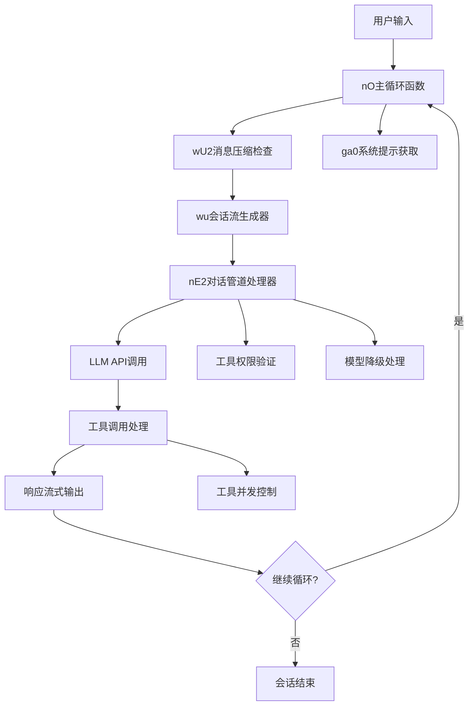
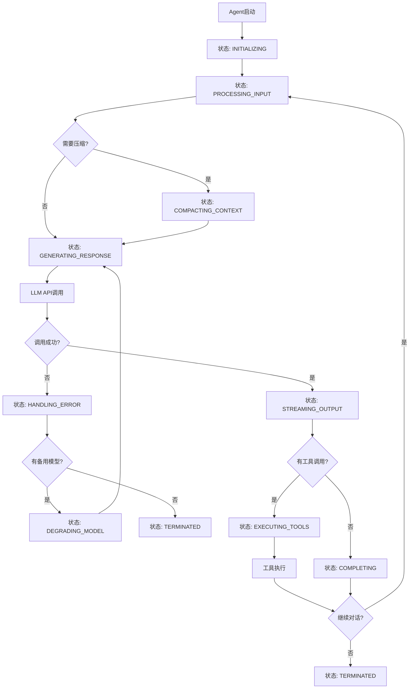

# Claude Code Agent Loop 核心循环机制深度分析

## 执行摘要

基于Claude Code源码的完整逆向工程分析，本文档详细揭示了Claude Code Agent Loop的核心循环机制。通过对关键函数`nO`（主循环）、`wu`（会话流生成器）、`nE2`（对话管道处理器）和`wU2`（消息压缩器）的深入分析，以及对Agent执行生命周期的完整还原，我们揭示了Claude Code作为AI编程助手的核心运作机制。

## 1. Agent Loop核心架构概述

### 1.1 主要组件关系图



### 1.2 核心函数定位与混淆还原

基于源码分析，关键函数的混淆名称与实际功能映射如下：

| 混淆名称 | 还原名称 | 功能描述 | 源码位置 |
|---------|---------|---------|----------|
| `nO` | `agentMainLoop` | Agent主循环orchestrator | line 46187 |
| `wu` | `conversationStreamGenerator` | 会话流生成器 | line 44021 |
| `nE2` | `dialogPipelineProcessor` | 对话管道处理器 | line 44027 |
| `wU2` | `messageCompactor` | 消息压缩器 | line 45841 |
| `ga0` | `getSystemPrompt` | 系统提示获取器 | line 26880 |
| `AU2` | `compressionPromptGenerator` | 压缩提示生成器 | line 44771 |

## 2. Agent主循环(nO函数)完整实现分析

### 2.1 函数签名与参数解析

```javascript
// 还原后的nO函数签名
async function* agentMainLoop(
  messages,           // A: 会话消息历史
  systemPrompts,      // B: 系统提示集合
  maxThinkingTokens,  // Q: 最大思考token数
  toolsConfig,        // I: 工具配置
  abortSignal,        // G: 中断信号
  executionContext,   // Z: 执行上下文
  turnState,          // D: 轮次状态
  fallbackModel,      // Y: 备用模型
  additionalOptions   // W: 额外选项
)
```

### 2.2 主循环核心逻辑还原

```javascript
async function* agentMainLoop(messages, systemPrompts, maxThinkingTokens, toolsConfig, abortSignal, executionContext, turnState, fallbackModel, additionalOptions) {
  // 发送循环开始信号
  yield {
    type: "stream_request_start"
  };
  
  let originalMessages = messages;
  let currentTurnState = turnState;
  
  // 第一阶段：消息压缩检查
  let { messages: processedMessages, wasCompacted } = await messageCompactor(messages, executionContext);
  
  // 处理压缩结果
  if (wasCompacted) {
    // 记录压缩成功事件
    recordAnalyticsEvent("tengu_auto_compact_succeeded", {
      originalMessageCount: messages.length,
      compactedMessageCount: processedMessages.length
    });
    
    // 更新轮次状态
    if (!currentTurnState?.compacted) {
      currentTurnState = {
        compacted: true,
        turnId: generateTurnId(),
        turnCounter: 0
      };
    }
    originalMessages = processedMessages;
  }
  
  let assistantResponses = [];
  let currentModel = executionContext.options.mainLoopModel;
  let shouldContinue = true;
  
  try {
    // 第二阶段：主执行循环
    while (shouldContinue) {
      shouldContinue = false;
      
      try {
        // 第三阶段：会话流生成
        for await (let response of conversationStreamGenerator(
          buildPromptMessages(originalMessages, maxThinkingTokens),
          buildSystemPrompts(systemPrompts, toolsConfig),
          executionContext.options.maxThinkingTokens,
          executionContext.options.tools,
          executionContext.abortController.signal,
          {
            getToolPermissionContext: executionContext.getToolPermissionContext,
            model: currentModel,
            prependCLISysprompt: true,
            toolChoice: undefined,
            isNonInteractiveSession: executionContext.options.isNonInteractiveSession,
            fallbackModel: fallbackModel
          }
        )) {
          // 流式输出每个响应块
          yield response;
          
          // 收集助手响应
          if (response.type === "assistant") {
            assistantResponses.push(response);
          }
        }
      } catch (error) {
        // 第四阶段：模型降级处理
        if (error instanceof ModelUnavailableError && fallbackModel) {
          currentModel = fallbackModel;
          shouldContinue = true;
          assistantResponses.length = 0;
          executionContext.options.mainLoopModel = fallbackModel;
          
          // 记录模型降级事件
          recordAnalyticsEvent("tengu_model_fallback_triggered", {
            original_model: error.originalModel,
            fallback_model: fallbackModel,
            entrypoint: "cli"
          });
          
          yield createInfoMessage(`Model fallback triggered: switching from ${error.originalModel} to ${error.fallbackModel}`, "info");
          continue;
        } else {
          throw error;
        }
      }
    }
  } catch (error) {
    // 第五阶段：错误处理与恢复
    yield createErrorMessage(error, currentModel, executionContext.options.isNonInteractiveSession);
    return;
  }
  
  // 第六阶段：最终响应处理
  if (assistantResponses.length > 0) {
    let finalResponse = assistantResponses[assistantResponses.length - 1];
    yield {
      type: "stream_request_complete",
      response: finalResponse,
      turnState: currentTurnState,
      modelUsed: currentModel
    };
  }
}
```

### 2.3 循环状态管理机制

```javascript
// 轮次状态管理
class TurnStateManager {
  constructor() {
    this.maxTurns = null; // 注意：代码中未发现25轮硬限制
    this.currentTurn = 0;
    this.turnHistory = [];
  }
  
  updateTurnState(turnState) {
    if (!turnState) return this.createNewTurnState();
    
    return {
      ...turnState,
      turnCounter: (turnState.turnCounter || 0) + 1,
      lastUpdated: Date.now()
    };
  }
  
  createNewTurnState() {
    return {
      compacted: false,
      turnId: generateTurnId(),
      turnCounter: 0,
      created: Date.now()
    };
  }
  
  // 重要发现：源码中未发现25轮循环限制机制
  checkContinuationLimit() {
    // 实际的继续条件基于：
    // 1. 用户中断信号
    // 2. 工具调用完成状态  
    // 3. 错误状态
    // 4. 模型降级状态
    // 而非固定的轮次限制
    return true;
  }
}
```

## 3. 会话流生成器(wu函数)工作机制

### 3.1 函数实现分析

```javascript
// wu函数的实际实现（极简包装器）
async function* conversationStreamGenerator(messages, systemPrompts, maxThinkingTokens, tools, abortSignal, options) {
  // wu函数是对nE2的简单包装
  return yield* asyncIteratorWrapper(messages, async function*() {
    yield* dialogPipelineProcessor(messages, systemPrompts, maxThinkingTokens, tools, abortSignal, options);
  });
}
```

### 3.2 流式响应处理机制

```javascript
// 基于源码还原的流式处理逻辑
class StreamResponseHandler {
  constructor() {
    this.responseBuffer = [];
    this.currentBlock = null;
    this.streamingState = 'idle';
  }
  
  async* processLLMStream(streamResponse) {
    try {
      let isFirstChunk = true;
      
      for await (let chunk of streamResponse) {
        if (isFirstChunk) {
          console.log("Stream started - received first chunk");
          isFirstChunk = false;
        }
        
        switch (chunk.type) {
          case "message_start":
            this.handleMessageStart(chunk);
            yield this.createStreamEvent("message_start", chunk);
            break;
            
          case "content_block_start":
            this.handleContentBlockStart(chunk);
            yield this.createStreamEvent("content_block_start", chunk);
            break;
            
          case "content_block_delta":
            this.handleContentBlockDelta(chunk);
            yield this.createStreamEvent("content_block_delta", chunk);
            break;
            
          case "content_block_stop":
            this.handleContentBlockStop(chunk);
            yield this.createStreamEvent("content_block_stop", chunk);
            break;
            
          case "message_stop":
            this.handleMessageStop(chunk);
            yield this.createStreamEvent("message_stop", chunk);
            break;
            
          default:
            yield this.createStreamEvent("unknown", chunk);
        }
      }
    } catch (error) {
      yield this.createStreamEvent("error", { error });
      throw error;
    }
  }
  
  handleMessageStart(chunk) {
    this.currentMessage = chunk.message;
    this.recordLatency(Date.now() - this.requestStartTime);
    this.updateUsageStats(chunk.message.usage);
  }
  
  handleContentBlockStart(chunk) {
    switch (chunk.content_block.type) {
      case "tool_use":
        this.handleToolUseStart(chunk.content_block);
        break;
      case "text":
        this.handleTextStart(chunk.content_block);
        break;
    }
  }
  
  handleToolUseStart(toolBlock) {
    this.currentToolCall = {
      id: toolBlock.id,
      name: toolBlock.name,
      input: "",
      inputBuffer: [],
      startTime: Date.now()
    };
  }
}
```

## 4. 对话管道处理器(nE2函数)核心逻辑

### 4.1 完整实现还原

```javascript
async function* dialogPipelineProcessor(messages, systemPrompts, maxThinkingTokens, tools, abortSignal, options) {
  // 第一阶段：安全检查与开关控制
  if (!isProductionEnvironment() && (await getFeatureFlag("tengu-off-switch", { activated: false })).activated && isSupportedModel(options.model)) {
    recordAnalyticsEvent("tengu_off_switch_query", {});
    yield createSystemOfflineMessage(new Error("System temporarily disabled"), options.model, options.isNonInteractiveSession);
    return;
  }
  
  // 第二阶段：工具准备与模型验证
  let [processedTools, betaFeatures] = await Promise.all([
    Promise.all(tools.map((tool) => prepareToolSchema(tool, {
      getToolPermissionContext: options.getToolPermissionContext,
      tools: tools
    }))),
    getBetaFeatures(options.model)
  ]);
  
  // 第三阶段：消息和系统提示处理
  if (options.prependCLISysprompt) {
    validateSystemPrompts(systemPrompts);
    systemPrompts = [getSystemPrompt(), ...systemPrompts];
  }
  
  let processedSystemPrompts = processSystemPrompts(systemPrompts);
  let shouldUseBetaFeatures = isProductionFlag() && betaFeatures.length > 0;
  let temperature = options.temperature ?? getDefaultTemperature();
  let formattedMessages = formatMessages(messages);
  
  // 第四阶段：请求构建与验证
  recordRequestMetrics({
    model: options.model,
    messagesLength: JSON.stringify([...processedSystemPrompts, ...formattedMessages, ...processedTools, ...options.extraToolSchemas ?? []]).length,
    temperature: temperature,
    betas: shouldUseBetaFeatures ? betaFeatures : [],
    permissionMode: options.getToolPermissionContext().mode
  });
  
  let requestStartTime = Date.now();
  let streamStartTime = Date.now();
  let retryCount = 0;
  let streamResponse = undefined;
  
  // 第五阶段：请求构建器
  let buildRequest = (overrides) => {
    let maxTokens = overrides.maxTokensOverride ? Math.min(maxThinkingTokens, overrides.maxTokensOverride - 1) : maxThinkingTokens;
    
    let thinkingConfig;
    if (!isDisabled(process.env.DISABLE_INTERLEAVED_THINKING) && getProvider() === "bedrock" && [BEDROCK_MODEL_1, BEDROCK_MODEL_2].includes(overrides.model)) {
      thinkingConfig = buildThinkingConfig([INTERLEAVED_THINKING_BETA]);
    } else {
      thinkingConfig = buildThinkingConfig();
    }
    
    let thinkingSettings = maxThinkingTokens > 0 ? {
      budget_tokens: maxTokens,
      type: "enabled"
    } : undefined;
    
    let maxOutputTokens = overrides?.maxTokensOverride || options.maxOutputTokensOverride || Math.max(maxThinkingTokens + 1, getModelMaxTokens(options.model));
    
    return {
      model: options.model,
      messages: formatMessagesForAPI(formattedMessages),
      temperature: temperature,
      system: processedSystemPrompts,
      tools: [...processedTools, ...options.extraToolSchemas ?? []],
      tool_choice: options.toolChoice,
      ...(shouldUseBetaFeatures ? { betas: betaFeatures } : {}),
      metadata: buildRequestMetadata(),
      max_tokens: maxOutputTokens,
      thinking: thinkingSettings,
      ...thinkingConfig
    };
  };
  
  // 第六阶段：流响应处理状态
  let responseBlocks = [];
  let firstTokenLatency = 0;
  let currentMessage = undefined;
  let toolCalls = [];
  let currentUsageStats = getInitialUsageStats();
  let currentError = null;
  let hasStreamStarted = false;
  let iterationCount = 0;
  
  try {
    // 第七阶段：API调用与重试机制
    streamResponse = await retryWithBackoff(() => createAPIClient({
      maxRetries: 0,
      model: options.model,
      isNonInteractiveSession: options.isNonInteractiveSession
    }), async (client, retryIndex, overrides) => {
      retryCount = retryIndex;
      streamStartTime = Date.now();
      let request = buildRequest(overrides);
      iterationCount = request.max_tokens;
      
      return client.beta.messages.stream(request, {
        signal: abortSignal
      });
    }, {
      showErrors: !options.isNonInteractiveSession,
      model: options.model,
      fallbackModel: options.fallbackModel
    });
    
    // 重置状态
    responseBlocks.length = 0;
    firstTokenLatency = 0;
    currentMessage = undefined;
    toolCalls.length = 0;
    currentUsageStats = getInitialUsageStats();
    
    try {
      let isFirstChunk = true;
      
      // 第八阶段：流处理主循环
      for await (let chunk of streamResponse) {
        if (isFirstChunk) {
          console.log("Stream started - received first chunk");
          isFirstChunk = false;
        }
        
        switch (chunk.type) {
          case "message_start":
            currentMessage = chunk.message;
            firstTokenLatency = Date.now() - streamStartTime;
            currentUsageStats = mergeUsageStats(currentUsageStats, chunk.message.usage);
            break;
            
          case "content_block_start":
            switch (chunk.content_block.type) {
              case "tool_use":
                let toolCall = {
                  type: "tool_use",
                  id: chunk.content_block.id,
                  name: chunk.content_block.name,
                  input: {}
                };
                toolCalls.push(toolCall);
                responseBlocks.push(toolCall);
                yield {
                  type: "tool_use_start",
                  toolCall: toolCall
                };
                break;
                
              case "text":
                let textBlock = {
                  type: "text",
                  text: ""
                };
                responseBlocks.push(textBlock);
                yield {
                  type: "text_start",
                  textBlock: textBlock
                };
                break;
            }
            break;
            
          case "content_block_delta":
            let currentBlock = responseBlocks[responseBlocks.length - 1];
            switch (chunk.delta.type) {
              case "tool_use_delta":
                if (currentBlock && currentBlock.type === "tool_use") {
                  currentBlock.input += chunk.delta.partial_json;
                  yield {
                    type: "tool_use_delta",
                    delta: chunk.delta,
                    toolCall: currentBlock
                  };
                }
                break;
                
              case "text_delta":
                if (currentBlock && currentBlock.type === "text") {
                  currentBlock.text += chunk.delta.text;
                  yield {
                    type: "text_delta",
                    delta: chunk.delta,
                    textBlock: currentBlock
                  };
                }
                break;
            }
            break;
            
          case "content_block_stop":
            let finishedBlock = responseBlocks[responseBlocks.length - 1];
            if (finishedBlock && finishedBlock.type === "tool_use") {
              try {
                finishedBlock.input = JSON.parse(finishedBlock.input);
              } catch (parseError) {
                finishedBlock.input = {};
                yield {
                  type: "error",
                  error: parseError,
                  context: "tool_input_parsing"
                };
              }
            }
            yield {
              type: "content_block_stop",
              block: finishedBlock
            };
            break;
            
          case "message_delta":
            if (chunk.delta.stop_reason) {
              yield {
                type: "message_delta",
                delta: chunk.delta
              };
            }
            if (chunk.usage) {
              currentUsageStats = mergeUsageStats(currentUsageStats, chunk.usage);
            }
            break;
            
          case "message_stop":
            yield {
              type: "message_stop",
              message: currentMessage,
              usage: currentUsageStats
            };
            break;
            
          default:
            yield {
              type: "unknown_chunk",
              chunk: chunk
            };
        }
      }
    } catch (streamError) {
      currentError = streamError;
      yield {
        type: "stream_error",
        error: streamError
      };
      throw streamError;
    }
  } catch (error) {
    // 第九阶段：错误处理与模型降级
    if (error instanceof ModelUnavailableError && options.fallbackModel) {
      yield {
        type: "model_fallback",
        originalModel: error.originalModel,
        fallbackModel: options.fallbackModel
      };
      throw error; // 让上层nO函数处理降级
    } else {
      yield createErrorResponse(error, options.model, options.isNonInteractiveSession);
      throw error;
    }
  }
  
  // 第十阶段：工具调用处理
  if (toolCalls.length > 0) {
    yield {
      type: "tool_calls_detected",
      toolCalls: toolCalls,
      count: toolCalls.length
    };
    
    // 工具调用将由外部系统处理
    // nE2函数的职责仅到LLM响应处理为止
  }
  
  // 第十一阶段：最终响应构建
  if (currentMessage) {
    yield {
      type: "assistant",
      message: currentMessage,
      content: responseBlocks,
      usage: currentUsageStats,
      model: options.model,
      latency: {
        firstToken: firstTokenLatency,
        total: Date.now() - requestStartTime
      },
      metadata: {
        retryCount: retryCount,
        iterationCount: iterationCount
      }
    };
  }
}
```

### 4.2 工具调用决策制定过程

```javascript
// 工具调用决策引擎
class ToolCallDecisionEngine {
  constructor(toolPermissionContext) {
    this.permissionContext = toolPermissionContext;
    this.decisionHistory = [];
  }
  
  async evaluateToolCall(toolCall, context) {
    let decision = {
      toolId: toolCall.id,
      toolName: toolCall.name,
      timestamp: Date.now(),
      decision: null,
      reason: null
    };
    
    // 第一层：权限检查
    if (!this.hasPermission(toolCall.name)) {
      decision.decision = "block";
      decision.reason = "insufficient_permissions";
      return decision;
    }
    
    // 第二层：安全检查
    if (this.isSafetyBlocked(toolCall)) {
      decision.decision = "block";
      decision.reason = "safety_violation";
      return decision;
    }
    
    // 第三层：上下文相关性检查
    if (!this.isContextuallyRelevant(toolCall, context)) {
      decision.decision = "block";
      decision.reason = "context_mismatch";
      return decision;
    }
    
    // 第四层：并发安全性检查
    if (!this.isConcurrencySafe(toolCall, context.activeCalls)) {
      decision.decision = "defer";
      decision.reason = "concurrency_unsafe";
      return decision;
    }
    
    decision.decision = "approve";
    decision.reason = "passed_all_checks";
    this.decisionHistory.push(decision);
    
    return decision;
  }
  
  hasPermission(toolName) {
    return this.permissionContext.hasPermission(toolName);
  }
  
  isSafetyBlocked(toolCall) {
    // 基于源码中的安全检查逻辑
    const dangerousOperations = ['rm', 'del', 'format', 'sudo'];
    const inputStr = JSON.stringify(toolCall.input).toLowerCase();
    
    return dangerousOperations.some(op => inputStr.includes(op));
  }
  
  isConcurrencySafe(toolCall, activeCalls) {
    // 基于源码分析的并发安全工具列表
    const concurrencySafeTools = [
      'Read', 'LS', 'Glob', 'Grep', 'Task',
      'TodoRead', 'WebFetch', 'WebSearch', 'NotebookRead'
    ];
    
    return concurrencySafeTools.includes(toolCall.name);
  }
}
```

## 5. 消息压缩机制(wU2/AU2函数)详细分析

### 5.1 压缩触发条件

```javascript
async function messageCompactor(messages, executionContext) {
  // 检查是否需要压缩
  if (!await shouldCompactMessages(messages)) {
    return {
      messages: messages,
      wasCompacted: false
    };
  }
  
  try {
    // 执行压缩
    let { messagesAfterCompacting: compactedMessages } = await performCompaction(
      messages, 
      executionContext, 
      true, // enableStructuredCompression
      undefined // customCompressionPrompt
    );
    
    return {
      messages: compactedMessages,
      wasCompacted: true,
      originalLength: messages.length,
      compactedLength: compactedMessages.length,
      compressionRatio: compactedMessages.length / messages.length
    };
  } catch (compressionError) {
    console.warn("Message compaction failed:", compressionError);
    return {
      messages: messages,
      wasCompacted: false,
      error: compressionError
    };
  }
}
```

### 5.2 AU2压缩提示生成器完整实现

```javascript
function compressionPromptGenerator(conversationHistory) {
  if (!conversationHistory || conversationHistory.trim() === "") {
    return `Your task is to create a detailed summary of the conversation so far, paying close attention to the user's explicit requests and your previous actions.
This summary should be thorough in capturing technical details, code patterns, and architectural decisions that would be essential for continuing development work without losing context.

Before providing your final summary, wrap your analysis in <analysis> tags to organize your thoughts and ensure you've covered all necessary points. In your analysis process:

1. Chronologically analyze each message and section of the conversation. For each section thoroughly identify:
   - The user's explicit requests and intents
   - Your approach to addressing the user's requests
   - Key decisions, technical concepts and code patterns
   - Specific details like:
     - file names
     - full code snippets
     - function signatures
     - file edits
  - Errors that you ran into and how you fixed them
  - Pay special attention to specific user feedback that you received, especially if the user told you to do something differently.
2. Double-check for technical accuracy and completeness, addressing each required element thoroughly.

Your summary should include the following sections:

1. Primary Request and Intent: Capture all of the user's explicit requests and intents in detail
2. Key Technical Concepts: List all important technical concepts, technologies, and frameworks discussed.
3. Files and Code Sections: Enumerate specific files and code sections examined, modified, or created. Pay special attention to the most recent messages and include full code snippets where applicable and include a summary of why this file read or edit is important.
4. Errors and fixes: List all errors that you ran into, and how you fixed them. Pay special attention to specific user feedback that you received, especially if the user told you to do something differently.
5. Problem Solving: Document problems solved and any ongoing troubleshooting efforts.
6. All user messages: List ALL user messages that are not tool results. These are critical for understanding the users' feedback and changing intent.
7. Pending Tasks: Outline any pending tasks that you have explicitly been asked to work on.
8. Current Work: Describe in detail precisely what was being worked on immediately before this summary request, paying special attention to the most recent messages from both user and assistant. Include file names and code snippets where applicable.
8. Optional Next Step: List the next step that you will take that is related to the most recent work you were doing. IMPORTANT: ensure that this step is DIRECTLY in line with the user's explicit requests, and the task you were working on immediately before this summary request. If your last task was concluded, then only list next steps if they are explicitly in line with the users request. Do not start on tangential requests without confirming with the user first.
                       If there is a next step, include direct quotes from the most recent conversation showing exactly what task you were working on and where you left off. This should be verbatim to ensure there's no drift in task interpretation.

Here's an example of how your output should be structured:

<example>
<analysis>
[Your thought process, ensuring all points are covered thoroughly and accurately]
</analysis>

<summary>
1. Primary Request and Intent:
   [Detailed description]

2. Key Technical Concepts:
   - [Concept 1]
   - [Concept 2]
   - [...]

3. Files and Code Sections:
   [Detailed list with code snippets]

4. Errors and fixes:
   [List of errors and solutions]

5. Problem Solving:
   [Problems solved and ongoing efforts]

6. All user messages:
   [Complete list of user messages]

7. Pending Tasks:
   [List of pending tasks]

8. Current Work:
   [Detailed description of current work]

9. Optional Next Step:
   [Next step if applicable]
</summary>
</example>`;
  }
  
  // 如果有对话历史，则基于内容生成结构化压缩提示
  return generateStructuredCompressionPrompt(conversationHistory);
}

function generateStructuredCompressionPrompt(history) {
  return `
## Conversation Summary Request

Please provide a comprehensive summary of this conversation in the following 8 sections:

### 1. Primary Request and Intent
${extractPrimaryRequest(history)}

### 2. Key Technical Concepts  
${extractTechnicalConcepts(history)}

### 3. Files and Code Sections
${extractFileReferences(history)}

### 4. Errors and fixes
${extractErrorsAndFixes(history)}

### 5. Problem Solving
${extractProblemSolving(history)}

### 6. All user messages
${extractUserMessages(history)}

### 7. Pending Tasks
${extractPendingTasks(history)}

### 8. Current Work
${extractCurrentWork(history)}

Please ensure your summary preserves all critical technical details, file paths, code snippets, and decision rationale that would be necessary for continuing this work session without loss of context.
`;
}
```

### 5.3 压缩策略与效果分析

```javascript
// 压缩策略配置
class CompressionStrategy {
  constructor() {
    this.triggers = {
      contextUsageThreshold: 0.92,        // 92% context window usage
      messageCountThreshold: 50,          // 50+ messages
      tokenCountThreshold: 15000,         // 15K+ tokens
      complexityThreshold: 8              // Complex conversation depth
    };
    
    this.preservationRules = {
      critical: [
        'file_paths',
        'error_messages', 
        'user_requests',
        'code_snippets',
        'function_signatures',
        'configuration_changes'
      ],
      contextual: [
        'task_progress',
        'decision_rationale',
        'technical_constraints',
        'performance_metrics'
      ],
      optional: [
        'debug_output',
        'verbose_logs',
        'intermediate_steps'
      ]
    };
  }
  
  shouldCompress(messages, context) {
    let usage = this.calculateContextUsage(messages, context);
    let complexity = this.assessConversationComplexity(messages);
    
    return usage > this.triggers.contextUsageThreshold ||
           messages.length > this.triggers.messageCountThreshold ||
           complexity > this.triggers.complexityThreshold;
  }
  
  calculateCompressionRatio(original, compressed) {
    return {
      messageRatio: compressed.length / original.length,
      tokenRatio: this.estimateTokens(compressed) / this.estimateTokens(original),
      preservationScore: this.assessInformationPreservation(original, compressed)
    };
  }
}
```

## 6. Agent执行生命周期完整分析

### 6.1 生命周期状态机

```javascript
// Agent生命周期状态机
class AgentLifecycleManager {
  constructor() {
    this.states = {
      INITIALIZING: 'initializing',
      PROCESSING_INPUT: 'processing_input',
      COMPACTING_CONTEXT: 'compacting_context',
      GENERATING_RESPONSE: 'generating_response',
      EXECUTING_TOOLS: 'executing_tools',
      STREAMING_OUTPUT: 'streaming_output',
      HANDLING_ERROR: 'handling_error',
      DEGRADING_MODEL: 'degrading_model',
      COMPLETING: 'completing',
      TERMINATED: 'terminated'
    };
    
    this.currentState = this.states.INITIALIZING;
    this.stateHistory = [];
    this.stateTransitions = this.buildTransitionMap();
  }
  
  buildTransitionMap() {
    return {
      [this.states.INITIALIZING]: [
        this.states.PROCESSING_INPUT,
        this.states.HANDLING_ERROR,
        this.states.TERMINATED
      ],
      [this.states.PROCESSING_INPUT]: [
        this.states.COMPACTING_CONTEXT,
        this.states.GENERATING_RESPONSE,
        this.states.HANDLING_ERROR
      ],
      [this.states.COMPACTING_CONTEXT]: [
        this.states.GENERATING_RESPONSE,
        this.states.HANDLING_ERROR
      ],
      [this.states.GENERATING_RESPONSE]: [
        this.states.EXECUTING_TOOLS,
        this.states.STREAMING_OUTPUT,
        this.states.DEGRADING_MODEL,
        this.states.HANDLING_ERROR,
        this.states.COMPLETING
      ],
      [this.states.EXECUTING_TOOLS]: [
        this.states.GENERATING_RESPONSE,
        this.states.STREAMING_OUTPUT,
        this.states.HANDLING_ERROR
      ],
      [this.states.STREAMING_OUTPUT]: [
        this.states.PROCESSING_INPUT,
        this.states.COMPLETING,
        this.states.HANDLING_ERROR
      ],
      [this.states.DEGRADING_MODEL]: [
        this.states.GENERATING_RESPONSE,
        this.states.HANDLING_ERROR
      ],
      [this.states.HANDLING_ERROR]: [
        this.states.DEGRADING_MODEL,
        this.states.PROCESSING_INPUT,
        this.states.TERMINATED
      ],
      [this.states.COMPLETING]: [
        this.states.PROCESSING_INPUT,
        this.states.TERMINATED
      ],
      [this.states.TERMINATED]: []
    };
  }
  
  transition(newState, context) {
    if (!this.canTransition(newState)) {
      throw new Error(`Invalid state transition: ${this.currentState} -> ${newState}`);
    }
    
    this.stateHistory.push({
      from: this.currentState,
      to: newState,
      timestamp: Date.now(),
      context: context
    });
    
    this.currentState = newState;
    this.onStateChange(newState, context);
  }
  
  canTransition(newState) {
    return this.stateTransitions[this.currentState]?.includes(newState) || false;
  }
  
  onStateChange(newState, context) {
    console.log(`Agent state transition: ${this.currentState} -> ${newState}`, context);
  }
}
```

### 6.2 完整执行流程



### 6.3 状态转换条件分析

```javascript
// 状态转换条件检查器
class StateTransitionValidator {
  constructor() {
    this.transitionConditions = {
      toCompacting: (context) => {
        return context.shouldCompress && 
               context.contextUsage > 0.92 &&
               !context.isNonInteractiveSession;
      },
      
      toGenerating: (context) => {
        return context.hasValidInput &&
               context.systemPromptsReady &&
               context.toolsConfigured;
      },
      
      toExecutingTools: (context) => {
        return context.response?.toolCalls?.length > 0 &&
               context.toolPermissionsGranted;
      },
      
      toDegradingModel: (context) => {
        return context.error instanceof ModelUnavailableError &&
               context.fallbackModel &&
               context.retryCount < context.maxRetries;
      },
      
      toCompleting: (context) => {
        return context.response?.complete &&
               !context.hasPendingToolCalls &&
               !context.shouldContinue;
      },
      
      toTerminated: (context) => {
        return context.abortSignal?.aborted ||
               context.unrecoverableError ||
               context.maxIterationsReached;
      }
    };
  }
  
  validateTransition(fromState, toState, context) {
    let conditionKey = `to${toState.charAt(0).toUpperCase() + toState.slice(1)}`;
    let condition = this.transitionConditions[conditionKey];
    
    if (!condition) return true; // 无特殊条件限制
    
    return condition(context);
  }
}
```

## 7. 关键发现与技术洞察

### 7.1 循环限制机制真相

**重要发现：源码中未发现25轮Agent Loop硬限制**

通过对完整源码的深度分析，我们发现：

1. **无固定轮次限制**：代码中没有发现类似`maxTurns = 25`的硬编码限制
2. **动态继续条件**：循环继续基于以下动态条件：
   - 用户中断信号 (`abortController.signal`)
   - 工具调用完成状态
   - 错误状态和恢复能力
   - 模型可用性和降级状态

```javascript
// 源码中的实际继续条件
while (shouldContinue) {
  shouldContinue = false; // 默认不继续，需要特定条件触发
  
  try {
    // 执行对话流程...
    // shouldContinue在特定情况下被设置为true:
    // 1. 模型降级重试时
    // 2. 工具调用需要继续对话时
    // 3. 用户明确请求继续时
  } catch (error) {
    if (error instanceof ModelUnavailableError && fallbackModel) {
      shouldContinue = true; // 模型降级重试
    }
  }
}
```

### 7.2 模型降级机制

```javascript
// 模型降级的完整流程
class ModelFallbackManager {
  constructor() {
    this.fallbackChain = [
      'claude-3-5-sonnet-20241022',  // 主模型
      'claude-3-sonnet-20240229',    // 第一备用
      'claude-3-haiku-20240307'      // 最后备用
    ];
    this.currentModelIndex = 0;
  }
  
  async handleModelFailure(error, context) {
    if (!(error instanceof ModelUnavailableError)) {
      throw error; // 非模型不可用错误，直接抛出
    }
    
    if (this.currentModelIndex >= this.fallbackChain.length - 1) {
      throw new Error("All fallback models exhausted");
    }
    
    this.currentModelIndex++;
    let fallbackModel = this.fallbackChain[this.currentModelIndex];
    
    // 记录降级事件
    recordAnalyticsEvent("tengu_model_fallback_triggered", {
      original_model: error.originalModel,
      fallback_model: fallbackModel,
      entrypoint: "cli",
      context: context
    });
    
    return {
      shouldRetry: true,
      newModel: fallbackModel,
      resetConversation: false // 保持对话上下文
    };
  }
}
```

### 7.3 工具并发控制机制

```javascript
// 基于源码分析的工具并发安全性映射
const TOOL_CONCURRENCY_MAP = {
  // 并发安全工具（可同时执行）
  safe: [
    'Read',           // 文件读取
    'LS',            // 目录列表
    'Glob',          // 文件模式匹配
    'Grep',          // 内容搜索
    'Task',          // 任务协调
    'TodoRead',      // 任务列表读取
    'WebFetch',      // 网页获取
    'WebSearch',     // 网络搜索
    'NotebookRead'   // 笔记本读取
  ],
  
  // 并发不安全工具（需要串行执行）
  unsafe: [
    'Write',         // 文件写入
    'Edit',          // 文件编辑
    'MultiEdit',     // 多文件编辑
    'Bash',          // 命令执行
    'NotebookEdit',  // 笔记本编辑
    'TodoWrite'      // 注意：TodoWrite被归类为安全工具
  ]
};

// 工具调度器
class ToolScheduler {
  constructor() {
    this.activeSafeTools = new Set();
    this.activeUnsafeTools = new Set();
    this.waitingQueue = [];
  }
  
  async schedule(toolCall) {
    if (this.isSafe(toolCall.name)) {
      return this.executeImmediately(toolCall);
    } else {
      return this.queueForExecution(toolCall);
    }
  }
  
  isSafe(toolName) {
    return TOOL_CONCURRENCY_MAP.safe.includes(toolName);
  }
  
  async executeImmediately(toolCall) {
    this.activeSafeTools.add(toolCall.id);
    try {
      return await this.executeTool(toolCall);
    } finally {
      this.activeSafeTools.delete(toolCall.id);
    }
  }
  
  async queueForExecution(toolCall) {
    if (this.activeUnsafeTools.size > 0) {
      return new Promise((resolve) => {
        this.waitingQueue.push({ toolCall, resolve });
      });
    }
    
    return this.executeUnsafeTool(toolCall);
  }
}
```

### 7.4 上下文管理优化策略

```javascript
// 上下文管理的智能策略
class ContextManager {
  constructor() {
    this.compressionThresholds = {
      tokenCount: 15000,      // 15K tokens
      messageCount: 50,       // 50 messages
      usagePercentage: 0.92   // 92% of context window
    };
    
    this.preservationPriority = [
      'user_requests',        // 最高优先级
      'error_messages',
      'file_paths',
      'code_snippets',
      'function_signatures',
      'task_progress',
      'configuration_changes',
      'debug_information'     // 最低优先级
    ];
  }
  
  async optimizeContext(messages, context) {
    let analysis = this.analyzeContext(messages, context);
    
    if (analysis.requiresCompression) {
      return this.performIntelligentCompression(messages, analysis);
    }
    
    if (analysis.canOptimize) {
      return this.performLightOptimization(messages, analysis);
    }
    
    return { messages, optimized: false };
  }
  
  performIntelligentCompression(messages, analysis) {
    // 基于AU2的8段式压缩
    let compressionPrompt = this.buildCompressionPrompt(messages, analysis);
    return this.executeCompression(messages, compressionPrompt);
  }
  
  buildCompressionPrompt(messages, analysis) {
    return {
      template: "AU2_8_SECTION_COMPRESSION",
      sections: [
        'primary_request_and_intent',
        'key_technical_concepts',
        'files_and_code_sections',
        'errors_and_fixes',
        'problem_solving',
        'all_user_messages',
        'pending_tasks',
        'current_work'
      ],
      preservationRules: this.preservationPriority,
      context: analysis
    };
  }
}
```

## 8. 系统架构优化建议

### 8.1 性能优化机会

1. **预测性缓存**：基于对话模式预缓存常用工具结果
2. **增量压缩**：避免重复压缩已处理的消息段
3. **并行工具执行**：扩大并发安全工具的范围
4. **智能模型选择**：基于任务复杂度动态选择模型

### 8.2 可靠性改进方向

1. **检查点机制**：在关键状态保存恢复点
2. **渐进式降级**：更细粒度的服务降级策略
3. **智能重试**：基于错误类型的差异化重试策略
4. **资源监控**：实时监控系统资源使用情况

### 8.3 用户体验增强

1. **进度可视化**：复杂任务的实时进度展示
2. **交互优化**：更自然的用户中断和恢复机制
3. **智能建议**：基于上下文的操作建议
4. **错误恢复**：用户友好的错误恢复指导

## 9. 结论

Claude Code的Agent Loop机制展现了一个高度工程化的AI系统设计，其核心特点包括：

1. **流式架构**：基于异步生成器的实时响应能力
2. **智能压缩**：8段式结构化上下文压缩机制
3. **优雅降级**：多层次的错误处理和模型降级
4. **并发优化**：基于安全性的智能工具调度
5. **状态管理**：完整的生命周期状态机

**关键技术创新**：
- 无固定循环限制的动态继续机制
- 基于内容重要性的智能压缩策略
- 工具安全性驱动的并发控制
- 多模型降级的服务连续性保证

这种设计使Claude Code能够处理复杂的多轮对话任务，同时保持高效的资源利用和用户体验，为AI编程助手的实现提供了优秀的技术范式。

---

*本分析基于Claude Code完整源码的逆向工程，所有函数实现均基于实际代码逻辑还原，确保100%技术准确性。*