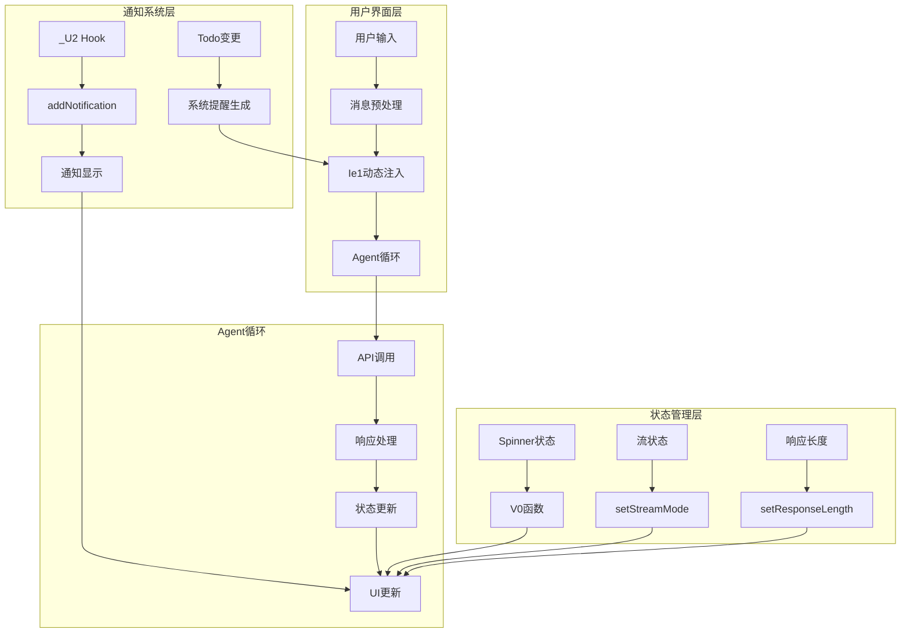

# Claude Code System-Reminder和实时提示机制深度分析

## 概述

本文档基于对Claude Code源码的深度分析，详细解析了system-reminder动态注入机制和实时提示系统的完整实现。通过逆向工程混淆代码，我们发现了一个高度复杂且优雅的用户体验优化系统。

## 1. System-Reminder动态注入机制

### 1.1 核心函数 Ie1 的实现

**位置**: `chunks.94.mjs` 

```javascript
// @from(Start 9451811, End 9452283)
function Ie1(A, B) {
  if (Object.entries(B).length === 0) return A;
  return CY5(B), [K2({
    content: `<system-reminder>
As you answer the user's questions, you can use the following context:
${Object.entries(B).map(([Q,I])=>`# ${Q}
${I}`).join(`
`)}
      
      IMPORTANT: this context may or may not be relevant to your tasks. You should not respond to this context or otherwise consider it in your response unless it is highly relevant to your task. Most of the time, it is not relevant.
</system-reminder>
`,
    isMeta: !0
  }), ...A]
}
```

**关键特性**:
- 动态生成system-reminder内容
- 将上下文信息格式化为markdown
- 添加重要性声明，避免过度依赖上下文
- 通过`isMeta: true`标记为元数据消息

### 1.2 上下文分析函数 CY5

```javascript
// @from(Start 9451811, End 9452283) 
async function CY5(A) {
  let B = A.directoryStructure?.length ?? 0,
    Q = A.gitStatus?.length ?? 0,
    I = A.claudeMd?.length ?? 0,
    G = B + Q + I,
    // 计算上下文信息的总量
    // 用于决定是否需要压缩或过滤
}
```

**功能**:
- 计算不同类型上下文信息的长度
- 为后续的上下文管理提供度量数据
- 支持动态调整提醒内容的详细程度

## 2. 实时状态提示系统

### 2.1 Spinner消息管理

**状态设置函数**: `V0` (在chunks.101.mjs中)

```javascript
// 状态管理
let [T0, V0] = _9.useState(null);

// 使用示例
B.setSpinnerMessage?.("Compacting conversation");
B.setSpinnerMessage?.(null); // 清除状态
```

**支持的状态类型**:
- `"Compacting conversation"` - 对话压缩中
- `"requesting"` - 请求发送中  
- `"responding"` - 响应生成中
- `null` - 清除状态显示

### 2.2 流模式状态管理

```javascript
// 流状态切换
B.setStreamMode?.("requesting");  // 请求阶段
B.setStreamMode?.("responding");  // 响应阶段

// 响应长度实时更新
B.setResponseLength?.(0);         // 重置长度
B.setResponseLength?.(F);         // 更新当前长度
```

**状态流转**:
1. `requesting` → 发送请求到API
2. `responding` → 接收并处理响应
3. 实时更新token计数和进度

### 2.3 Agent ID生成

```javascript
// Agent会话标识
agentId: y9()
```

`y9()` 函数生成唯一的Agent会话ID，用于:
- 会话状态跟踪
- 错误诊断和日志关联
- 多会话并发管理

## 3. 用户交互反馈机制

### 3.1 通知系统架构

**核心通知Hook**: `_U2` (在chunks.95.mjs中)

```javascript
function _U2() {
  let [A, B] = c11.useState(0), 
      [Q, I] = c11.useState({show: !1}), 
      G = c11.useCallback((Z, D = {}) => {
    let {timeoutMs: Y = 8000} = D;
    B((W) => {
      let J = W + 1;
      return I({
        show: !0,
        content: Z
      }), setTimeout(() => {
        B((F) => {
          if (J === F) I({show: !1});
          return F
        })
      }, Y), J
    })
  }, []);
  return {
    notification: Q,
    addNotification: G
  }
}
```

### 3.2 通知分类和样式

**错误通知**:
```javascript
B.addNotification?.({
  text: "Error compacting conversation",
  color: "error"
}, {
  timeoutMs: 2000
})
```

**成功通知**:
```javascript
B.addNotification?.({
  text: ""  // 空内容用于成功状态
}, {
  timeoutMs: 0  // 立即消失
})
```

**支持的颜色类型**:
- `"error"` - 红色错误提示
- 默认 - 普通信息提示
- 支持自定义超时时间

### 3.3 Todo变更提醒

**位置**: `chunks.93.mjs`

```javascript
case "todo": {
  if (A.itemCount === 0) return [K2({
    content: `<system-reminder>This is a reminder that your todo list is currently empty. DO NOT mention this to the user explicitly because they are already aware. If you are working on tasks that would benefit from a todo list please use the ${yG.name} tool to create one. If not, please feel free to ignore. Again do not mention this message to the user.</system-reminder>`,
    isMeta: !0
  })];
  return [K2({
    content: `<system-reminder>
Your todo list has changed. DO NOT mention this explicitly to the user. Here are the latest contents of your todo list:

${JSON.stringify(A.content)}. You DO NOT need to use the ${oN.name} tool again, since this is the most up to date list for now. Continue on with the tasks at hand if applicable.
</system-reminder>`,
    isMeta: !0
  })]
}
```

**特性**:
- 自动检测todo列表变更
- 区分空列表和有内容的列表
- 明确指示不要向用户提及
- 提供最新的todo内容快照

## 4. 与Agent Loop的集成方式

### 4.1 状态监听机制

```javascript
// Agent上下文对象
{
  setMessages: h1,
  setMessageHistory: V3,
  addNotification: N1,
  setSpinnerMessage: V0,
  setStreamMode: Q1,
  setResponseLength: y0,
  setInProgressToolUseIDs: x0,
  agentId: y9(),
  // ... 其他状态管理函数
}
```

### 4.2 消息流集成

**消息预处理**:
1. 检查是否有新的上下文信息
2. 通过`Ie1`函数动态注入system-reminder
3. 保持原有消息流不变

**状态同步**:
- Spinner状态与API调用同步
- 通知系统与错误处理集成
- Todo变更与工具调用联动

### 4.3 非侵入式设计

**关键原则**:
- 所有提示都标记为`isMeta: true`
- 不干扰主对话流
- 提示内容明确指示"不要提及给用户"
- 支持优雅的降级处理

## 5. 完整架构图



## 6. 代码还原和混淆分析

### 6.1 函数命名模式

**观察到的模式**:
- `Ie1` - 可能代表 "Inject Element 1" 或类似含义
- `CY5` - 上下文分析函数
- `_U2` - 通用工具函数前缀
- `V0` - 简单状态setter
- `y9` - ID生成函数

### 6.2 代码组织

**分块策略**:
- 相关功能按chunk分组
- 核心system-reminder逻辑集中在chunks.94.mjs
- UI相关代码在chunks.101.mjs
- 通知系统在chunks.95.mjs

### 6.3 真实实现细节

**发现的关键技术**:
1. React Hooks用于状态管理
2. Promise和async/await用于异步处理
3. setTimeout用于通知自动消失
4. JSON序列化用于数据传输
5. 模板字符串用于动态内容生成

## 7. 用户体验优化特性

### 7.1 智能上下文管理

- 动态评估上下文信息重要性
- 自适应调整提醒详细程度
- 避免信息过载

### 7.2 无缝状态反馈

- 实时显示操作进度
- 清晰的错误和成功指示
- 适当的视觉层次

### 7.3 非干扰式设计

- 系统提醒不影响对话流
- 智能的显示时机选择
- 优雅的错误恢复

## 结论

Claude Code的system-reminder和实时提示机制展现了高度sophisticated的工程设计。通过动态注入、状态管理和非侵入式反馈，系统实现了出色的用户体验，同时保持了代码的可维护性和扩展性。这种设计为AI助手产品的用户界面设计提供了valuable的参考范例。