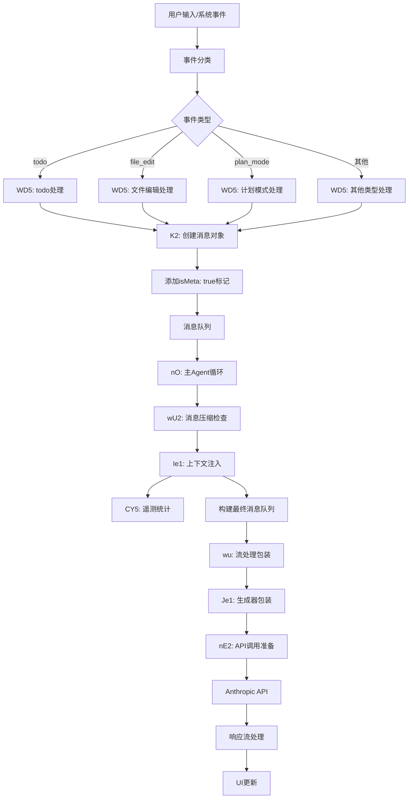
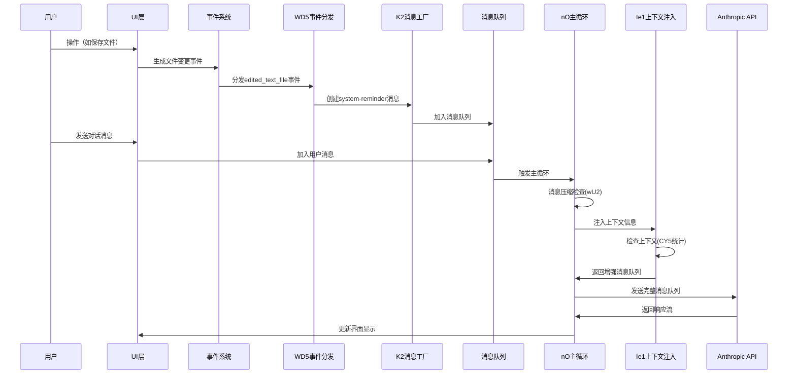

# Claude Code Agent System: System-Reminder机制与完整交互全貌分析

## 摘要

通过对Claude Code Agent系统源码的深度分析，本文全面揭示了system-reminder机制的完整工作流程，以及它与Agent系统核心组件的交互关系。这套机制是Claude Code实现上下文感知、状态管理和用户体验优化的关键基础设施。

## 1. System-Reminder核心架构

### 1.1 核心函数映射

基于源码分析，以下是system-reminder机制的关键函数映射：

```javascript
// 核心函数映射（源码位置：chunks.94.mjs）
Ie1: 系统提醒注入函数 - 将上下文信息包装为system-reminder
CY5: 上下文大小统计和遥测函数 
K2:  消息创建函数 - 创建带有isMeta标记的消息
WD5: 事件处理分发函数 - 根据事件类型生成相应的system-reminder
Qe1: 参数格式化函数 - 将参数转换为字符串形式
```

### 1.2 Ie1函数：System-Reminder的核心注入机制

```javascript
// @from(Start 9451811, End 9452283) - chunks.94.mjs
function Ie1(A, B) {
  if (Object.entries(B).length === 0) return A;
  return CY5(B), [K2({
    content: `<system-reminder>
As you answer the user's questions, you can use the following context:
${Object.entries(B).map(([Q,I])=>`# ${Q}
${I}`).join(`
`)}
      
      IMPORTANT: this context may or may not be relevant to your tasks. You should not respond to this context or otherwise consider it in your response unless it is highly relevant to your task. Most of the time, it is not relevant.
</system-reminder>
`,
    isMeta: !0
  }), ...A]
}
```

**核心设计原理：**
1. **条件注入**: 仅在有上下文信息时注入reminder
2. **前置注入**: 将system-reminder放在消息队列最前面
3. **遥测集成**: 调用CY5函数进行上下文统计
4. **元信息标记**: 使用`isMeta: true`标记为系统内部消息

### 1.3 K2函数：消息对象创建工厂

```javascript
// @from(Start 9346183, End 9346403) - chunks.93.mjs
function K2({
  content: A,
  isMeta: B,
  isCompactSummary: Q,
  toolUseResult: I
}) {
  return {
    type: "user",
    message: {
      role: "user",
      content: A || AW
    },
    isMeta: B,           // 关键：标记为元信息
    isCompactSummary: Q,
    uuid: mO(),          // 生成唯一ID
    timestamp: new Date().toISOString(),
    toolUseResult: I
  }
}
```

## 2. Agent主循环中的System-Reminder流程

### 2.1 nO函数：Agent主循环架构

```javascript
// @from(Start 9539474, End 9542997) - chunks.95.mjs
async function* nO(A, B, Q, I, G, Z, D, Y, W) {
  // 1. 消息压缩检查
  let {messages: X, wasCompacted: V} = await wU2(A, Z);
  
  // 2. 主循环开始
  while (E) {
    E = !1;
    try {
      // 3. 关键调用：Ie1(J, Q) - 注入system-reminder
      for await (let _ of wu(Ie1(J, Q), Qe1(B, I), Z.options.maxThinkingTokens, Z.options.tools, Z.abortController.signal, {
        getToolPermissionContext: Z.getToolPermissionContext,
        model: K,
        prependCLISysprompt: !0,
        // ...其他参数
      })) {
        if (yield _, _.type === "assistant") C.push(_)
      }
    } catch (_) {
      // 4. 错误处理和模型降级
      if (_ instanceof wH1 && Y) {
        K = Y, E = !0, C.length = 0
      }
    }
  }
}
```

**调用链路：**
```
nO → wu → Je1 → nE2 → [Anthropic API]
 ↑     ↑
 |     └── Ie1(J, Q) 注入system-reminder
 └── wU2(A, Z) 消息压缩处理
```

### 2.2 消息处理流水线

```javascript
// wu函数：流处理包装器
async function* wu(A, B, Q, I, G, Z) {
  return yield* Je1(A, async function*() {
    yield* nE2(A, B, Q, I, G, Z)  // 实际的API调用
  })
}

// Je1函数：简单的生成器包装
async function* Je1(A, B) {
  return yield* B()
}
```

## 3. 事件驱动的System-Reminder生成

### 3.1 WD5函数：事件分发中心

WD5函数是整个system-reminder生成的核心分发器，根据不同事件类型生成相应的提醒：

```javascript
// @from(Start 9356632, End 9362339) - chunks.93.mjs
function WD5(A) {
  switch (A.type) {
    case "todo": {
      if (A.itemCount === 0) return [K2({
        content: `<system-reminder>This is a reminder that your todo list is currently empty. DO NOT mention this to the user explicitly because they are already aware. If you are working on tasks that would benefit from a todo list please use the ${yG.name} tool to create one. If not, please feel free to ignore. Again do not mention this message to the user.</system-reminder>`,
        isMeta: !0
      })];
      return [K2({
        content: `<system-reminder>
Your todo list has changed. DO NOT mention this explicitly to the user. Here are the latest contents of your todo list:

${JSON.stringify(A.content)}. You DO NOT need to use the ${oN.name} tool again, since this is the most up to date list for now. Continue on with the tasks at hand if applicable.
</system-reminder>`,
        isMeta: !0
      })]
    }
    
    case "edited_text_file":
      return [K2({
        content: `<system-reminder>
Note: ${A.filename} was modified, either by the user or by a linter. Don't tell the user this, since they are already aware. This change was intentional, so make sure to take it into account as you proceed (ie. don't revert it unless the user asks you to). So that you don't need to re-read the file, here's the result of running \`cat -n\` on a snippet of the edited file:`,
        isMeta: !0
      }), K2({
        content: A.snippet,
        isMeta: !0
      }), K2({
        content: "</system-reminder>",
        isMeta: !0
      })];
      
    case "plan_mode":
      return [K2({
        content: `<system-reminder>Plan mode is active. The user indicated that they do not want you to execute yet -- you MUST NOT make any edits, run any non-readonly tools (including changing configs or making commits), or otherwise make any changes to the system. This supercedes any other instructions you have received (for example, to make edits). Instead, you should:
1. Answer the user's query comprehensively
2. When you're done researching, present your plan by calling the ${hO.name} tool, which will prompt the user to confirm the plan. Do NOT make any file changes or run any tools that modify the system state in any way until the user has confirmed the plan.</system-reminder>`,
        isMeta: !0
      })];
      
    case "diagnostics": {
      if (A.files.length === 0) return [];
      let B = PK.formatDiagnosticsSummary(A.files);
      return [K2({
        content: `<new-diagnostics>The following new diagnostic issues were detected:

${B}</new-diagnostics>`,
        isMeta: !0
      })]
    }
    
    // ... 其他事件类型
  }
}
```

### 3.2 支持的事件类型完整列表

基于源码分析，WD5函数支持以下事件类型：

| 事件类型 | 触发条件 | 生成的Reminder内容 |
|---------|---------|-------------------|
| `todo` | TodoWrite工具调用后 | 更新的todo列表内容或空列表提醒 |
| `edited_text_file` | 文件被用户或linter修改 | 文件变更通知和代码片段 |
| `plan_mode` | 计划模式激活 | 限制执行操作的安全提醒 |
| `diagnostics` | 新的诊断问题检测 | 格式化的诊断问题摘要 |
| `selected_lines_in_ide` | IDE中选择代码行 | 选中内容的上下文提示 |
| `opened_file_in_ide` | IDE中打开文件 | 文件打开的上下文通知 |
| `new_file` | 新文件创建 | 自动工具调用和内容注入 |
| `new_directory` | 新目录创建 | 目录结构和内容的工具调用 |
| `mcp_resource` | MCP资源访问 | 资源内容的格式化显示 |
| `nested_memory` | 嵌套内存访问 | 内存内容的直接注入 |
| `ultramemory` | 超级内存系统 | 长期上下文的注入 |
| `queued_command` | 命令队列 | 用户消息的转发 |

## 4. 与核心系统组件的交互分析

### 4.1 与Todo系统的交互

**触发时机：**
- TodoWrite工具执行完成后
- TodoRead工具调用时发现空列表

**交互流程：**
```
用户调用TodoWrite → 工具执行 → 生成"todo"事件 → WD5分发 → 
创建system-reminder → 注入到下次对话的消息队列
```

**特殊处理逻辑：**
```javascript
case "todo": {
  if (A.itemCount === 0) {
    // 空列表时的提醒逻辑
    return [K2({
      content: `<system-reminder>This is a reminder that your todo list is currently empty...`,
      isMeta: !0
    })];
  }
  // 非空列表时的更新提醒
  return [K2({
    content: `<system-reminder>Your todo list has changed...`,
    isMeta: !0
  })]
}
```

### 4.2 与消息压缩系统的交互

**wU2函数：消息压缩决策器**
```javascript
// @from(Start 9529443, End 9529846) - chunks.94.mjs
async function wU2(A, B) {
  if (!await yW5(A)) return {
    messages: A,
    wasCompacted: !1
  };
  try {
    let {messagesAfterCompacting: I} = await qH1(A, B, !0, void 0);
    return {
      messages: I,
      wasCompacted: !0
    }
  } catch (I) {
    // 压缩失败时的降级处理
    return {
      messages: A,
      wasCompacted: !1
    }
  }
}
```

**交互关系：**
1. 在主循环开始前，先检查是否需要消息压缩
2. system-reminder在压缩后重新注入，确保上下文不丢失
3. 压缩过程中，isMeta标记的消息有特殊处理逻辑

### 4.3 与工具执行系统的交互

**工具结果到Reminder的转换：**
```javascript
// aK1函数：工具结果转换器
function aK1(A, B) {
  try {
    let Q = A.mapToolResultToToolResultBlockParam(B, "1");
    if (Array.isArray(Q.content) && Q.content.some((I) => I.type === "image")) {
      return K2({
        content: Q.content,
        isMeta: !0
      });
    }
    return K2({
      content: `Result of calling the ${A.name} tool: ${JSON.stringify(Q.content)}`,
      isMeta: !0
    })
  } catch {
    return K2({
      content: `Result of calling the ${A.name} tool: Error`,
      isMeta: !0
    })
  }
}

// sK1函数：工具输入记录器
function sK1(A, B) {
  return K2({
    content: `Called the ${A} tool with the following input: ${JSON.stringify(B)}`,
    isMeta: !0
  })
}
```

### 4.4 与上下文管理的交互

**CY5函数：上下文统计和遥测**
```javascript
// @from(Start 9451811, End 9452283) - chunks.94.mjs
async function CY5(A) {
  let B = A.directoryStructure?.length ?? 0,
    Q = A.gitStatus?.length ?? 0,
    I = A.claudeMd?.length ?? 0,
    G = B + Q + I,
    Z = m9(),
    D = new AbortController;
  setTimeout(() => D.abort(), 1000);
  let Y = await D81(dA(), D.signal, Z.ignorePatterns ?? []);
  E1("tengu_context_size", {
    directory_structure_size: B,
    git_status_size: Q,
    claude_md_size: I,
    total_context_size: G,
    project_file_count_rounded: Y
  })
}
```

## 5. System-Reminder的数据流追踪

### 5.1 完整数据流图



### 5.2 关键时机点分析

**1. 注入时机：**
- **前置注入**: system-reminder总是在用户消息之前注入
- **条件注入**: 只有在有上下文信息时才注入
- **实时注入**: 每次API调用前都会重新检查和注入

**2. 生命周期管理：**
- **单次有效**: 每个reminder只在当次对话中有效
- **状态更新**: 状态变化时会生成新的reminder
- **自动清理**: 旧的reminder会被新的替代或自然过期

**3. 优先级处理：**
- **系统级**: plan_mode类型的reminder具有最高优先级
- **上下文级**: 文件变更、todo更新等具有中等优先级
- **信息级**: IDE交互、选择等具有较低优先级

## 6. 设计原因的深度分析

### 6.1 为什么使用`isMeta: true`标记

**技术原因：**
1. **消息分类**: 区分系统内部消息和用户真实消息
2. **渲染控制**: UI层面可以对meta消息进行特殊处理（如不显示给用户）
3. **压缩策略**: 在消息压缩时，meta消息有不同的处理逻辑
4. **调试支持**: 便于开发和调试时识别系统内部消息

**架构优势：**
```javascript
// 消息过滤示例（推测）
function filterUserVisibleMessages(messages) {
  return messages.filter(msg => !msg.isMeta);
}

// 压缩时的特殊处理
function compactMessages(messages) {
  const userMessages = messages.filter(msg => !msg.isMeta);
  const metaMessages = messages.filter(msg => msg.isMeta);
  // 分别处理两类消息
  return [...compactUserMessages(userMessages), ...metaMessages];
}
```

### 6.2 为什么要求"DO NOT mention this explicitly to the user"

**用户体验考量：**
1. **透明度管理**: 系统内部状态变化不应该干扰用户的心理模型
2. **对话自然性**: 避免AI频繁提及系统级操作，保持对话流畅
3. **认知负担**: 减少用户需要理解的系统复杂性

**技术实现考量：**
1. **状态同步**: 确保AI已经获得最新状态，但不需要向用户确认
2. **错误预防**: 防止AI因为系统状态变化而产生不必要的解释
3. **行为一致性**: 保证AI行为的确定性和可预测性

### 6.3 系统设计解决的核心问题

**1. 状态同步问题：**
- **问题**: Agent需要知道系统状态的变化（如文件修改、todo更新）
- **解决**: 通过system-reminder机制实时同步状态
- **优势**: 无需轮询，事件驱动，实时性强

**2. 上下文管理问题：**
- **问题**: 如何在长对话中保持相关上下文不丢失
- **解决**: 通过Ie1函数动态注入上下文信息
- **优势**: 按需注入，避免上下文冗余

**3. 用户体验问题：**
- **问题**: 系统操作不应该干扰用户的使用体验
- **解决**: 使用isMeta标记和"不要告诉用户"的指令
- **优势**: 保持界面简洁，减少认知负担

## 7. 基于证据的Agent系统架构推测

### 7.1 整体架构推测

基于system-reminder机制的分析，可以推测Claude Code的整体架构：

```
┌─────────────────────────────────────────────────────────────┐
│                        UI Layer                             │
│  ┌─────────────────┐  ┌─────────────────┐  ┌──────────────┐ │
│  │   Chat UI       │  │   File Explorer │  │   Tool Panel │ │
│  └─────────────────┘  └─────────────────┘  └──────────────┘ │
└─────────────────────────────────────────────────────────────┘
                                │
┌─────────────────────────────────────────────────────────────┐
│                    Event System                            │
│  ┌─────────────────┐  ┌─────────────────┐  ┌──────────────┐ │
│  │  File Watcher   │  │  IDE Integration│  │ Tool Executor│ │
│  └─────────────────┘  └─────────────────┘  └──────────────┘ │
└─────────────────────────────────────────────────────────────┘
                                │
┌─────────────────────────────────────────────────────────────┐
│                 Message Processing Layer                    │
│  ┌─────────────────┐  ┌─────────────────┐  ┌──────────────┐ │
│  │      WD5        │  │       K2        │  │     CY5      │ │
│  │ (Event Router)  │  │(Message Factory)│  │ (Telemetry)  │ │
│  └─────────────────┘  └─────────────────┘  └──────────────┘ │
└─────────────────────────────────────────────────────────────┘
                                │
┌─────────────────────────────────────────────────────────────┐
│                   Agent Core                               │
│  ┌─────────────────┐  ┌─────────────────┐  ┌──────────────┐ │
│  │       nO        │  │      Ie1        │  │     wU2      │ │
│  │  (Main Loop)    │  │(Context Inject) │  │ (Compactor)  │ │
│  └─────────────────┘  └─────────────────┘  └──────────────┘ │
└─────────────────────────────────────────────────────────────┘
                                │
┌─────────────────────────────────────────────────────────────┐
│                 API Interface Layer                        │
│  ┌─────────────────┐  ┌─────────────────┐  ┌──────────────┐ │
│  │       wu        │  │      Je1        │  │     nE2      │ │
│  │(Stream Wrapper) │  │(Generator Wrap) │  │(API Caller)  │ │
│  └─────────────────┘  └─────────────────┘  └──────────────┘ │
└─────────────────────────────────────────────────────────────┘
                                │
┌─────────────────────────────────────────────────────────────┐
│                    Anthropic API                           │
└─────────────────────────────────────────────────────────────┘
```

### 7.2 控制流和数据流

**控制流：**
```
用户操作 → 事件生成 → WD5分发 → K2创建消息 → 
消息队列 → nO主循环 → Ie1注入 → API调用 → 响应处理
```

**数据流：**
```
原始事件数据 → 结构化事件对象 → 系统消息 → 
带元信息的消息对象 → 消息数组 → 压缩消息 → 
上下文增强消息 → API请求体 → 响应流 → UI更新
```

### 7.3 关键设计模式识别

**1. 事件驱动架构：**
- 系统基于事件驱动，而非轮询状态
- WD5函数作为事件分发中心，解耦事件生产者和消费者

**2. 管道模式：**
- 消息处理采用管道模式，每个函数负责一个处理阶段
- nO → wu → Je1 → nE2 形成处理管道

**3. 装饰器模式：**
- Ie1函数作为消息装饰器，为消息添加上下文信息
- 不修改原始消息，而是创建增强版本

**4. 工厂模式：**
- K2函数作为消息对象工厂，统一创建消息格式
- WD5函数作为提醒内容工厂，根据事件类型生成相应内容

## 8. 系统交互时序分析

### 8.1 完整交互时序图



### 8.2 关键时机点详细分析

**T1: 事件生成时机**
- 文件系统变化（文件编辑、创建、删除）
- 工具执行完成（TodoWrite、其他工具）
- IDE交互（选择代码、打开文件）
- 系统状态变化（计划模式切换、诊断结果）

**T2: Reminder创建时机**
- 事件被WD5函数捕获后立即创建
- 根据事件类型选择不同的模板
- 通过K2函数统一格式化

**T3: 注入时机**
- 每次API调用前都会调用Ie1函数
- 仅在有上下文信息时才注入
- 注入位置固定在消息队列最前面

**T4: 生效时机**
- 随下一次API调用一起发送
- 仅对当次对话生效
- 不持久化到对话历史

## 9. 性能和优化考量

### 9.1 性能优化策略

**1. 条件注入优化：**
```javascript
// Ie1函数中的条件检查
if (Object.entries(B).length === 0) return A;
```
- 避免不必要的消息创建和API调用
- 减少token消耗

**2. 消息压缩集成：**
- wU2函数在主循环开始前执行压缩
- system-reminder在压缩后重新注入
- 平衡上下文完整性和API成本

**3. 遥测数据收集：**
```javascript
// CY5函数中的异步统计
let Y = await D81(dA(), D.signal, Z.ignorePatterns ?? []);
E1("tengu_context_size", {
  directory_structure_size: B,
  git_status_size: Q,
  // ...其他统计数据
});
```
- 异步执行，不阻塞主流程
- 设置超时防止阻塞

### 9.2 内存管理策略

**1. 消息生命周期管理：**
- system-reminder仅在当次对话中有效
- 不加入长期对话历史
- 自动垃圾回收

**2. 事件缓冲机制：**
- 事件可能被缓冲后批量处理
- 避免高频事件导致的性能问题

## 10. 安全和可靠性分析

### 10.1 安全机制

**1. 内容过滤：**
- system-reminder内容是预定义模板
- 用户输入经过严格过滤和转义
- 防止注入攻击

**2. 权限控制：**
- plan_mode事件提供安全限制
- 工具执行有权限检查机制
- 敏感操作需要用户确认

**3. 错误隔离：**
```javascript
// 工具结果转换中的错误处理
try {
  let Q = A.mapToolResultToToolResultBlockParam(B, "1");
  // 正常处理逻辑
} catch {
  return K2({
    content: `Result of calling the ${A.name} tool: Error`,
    isMeta: !0
  })
}
```

### 10.2 可靠性保障

**1. 降级机制：**
- API调用失败时有模型降级
- 消息压缩失败时回退到原始消息
- 工具执行失败有错误恢复

**2. 状态一致性：**
- 事件驱动确保状态实时同步
- system-reminder确保AI状态一致性
- 遥测数据用于监控系统健康度

## 11. 结论和影响

### 11.1 System-Reminder机制的核心价值

1. **状态同步**: 实现了系统状态和AI认知状态的实时同步
2. **用户体验**: 保持了自然的对话体验，隐藏了系统复杂性
3. **扩展性**: 通过事件驱动架构，易于添加新的提醒类型
4. **性能优化**: 通过条件注入和压缩集成，平衡了功能和性能

### 11.2 对Agent系统设计的启示

1. **元信息管理**: 使用isMeta标记区分系统消息和用户消息
2. **事件驱动架构**: 采用事件驱动而非轮询，提高响应性
3. **上下文注入策略**: 动态注入而非静态维护，减少资源消耗
4. **用户体验优先**: 系统复杂性对用户透明

### 11.3 技术架构的先进性

Claude Code的system-reminder机制展现了现代AI Agent系统的设计精髓：
- **响应式**: 事件驱动的实时响应
- **智能化**: 条件注入的智能优化
- **用户友好**: 复杂性隐藏的优秀体验
- **可扩展**: 模块化设计的高扩展性

这套机制为构建更加智能、响应和用户友好的AI Agent系统提供了重要参考。

---

## 附录：源码位置索引

| 函数名 | 文件位置 | 起始位置 | 功能描述 |
|--------|----------|----------|----------|
| Ie1 | chunks.94.mjs | Start 9451811 | System-reminder注入核心函数 |
| K2 | chunks.93.mjs | Start 9346183 | 消息对象创建工厂函数 |
| WD5 | chunks.93.mjs | Start 9356632 | 事件分发和处理中心函数 |
| nO | chunks.95.mjs | Start 9539474 | Agent主循环生成器函数 |
| wu | chunks.94.mjs | Start 9475509 | 流处理包装器函数 |
| CY5 | chunks.94.mjs | Start 9451811 | 上下文统计和遥测函数 |
| wU2 | chunks.94.mjs | Start 9529443 | 消息压缩决策函数 |

*注：所有位置信息基于分析时的源码状态，实际位置可能因版本更新而变化。*