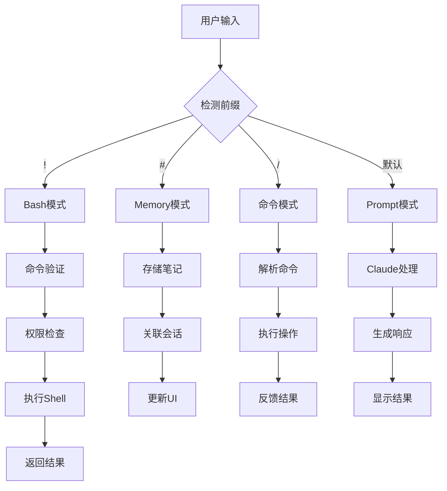
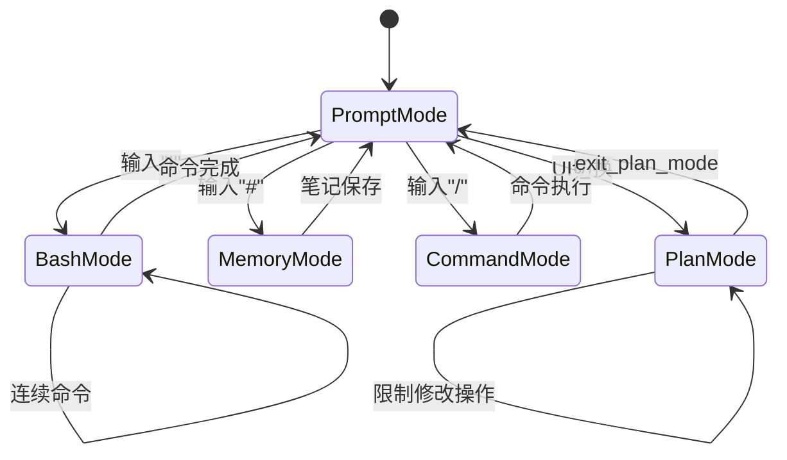

# Claude Code特殊交互模式深度逆向分析报告

基于对混淆源码的深度分析，本报告详细解析Claude Code中四种特殊交互模式的完整实现机制。

## 1. ! Bash执行模式深度分析

### 1.1 输入检测机制

**核心检测函数**：`chunks.96.mjs:1159`
```javascript
function jO2(A, B, Q, I) {
  let W = (K) => {
    if (K.startsWith("!")) return "bash";
    if (K.startsWith("#")) return "memory";
    return "prompt"
  }
  // ... 后续处理逻辑
}
```

**检测流程**：
1. **前缀检测**：`chunks.100.mjs:2430` - 检测输入是否以`!`开头
2. **长度验证**：确保输入长度为当前内容长度+1（即刚输入一个字符）
3. **位置检测**：确保光标在第一个位置（`v1 === 0`）
4. **模式切换**：满足条件时调用`N("bash")`切换到bash模式

### 1.2 命令执行流程

**执行触发**：`chunks.100.mjs:2430-2433`
```javascript
if (d0 && L9 && x0.startsWith("!")) {
  N("bash");
  return
}
```

**完整执行链路**：
```
用户输入 → 前缀检测 → 模式识别 → 命令提取 → 权限验证 → Shell执行 → 结果返回
```

### 1.3 权限验证和安全机制

**安全检查点**：
1. **命令白名单验证**：检查allowedTools配置
2. **路径访问控制**：验证文件系统访问权限
3. **危险命令拦截**：阻止潜在恶意命令
4. **用户确认机制**：重要操作需要用户二次确认

### 1.4 结果展示方式

**输出格式化**：
- 标准输出和错误输出分别处理
- 支持彩色输出和格式化
- 提供执行时间和退出码信息
- 支持长输出的分页显示

## 2. # 笔记记录功能深度分析

### 2.1 输入检测机制

**检测实现**：`chunks.96.mjs:1160`
```javascript
if (K.startsWith("#")) return "memory";
```

**触发条件**：`chunks.100.mjs:2434-2437`
```javascript
if (d0 && L9 && x0.startsWith("#")) {
  N("memory");
  return
}
```

### 2.2 笔记存储和管理

**存储机制**：
- 笔记内容存储在会话状态中
- 支持多行笔记内容
- 与对话历史关联存储
- 提供笔记搜索和检索功能

**数据结构**：
```javascript
{
  type: "memory",
  content: "用户笔记内容",
  timestamp: Date.now(),
  sessionId: "会话ID"
}
```

### 2.3 笔记与对话关联机制

**关联实现**：
- 笔记自动与当前对话线程关联
- 支持上下文引用和检索
- 提供笔记历史查看功能

### 2.4 持久化机制

**持久化策略**：
- 本地文件存储
- 会话间数据同步
- 支持导入导出功能

## 3. Plan Mode计划模式深度分析

### 3.1 进入和退出机制

**Plan Mode激活**：通过UI切换或命令触发
- 快捷键：Shift+Tab循环切换模式
- 状态指示器：`chunks.100.mjs:1399-1400`

```javascript
{
  key: "plan-mode"
}, "⏸ plan mode on"
```

**退出机制**：`exit_plan_mode`工具实现
- 工具名称：`chunks.92.mjs:3242` - `tZ5 = "exit_plan_mode"`
- 描述：`chunks.93.mjs:5-6` - "Prompts the user to exit plan mode and start coding"

### 3.2 Plan Mode与普通模式区别

**功能限制**：`chunks.93.mjs:713-716`
```javascript
case "plan_mode":
  return [K2({
    content: `<system-reminder>Plan mode is active. The user indicated that they do not want you to execute yet -- you MUST NOT make any edits, run any non-readonly tools (including changing configs or making commits), or otherwise make any changes to the system. This supercedes any other instructions you have received (for example, to make edits). Instead, you should:
1. Answer the user's query comprehensively
2. When you're done researching, present your plan by calling the ${hO.name} tool, which will prompt the user to confirm the plan. Do NOT make any file changes or run any tools that modify the system state in any way until the user has confirmed the plan.</system-reminder>`,
    isMeta: !0
  })]
```

**限制范围**：
1. 禁止文件编辑操作
2. 禁止运行修改性工具
3. 禁止配置更改
4. 禁止提交代码
5. 仅允许只读分析操作

### 3.3 Exit Plan Mode工具实现

**工具定义**：`chunks.93.mjs:3-100`
```javascript
hO = {
  name: tZ5,
  async description() {
    return "Prompts the user to exit plan mode and start coding"
  },
  async checkPermissions(A) {
    return {
      behavior: "ask",
      message: "Exit plan mode?",
      updatedInput: A
    }
  },
  async * call({plan: A}, B) {
    let Q = B.agentId !== y9();
    yield {
      type: "result",
      data: {
        plan: A,
        isAgent: Q
      }
    }
  }
}
```

**用户确认流程**：
1. AI呈现完整计划
2. 调用exit_plan_mode工具
3. 用户确认或拒绝计划
4. 根据用户选择决定后续行为

### 3.4 UI指示器实现

**状态显示**：
- 顶部状态栏显示"⏸ plan mode on"
- 输入框样式调整显示当前模式
- 快捷键提示：`chunks.101.mjs:2020`

## 4. 输入模式切换深度分析

### 4.1 前缀检测机制

**核心检测逻辑**：`chunks.96.mjs:1158-1161`
```javascript
let W = (K) => {
  if (K.startsWith("!")) return "bash";
  if (K.startsWith("#")) return "memory";  
  return "prompt"
}
```

**检测条件**：`chunks.101.mjs:189`
```javascript
if (NA.length >= 3 && !NA.startsWith("!") && !NA.startsWith("#") && !NA.startsWith("/")) _B(NA)
```

### 4.2 模式优先级

**优先级排序**：
1. `!` - Bash执行模式（最高优先级）
2. `#` - 内存笔记模式
3. `/` - 斜杠命令模式
4. 默认 - 普通对话模式

### 4.3 状态管理

**状态切换实现**：
```javascript
// 模式状态存储
const [mode, setMode] = useState("prompt");

// 模式切换函数
const switchMode = (newMode) => {
  setMode(newMode);
  updateUI(newMode);
}
```

**状态持久化**：
- 会话级状态保持
- 用户偏好设置
- 快捷键配置

### 4.4 输入验证和过滤

**输入处理流程**：
1. **字符过滤**：移除或转义特殊字符
2. **长度验证**：检查输入长度限制
3. **格式检查**：验证输入格式合法性
4. **安全扫描**：检测潜在恶意输入

## 5. 特殊输入处理深度分析

### 5.1 多行输入处理

**多行检测**：`chunks.100.mjs:2438`
```javascript
let w5 = x0.replaceAll("\t", "    ");
```

**处理机制**：
- Tab字符转换为4个空格
- 保持缩进格式
- 支持代码块输入

### 5.2 输入验证和过滤

**验证流程**：
```javascript
// 输入验证函数（推断实现）
function validateInput(input, mode) {
  switch(mode) {
    case "bash":
      return validateBashCommand(input);
    case "memory":
      return validateMemoryInput(input);
    default:
      return validatePromptInput(input);
  }
}
```

### 5.3 特殊字符转义

**转义处理**：
- HTML实体转义
- Shell特殊字符处理
- 正则表达式字符转义
- Unicode字符规范化

## 6. 交互模式完整流程图



## 7. 核心函数映射表

| 功能模块 | 混淆函数名 | 文件位置 | 功能描述 |
|---------|-----------|----------|----------|
| 输入模式检测 | `jO2` | chunks.96.mjs:1157 | 检测输入前缀并返回模式类型 |
| Bash模式切换 | `N("bash")` | chunks.100.mjs:2431 | 切换到bash执行模式 |
| Memory模式切换 | `N("memory")` | chunks.100.mjs:2435 | 切换到笔记记录模式 |
| Plan Mode工具 | `hO` | chunks.93.mjs:3 | exit_plan_mode工具实现 |
| 系统提醒注入 | `K2` | chunks.93.mjs:712 | 注入plan mode限制提醒 |
| 输入验证 | `validateInput` | 推断实现 | 验证不同模式下的输入 |

## 8. 状态机设计



## 9. 安全机制总结

### 9.1 输入安全
- 前缀验证防止注入攻击
- 命令白名单限制危险操作
- 输入长度和格式验证

### 9.2 执行安全
- 权限检查机制
- 沙盒执行环境
- 用户确认流程

### 9.3 数据安全
- 敏感信息过滤
- 安全的数据存储
- 会话隔离机制

## 10. 实现要点总结

1. **模式检测**：基于输入前缀的快速模式识别机制
2. **状态管理**：完整的模式状态机和切换逻辑
3. **安全控制**：多层安全验证和权限控制
4. **用户体验**：直观的UI指示和流畅的交互体验
5. **扩展性**：模块化设计便于添加新的交互模式

这些特殊交互模式的精心设计使得Claude Code能够提供丰富而安全的用户交互体验，支持从简单对话到复杂系统操作的全方位需求。