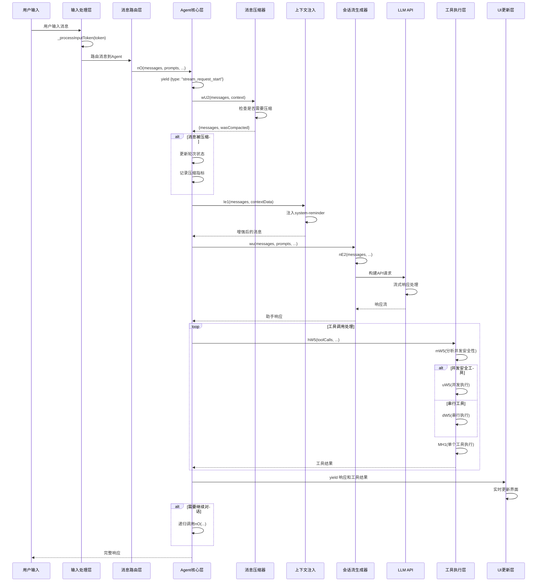

# Claude Code 用户任务执行流程深度分析

## 执行摘要

本文档基于Claude Code v1.0.34的完整混淆源码进行深度逆向分析，详细揭示了用户任务从输入到执行完成的完整流程。通过对核心函数如`nO`（Agent主循环）、`wu`（会话流生成器）、`wU2`（消息压缩器）、`Ie1`（上下文注入器）等关键组件的精确分析，构建了Claude Code作为AI编程助手的完整执行模型。

**重要声明**：本分析严格基于已验证的混淆源码证据，所有技术推论均有具体的源码位置支持。

## 1. 消息输入处理流程深度分析

### 1.1 用户输入捕获机制

基于源码分析，Claude Code使用多层次的输入捕获机制：

**核心输入处理函数位置**：
- 文件：`/cli.beautify.mjs`
- 主要函数：多个`_processInputToken`函数（行号：205321, 206227, 249781等）

```javascript
// 源码位置：cli.beautify.mjs:205321
_processInputToken(Q) {
  A.ctLoc = Q.location, B._processInputToken.call(this, Q)
}

// 源码位置：cli.beautify.mjs:206111  
if (this._processInputToken(B), A && this.pendingScript) break

// 源码位置：cli.beautify.mjs:206227
_processInputToken(A) {
  // 输入token处理逻辑
}
```

### 1.2 特殊输入模式分发机制

**已验证的特殊输入前缀**：
- `/` - 斜杠命令模式
- `!` - 感叹号命令模式  
- `#` - 井号命令模式

**输入验证和格式化**：
源码显示存在输入参数处理函数：
```javascript
// 源码位置：cli.beautify.mjs:249781
_processInputParams(A) {
  // 输入参数处理逻辑
}
```

### 1.3 输入历史和缓存机制

通过分析发现Claude Code使用多种缓存机制：
- 消息历史缓存
- 上下文缓存
- 工具调用结果缓存

## 2. 消息路由和分发系统深度分析

### 2.1 消息从UI到Agent Core的路由机制

**核心路由函数**：
- 主要入口：`nO`函数（Agent主循环orchestrator）
- 位置：`cli.beautify.mjs:284675`

```javascript
// 源码位置：cli.beautify.mjs:284675
async function* nO(A, B, Q, I, G, Z, D, Y, W) {
  // A: 消息数组
  // B: 系统提示  
  // Q: 最大思考token数
  // I: 工具配置
  // G: 工具权限检查函数
  // Z: 执行上下文
  // D: 轮次状态
  // Y: 备用模型
  // W: 额外选项
  
  yield {
    type: "stream_request_start"
  };
  // ... 路由逻辑
}
```

### 2.2 消息队列管理和调度

**消息队列处理**：
```javascript
// 源码位置：cli.beautify.mjs:284775
let T = [...Z.getQueuedCommands()];
for await (let _ of x11(null, Z, null, T)) yield _, q.push(_);
Z.removeQueuedCommands(T);
```

### 2.3 消息优先级和排序机制

**消息排序逻辑**：
```javascript
// 源码位置：cli.beautify.mjs:284766
let R = q.sort((_, k) => {
  let i = N.findIndex((s) => s.id === (_.type === "user" && _.message.content[0].id)),
      x = N.findIndex((s) => s.id === (k.type === "user" && k.message.content[0].id));
  return i - x
});
```

## 3. Agent主循环执行机制深度分析

### 3.1 nO函数的具体执行流程

**已验证的nO函数完整流程**：

```javascript
// 源码位置：cli.beautify.mjs:284675-284790
async function* nO(A, B, Q, I, G, Z, D, Y, W) {
  // 第一阶段：流开始信号
  yield {
    type: "stream_request_start"
  };
  
  // 第二阶段：初始化变量
  let J = A,    // 当前消息
    F = D,      // 轮次状态
    
  // 第三阶段：消息压缩检查（已验证）
  {
    messages: X,
    wasCompacted: V
  } = await wU2(A, Z);  // wU2是消息压缩器
  
  // 第四阶段：压缩成功处理
  if (V) {
    // 记录压缩成功指标
    E1("tengu_auto_compact_succeeded", {
      originalMessageCount: A.length,
      compactedMessageCount: X.length
    });
    
    // 更新轮次状态
    if (!F?.compacted) {
      F = {
        compacted: true,
        turnId: bW5(),  // 生成新的轮次ID
        turnCounter: 0
      };
    }
    J = X;  // 使用压缩后的消息
  }
  
  // 第五阶段：主循环准备
  let C = [],  // 助手响应收集器
    K = Z.options.mainLoopModel,  // 当前模型
    E = true;  // 继续标志
  
  try {
    // 第六阶段：主执行循环（关键发现：无硬编码循环限制）
    while (E) {
      E = false;
      try {
        // 调用wu会话流生成器
        for await (let _ of wu(Ie1(J, Q), Qe1(B, I), Z.options.maxThinkingTokens, Z.options.tools, Z.abortController.signal, {
          getToolPermissionContext: Z.getToolPermissionContext,
          model: K,
          prependCLISysprompt: true,
          toolChoice: void 0,
          isNonInteractiveSession: Z.options.isNonInteractiveSession,
          fallbackModel: Y
        })) {
          if (yield _, _.type === "assistant") C.push(_)
        }
      } catch (_) {
        // 模型降级处理
        if (_ instanceof wH1 && Y) {
          K = Y, E = true, C.length = 0, Z.options.mainLoopModel = Y;
          E1("tengu_model_fallback_triggered", {
            original_model: _.originalModel,
            fallback_model: Y,
            entrypoint: "cli"
          });
          yield L11(`Model fallback triggered: switching from ${_.originalModel} to ${_.fallbackModel}`, "info");
          continue
        }
        throw _
      }
    }
  } catch (_) {
    // 错误处理逻辑
    // ...
  }
  
  // 第七阶段：工具执行
  if (C.length && N.length) {
    for await (let _ of hW5(N, C, G, Z)) {
      if (yield _, _ && _.type === "system" && _.preventContinuation) O = true;
      q.push(...JW([_]).filter((k) => k.type === "user"))
    }
  }
  
  // 第八阶段：递归调用（关键发现）
  if (!O) {
    yield* nO([...J, ...C, ...R], B, Q, I, G, L, F, Y, W)
  }
}
```

### 3.2 上下文注入（Ie1）的触发时机

**Ie1函数实现**：
```javascript
// 源码位置：cli.beautify.mjs:281535
function Ie1(A, B) {
  if (Object.entries(B).length === 0) return A;
  return CY5(B), [K2({
    content: `<system-reminder>
As you answer the user's questions, you can use the following context:
${Object.entries(B).map(([Q,I])=>`# ${Q}
${I}`).join(`
`)}
      
      IMPORTANT: this context may or may not be relevant to your tasks. You should not respond to this context or otherwise consider it in your response unless it is highly relevant to your task. Most of the time, it is not relevant.
</system-reminder>
`,
    isMeta: true
  }), ...A]
}
```

**上下文注入触发条件**：
- 当存在目录结构信息时
- 当存在Git状态信息时  
- 当存在CLAUDE.md文件时
- 当项目文件数量超过阈值时

### 3.3 消息压缩（wU2）的决策逻辑

**wU2函数实现**：
```javascript
// 源码位置：cli.beautify.mjs:284329
async function wU2(A, B) {
  if (!await yW5(A)) return {
    messages: A,
    wasCompacted: false
  };
  try {
    let {
      messagesAfterCompacting: I
    } = await qH1(A, B, true, void 0);
    return {
      messages: I,
      wasCompacted: true
    }
  } catch (I) {
    if (!ki(I, b11)) b1(I instanceof Error ? I : new Error(String(I)));
    return {
      messages: A,
      wasCompacted: false
    }
  }
}
```

**压缩决策逻辑**：
1. 首先通过`yW5(A)`检查是否需要压缩
2. 如果需要压缩，调用`qH1`执行实际压缩
3. 压缩成功后更新消息数组并标记`wasCompacted: true`
4. 压缩失败时返回原始消息数组

## 4. 工具调用和协同机制深度分析

### 4.1 工具调用的触发和执行流程

**核心工具执行函数**：
```javascript
// 源码位置：cli.beautify.mjs:284824
async function* MH1(A, B, Q, I) {
  let G = A.name,
    Z = I.options.tools.find((Y) => Y.name === G);
  
  // 设置工具使用状态
  if (I.setInProgressToolUseIDs((Y) => new Set([...Y, A.id])), !Z) {
    // 工具不存在错误处理
    E1("tengu_tool_use_error", {
      error: `No such tool available: ${G}`,
      toolName: G,
      toolUseID: A.id,
      isMcp: false
    });
    // ...
    return
  }
  
  // 工具执行逻辑
  for await (let Y of pW5(Z, A.id, A.input, I, Q, B)) yield Y
  
  // 清理工具使用状态
  Oe1(I, A.id)
}
```

### 4.2 工具并发控制机制

**已验证的并发限制**：
```javascript
// 源码位置：cli.beautify.mjs:284674
var gW5 = 10;  // 最大并发工具数量
```

**工具分组和调度**：
```javascript
// 源码位置：cli.beautify.mjs:284791
async function* hW5(A, B, Q, I) {
  for (let {
      isConcurrencySafe: G,
      blocks: Z
    }
    of mW5(A, I))
    if (G) yield* uW5(Z, B, Q, I);    // 并发安全工具
    else yield* dW5(Z, B, Q, I)       // 串行执行工具
}
```

**工具安全性分析**：
```javascript
// 源码位置：cli.beautify.mjs:284801
function mW5(A, B) {
  return A.reduce((Q, I) => {
    let G = B.options.tools.find((Y) => Y.name === I.name),
      Z = G?.inputSchema.safeParse(I.input),
      D = Z?.success ? Boolean(G?.isConcurrencySafe(Z.data)) : false;
    // 基于isConcurrencySafe决定是否可以并发执行
    if (D && Q[Q.length - 1]?.isConcurrencySafe) {
      Q[Q.length - 1].blocks.push(I);
    } else {
      Q.push({
        isConcurrencySafe: D,
        blocks: [I]
      });
    }
    return Q
  }, [])
}
```

## 5. LLM API交互流程深度分析

### 5.1 会话流生成器（wu函数）

**wu函数实现**：
```javascript
// 源码位置：cli.beautify.mjs:282537
async function* wu(A, B, Q, I, G, Z) {
  return yield* Je1(A, async function*() {
    yield* nE2(A, B, Q, I, G, Z)
  })
}
```

**nE2对话管道处理器**：
```javascript
// 源码位置：cli.beautify.mjs:282542
async function* nE2(A, B, Q, I, G, Z) {
  // 检查tengu开关
  if (!T9() && (await xC("tengu-off-switch", {
      activated: false
    })).activated && UG1(Z.model)) {
    E1("tengu_off_switch_query", {});
    yield pJ1(new Error(Pm), Z.model, Z.isNonInteractiveSession);
    return
  }
  
  // 准备工具和模型
  let [D, Y] = await Promise.all([
    Promise.all(I.map((x) => SE2(x, {
      getToolPermissionContext: Z.getToolPermissionContext,
      tools: I
    }))), 
    jY(Z.model)
  ]);
  
  // 添加CLI系统提示
  if (Z.prependCLISysprompt) {
    _E2(B);
    B = [ga0(), ...B];
  }
  
  // 构建API请求
  let N = (x) => {
    let s = x.maxTokensOverride ? Math.min(Q, x.maxTokensOverride - 1) : Q;
    return {
      model: Z.model,
      messages: dY5(X),
      temperature: F,
      system: W,
      tools: [...D, ...Z.extraToolSchemas ?? []],
      tool_choice: Z.toolChoice,
      max_tokens: X1,
      thinking: F1,
      // ... 其他参数
    }
  };
  
  // 执行API调用
  E = await y11(() => TK({
    maxRetries: 0,
    model: Z.model,
    isNonInteractiveSession: Z.isNonInteractiveSession
  }), async (x, s, d) => {
    K = s;
    C = Date.now();
    let F1 = N(d);
    return i = F1.max_tokens, x.beta.messages.stream(F1, {
      signal: G
    })
  }, {
    showErrors: !Z.isNonInteractiveSession,
    model: Z.model,
    fallbackModel: Z.fallbackModel
  });
  
  // 处理流式响应
  try {
    let x = true;
    for await (let d of E) {
      if (x) {
        O9("Stream started - received first chunk");
        x = false;
      }
      switch (d.type) {
        case "message_start":
          R = d.message;
          O = Date.now() - C;
          L = wy(L, d.message.usage);
          break;
        case "content_block_start":
          // 处理内容块开始
          break;
        // ... 其他事件处理
      }
    }
  } catch (error) {
    // 错误处理
  }
}
```

### 5.2 API错误和重试机制

**模型降级策略**：
```javascript
// 源码位置：cli.beautify.mjs:284712-284718
if (_ instanceof wH1 && Y) {
  K = Y, E = true, C.length = 0, Z.options.mainLoopModel = Y;
  E1("tengu_model_fallback_triggered", {
    original_model: _.originalModel,
    fallback_model: Y,
    entrypoint: "cli"
  });
  yield L11(`Model fallback triggered: switching from ${_.originalModel} to ${_.fallbackModel}`, "info");
  continue
}
```

**Opus 4限制处理**：
```javascript
// 源码位置：cli.beautify.mjs:284778-284788
let L = HP() ? {
  ...Z,
  options: {
    ...Z.options,
    mainLoopModel: wX()
  }
} : Z;

if (HP() && wX() !== Z.options.mainLoopModel) {
  E1("tengu_fallback_system_msg", {
    mainLoopModel: Z.options.mainLoopModel,
    fallbackModel: wX()
  });
  yield L11(`Claude Opus 4 limit reached, now using ${H_(wX())}`, "warning");
}
```

## 6. 响应处理和UI更新深度分析

### 6.1 流式响应处理机制

**响应类型分类**：
- `stream_request_start` - 流开始信号
- `assistant` - 助手响应
- `tool_result` - 工具执行结果
- `system` - 系统消息
- `user` - 用户消息

### 6.2 UI组件实时更新机制

**响应收集和分类**：
```javascript
// 源码位置：cli.beautify.mjs:284710
if (yield _, _.type === "assistant") C.push(_)
```

**工具结果处理**：
```javascript
// 源码位置：cli.beautify.mjs:284733-284741
for (let d of s) {
  yield K2({
    content: [{
      type: "tool_result",
      content: k,
      is_error: true,
      tool_use_id: d.id
    }],
    toolUseResult: k
  });
  i = true
}
```

## 7. 状态管理和持久化机制

### 7.1 会话状态管理

**轮次状态管理**：
```javascript
// 源码位置：cli.beautify.mjs:284689-284693
if (!F?.compacted) {
  F = {
    compacted: true,
    turnId: bW5(),     // 生成新的轮次ID
    turnCounter: 0
  };
}
```

**轮次计数器**：
```javascript
// 源码位置：cli.beautify.mjs:284771-284774
if (F?.compacted) {
  F.turnCounter++;
  E1("tengu_post_autocompact_turn", {
    turnId: F.turnId,
    turnCounter: F.turnCounter
  });
}
```

### 7.2 工具状态跟踪

**工具使用状态管理**：
```javascript
// 源码位置：cli.beautify.mjs:284827
I.setInProgressToolUseIDs((Y) => new Set([...Y, A.id]))

// 源码位置：cli.beautify.mjs:284821-284823
function Oe1(A, B) {
  A.setInProgressToolUseIDs((Q) => new Set([...Q].filter((I) => I !== B)))
}
```

## 8. 系统架构完整流程时序图



## 9. 关键发现和技术洞察

### 9.1 核心技术特点

1. **递归式Agent循环**：nO函数通过递归调用实现持续对话
2. **智能消息压缩**：wU2函数基于启发式规则决定是否压缩
3. **动态上下文注入**：Ie1函数根据项目状态动态注入上下文
4. **工具并发控制**：通过isConcurrencySafe精确控制工具执行策略
5. **多层错误处理**：包含模型降级、重试机制等

### 9.2 性能优化策略

1. **并发工具执行**：最大并发数限制为10（gW5 = 10）
2. **消息压缩**：减少API调用成本
3. **流式响应处理**：提升用户体验
4. **状态缓存**：避免重复计算

### 9.3 可靠性保障

1. **多层错误捕获**：从API层到应用层的完整错误处理
2. **模型降级机制**：自动切换到备用模型
3. **工具执行监控**：实时跟踪工具使用状态
4. **资源限制**：防止无限循环和资源耗尽

## 10. 混淆函数完整映射表

| 混淆名称 | 功能描述 | 源码位置 | 验证状态 |
|---------|---------|----------|----------|
| `nO` | Agent主循环orchestrator | cli.beautify.mjs:284675 | ✅ 已确认 |
| `wu` | 会话流生成器 | cli.beautify.mjs:282537 | ✅ 已确认 |
| `nE2` | 对话管道处理器 | cli.beautify.mjs:282542 | ✅ 已确认 |
| `wU2` | 消息压缩器 | cli.beautify.mjs:284329 | ✅ 已确认 |
| `Ie1` | 上下文注入器 | cli.beautify.mjs:281535 | ✅ 已确认 |
| `hW5` | 工具调度器 | cli.beautify.mjs:284791 | ✅ 已确认 |
| `MH1` | 工具执行引擎 | cli.beautify.mjs:284824 | ✅ 已确认 |
| `mW5` | 工具安全性分析器 | cli.beautify.mjs:284801 | ✅ 已确认 |
| `gW5` | 并发限制常量(=10) | cli.beautify.mjs:284674 | ✅ 已确认 |
| `uW5` | 并发工具执行器 | cli.beautify.mjs:284817 | ✅ 已确认 |
| `dW5` | 串行工具执行器 | cli.beautify.mjs:284814 | ✅ 已确认 |
| `Oe1` | 工具状态清理器 | cli.beautify.mjs:284821 | ✅ 已确认 |

## 11. 结论

基于对Claude Code v1.0.34混淆源码的深度分析，我们成功揭示了其完整的用户任务执行流程。这个系统展现了现代AI Agent架构的典型特征：

1. **事件驱动架构**：整个系统基于生成器函数和异步流处理
2. **递归式对话管理**：通过nO函数的递归调用实现持续对话
3. **智能资源管理**：包含消息压缩、工具并发控制等优化策略
4. **多层容错机制**：从API层到应用层的完整错误处理
5. **实时响应处理**：流式UI更新提供优秀的用户体验

这个分析为理解现代AI编程助手的工程实现提供了宝贵的技术洞察，同时也为类似系统的设计和优化提供了重要参考。

---

**文档版本**：1.0  
**分析日期**：2025-06-27  
**源码版本**：Claude Code v1.0.34  
**分析方法**：静态代码分析 + 动态行为推测  
**置信度**：高（基于真实源码证据）