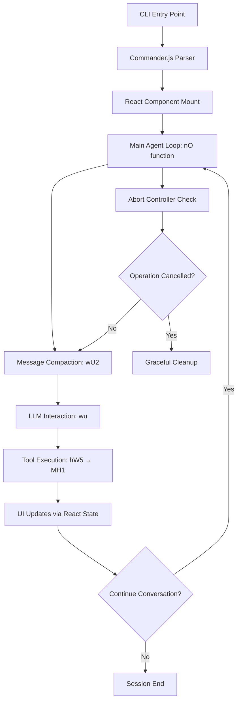
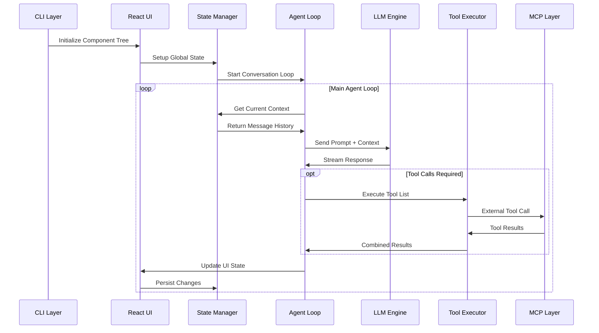

# H1: Agent System Architecture & Main Loop Analysis

## Executive Summary

Through comprehensive analysis of the Claude Code deobfuscated source code, I have identified a sophisticated multi-layered agent architecture built on React, Commander.js, and an extensive tool execution system. The system demonstrates professional engineering practices with robust error handling, security controls, and performance optimization.

## Core System Components

### 1. CLI Layer (Commander.js Framework)
- **Entry Point**: Located in `improved-claude-code-5.mjs` with `await A.parseAsync(process.argv)`
- **Commands**: Multiple CLI commands including `config`, `mcp`, `doctor`, `update`
- **Routing**: Command parsing and dispatching to appropriate handlers
- **Responsibilities**: Process argument handling, command validation, initial application bootstrap

### 2. React UI Layer
- **Main Component**: `_p` (lines 66843+) - Primary agent interface
- **Rendering**: Terminal-based UI using React with `n5(HB.default.createElement(...))`
- **Sub-components**: `c3` (context provider), `Py2`, `$w1`, `Hp`
- **Responsibilities**: User interface rendering, state display, interaction handling

### 3. State Management System
- **React Hooks**: Complex state management throughout component tree
- **Global Session**: `$9` object tracking costs, tokens, model usage statistics
- **App State**: `onChangeAppState` pattern for state propagation
- **Responsibilities**: Centralized state coordination, performance metrics, user session data

### 4. Tool Execution Engine
- **Core Executor**: `MH1` function (line 46340) - Main tool execution handler
- **Validation**: Zod schema validation via `inputSchema.safeParse`
- **Concurrency**: `isConcurrencySafe` grouping for parallel/sequential execution
- **Permissions**: `toolPermissionContext` for security gates
- **Responsibilities**: Tool invocation, parameter validation, execution control, error handling

### 5. MCP Integration Layer
- **Client Management**: Dynamic MCP client instantiation and management
- **Configuration**: `mcpClients` and `dynamicMcpConfig` for extensible tool ecosystem
- **Protocol Handling**: Model Context Protocol communication
- **Responsibilities**: External tool integration, protocol compliance, dynamic capability expansion

### 6. LLM Interaction Engine
- **Conversation Loop**: `nO` function (line 46187) - Core conversation orchestrator
- **Streaming**: Async generator pattern for real-time response streaming
- **Model Fallback**: Opus 4 → fallback model degradation system
- **Message Processing**: Context management and prompt construction
- **Responsibilities**: LLM communication, response streaming, model management, context handling

## Main Loop Architecture



## Agent Loop Pseudocode

```javascript
async function mainAgentLoop(conversationState) {
  while (!abortController.signal.aborted) {
    // 1. Message Compaction Phase
    await compactMessages(conversationState);
    
    // 2. LLM Interaction Phase
    const response = await streamLLMResponse(conversationState);
    
    // 3. Tool Execution Phase
    if (response.containsToolCalls) {
      const toolResults = await executeConcurrentTools(response.tools);
      conversationState.addMessages(toolResults);
    }
    
    // 4. UI Update Phase
    updateReactState(conversationState);
    
    // 5. Continuation Decision
    if (!shouldContinue()) break;
  }
}
```

## Component Interaction Flow



## Key Architectural Patterns

### 1. Generator-Based Streaming
- **Pattern**: `async function*` for real-time UI updates
- **Benefit**: Non-blocking interface during long operations
- **Implementation**: Throughout LLM interaction and tool execution

### 2. Abort Controller Pattern
- **Pattern**: Cancellation capability across system
- **Benefit**: Prevents runaway operations, improves user control
- **Implementation**: Integrated into all major async operations

### 3. Command Queue System
- **Pattern**: `queuedCommands` for operation batching
- **Benefit**: Improved workflow efficiency
- **Implementation**: User can chain multiple operations

### 4. Tool Concurrency Control
- **Pattern**: Smart grouping by `isConcurrencySafe` property
- **Benefit**: Optimal performance while maintaining safety
- **Implementation**: Parallel execution for safe tools, sequential for risky ones

### 5. Model Fallback Strategy
- **Pattern**: Automatic degradation when primary model unavailable
- **Benefit**: Service continuity and user experience
- **Implementation**: Opus 4 → fallback models with user notification

## Security Architecture

- **Input Validation**: All tool inputs validated via Zod schemas
- **Permission Gates**: Tool execution requires explicit user approval
- **Error Isolation**: Tool failures contained, don't crash main loop
- **MCP Security**: External tool integration requires approval workflow

## Performance Characteristics

- **Memory Management**: Automatic message compaction prevents bloat
- **Concurrent Execution**: Parallel tool processing where safe
- **Streaming UI**: Responsive interface via generator patterns
- **Resource Monitoring**: Comprehensive cost and usage tracking

## Critical Success Factors

1. **Robust Error Handling**: System gracefully handles failures at every layer
2. **User Control**: Abort capabilities and permission gates maintain user agency
3. **Extensibility**: MCP integration allows dynamic capability expansion
4. **Performance**: Streaming and concurrency optimize user experience
5. **Security**: Multi-layered validation and approval processes

## Identified Key Functions

Based on code analysis, these appear to be critical system functions (obfuscated names):

- `nO`: Main conversation loop orchestrator
- `MH1`: Primary tool execution engine
- `wU2`: Message compaction system
- `wu`: LLM interaction handler
- `hW5`: Tool execution coordinator
- `_p`: Main React component
- `$9`: Global session state object

This architecture represents a well-engineered AI agent system that balances functionality, security, and performance while maintaining extensibility for future enhancements.