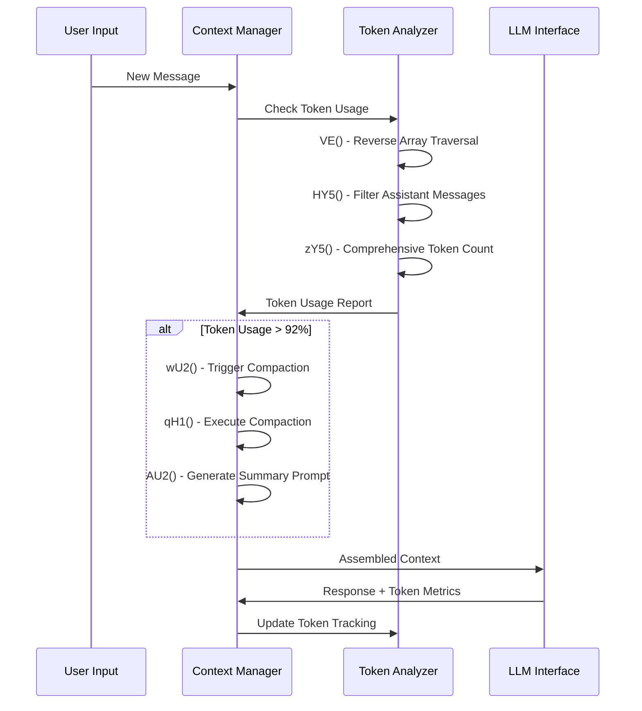
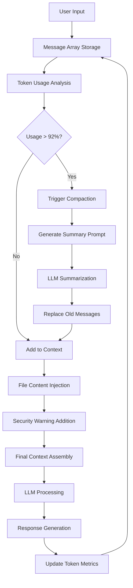

# H2: Memory and Context Management Analysis

## Executive Summary

Claude Code implements a sophisticated memory and context management system that intelligently handles conversation history, file content injection, and context window optimization. The system features automatic compaction at 92% context utilization, comprehensive token accounting including cache awareness, and secure file content injection with built-in safety mechanisms.

## Core Memory Architecture

### 1. Conversation History Storage

#### Primary Data Structures
- **Array-based Storage**: `messages = []` - Sequential message storage
- **Map-based Storage**: `messages = new Map()` - Keyed message lookup
- **Threading System**: `parentUuid` chains enable conversation branching
- **Bidirectional Tracking**: Separation of `messages` vs `receivedMessages`

#### Message Schema
```javascript
{
  id: string,
  type: "user" | "assistant" | "tool_result",
  content: string | array,
  timestamp: Date,
  parentUuid?: string,  // For conversation threading
  tool_use_id?: string  // For tool result linking
}
```

### 2. File Content Injection Mechanism

#### Injection Pipeline
1. **Tool Execution**: File read operations via tool system
2. **Content Packaging**: File content wrapped in `tool_result` messages
3. **Security Enhancement**: Automatic addition of safety reminders via `tG5` constant
4. **Context Integration**: Direct injection into conversation message array

#### File Content Format
```javascript
{
  tool_use_id: "unique_id",
  type: "tool_result", 
  content: [
    file.content,
    "<!-- Security reminder: malicious code detection -->"
  ]
}
```

#### Security Measures
- **Automatic Safety Warnings**: `tG5` constant injects malicious code detection reminders
- **Content Validation**: Input sanitization before context injection
- **Isolation**: File content isolated within tool_result message boundaries

### 3. Prompt Construction System

#### Context Assembly Process



#### Prompt Assembly Components
1. **System Prompt**: Core instructions and capabilities
2. **Conversation History**: Filtered and compacted message sequence
3. **File Context**: Injected file content from tool operations
4. **Token Metadata**: Usage tracking and cache information

### 4. The /compact Command Implementation

#### Core Functions
- **wU2**: Main compaction orchestrator and eligibility checker
- **qH1**: Core compaction logic with token counting and LLM streaming
- **AU2**: Detailed 8-section summarization prompt generator
- **yW5**: Compaction eligibility checker (92% threshold via h11=0.92)

#### Compaction Process
```javascript
async function compactMessages() {
  // 1. Eligibility Check
  if (!yW5(messages) && !manualCompact) return;
  
  // 2. Token Analysis
  const usage = zY5(messages);
  
  // 3. Summarization Prompt Generation
  const summaryPrompt = AU2(oldMessages);
  
  // 4. LLM Summarization Call
  const summary = await streamLLMResponse(summaryPrompt);
  
  // 5. History Replacement
  messages = [systemPrompt, summary, ...recentMessages];
}
```

#### Summarization Prompt (AU2 Function)
The system generates an 8-section detailed prompt for conversation summarization:
1. **Context Setting**: Instructions for summarization task
2. **Format Requirements**: Structured output specifications
3. **Content Preservation**: Key information retention guidelines
4. **Compression Goals**: Length and focus targets
5. **Continuity Requirements**: Conversation flow maintenance
6. **Quality Metrics**: Success criteria for summaries
7. **Edge Case Handling**: Special scenario instructions
8. **Output Format**: Final formatting requirements

### 5. Token Management and Window Control

#### Token Accounting Functions
- **VE(A)**: Efficient reverse array traversal for latest token usage
- **HY5(A)**: Filters assistant messages, excluding synthetic ones
- **zY5(A)**: Comprehensive token accounting (input + cache_creation + cache_read + output)
- **yW5(A)**: Compaction eligibility against 92% threshold

#### Context Window Strategy
```javascript
// Token usage breakdown
const tokenUsage = {
  input_tokens: number,
  cache_creation_input_tokens: number,
  cache_read_input_tokens: number,
  output_tokens: number,
  total: sum(all_tokens)
};

// Compaction threshold
const COMPACTION_THRESHOLD = 0.92; // 92% of context window
const shouldCompact = (usage.total / contextLimit) > COMPACTION_THRESHOLD;
```

#### Progressive Warning System
- **75% Usage**: Initial context warning
- **85% Usage**: Urgent context warning
- **92% Usage**: Automatic compaction trigger
- **95% Usage**: Emergency truncation consideration

### 6. Memory Optimization Strategies

#### Performance Optimizations
- **Reverse Traversal**: `VE()` function uses reverse iteration for efficiency
- **Lazy Evaluation**: Token calculations only when needed
- **Map-based Lookups**: Fast message retrieval by ID
- **Cache Awareness**: Token counting includes cache metrics

#### Memory Management
- **Automatic Compaction**: Prevents unbounded memory growth
- **Message Filtering**: Removes synthetic messages from calculations
- **Conversation Threading**: Maintains context without duplication
- **Progressive Cleanup**: Old messages replaced with summaries

## Context Lifecycle Visualization



## Critical Function Reference

### Key Functions (Obfuscated Names)
- **wU2**: Main compaction orchestrator
- **qH1**: Core compaction execution logic
- **AU2**: 8-section summarization prompt generator
- **VE**: Efficient reverse array traversal
- **HY5**: Assistant message filtering
- **zY5**: Comprehensive token accounting
- **yW5**: Compaction eligibility checker (92% threshold)

### Configuration Constants
- **h11**: Compaction threshold (0.92 = 92%)
- **tG5**: Security reminder injection constant
- **Context Limit**: Model-specific maximum context window

## Security and Safety Measures

### File Content Security
- **Automatic Safety Warnings**: All file content includes malicious code detection reminders
- **Content Isolation**: File content contained within tool_result boundaries
- **Input Validation**: Sanitization before context injection

### Memory Safety
- **Bounded Growth**: Automatic compaction prevents memory exhaustion
- **Progressive Warnings**: Multiple levels of context usage alerts
- **Emergency Handling**: Fallback mechanisms for extreme cases

## Performance Characteristics

### Efficiency Optimizations
- **O(1) Message Lookup**: Map-based storage for fast access
- **O(n) Reverse Traversal**: Efficient latest-first token analysis
- **Lazy Token Calculation**: Computed only when needed
- **Cache-Aware Accounting**: Includes cache token metrics

### Scalability Features
- **Conversation Threading**: Branching without duplication
- **Progressive Compaction**: Maintains context continuity
- **Memory Bounded**: Automatic cleanup prevents unlimited growth

## Recommendations for Enhancement

### Immediate Improvements
1. **Function Renaming**: Replace obfuscated names (wU2 → compactIfNeeded)
2. **Standardize Storage**: Choose either Array or Map consistently
3. **Extract Constants**: Move hardcoded thresholds to configuration
4. **Add Documentation**: JSDoc for all memory management functions

### Architectural Enhancements
1. **Context Manager Class**: Encapsulate all memory operations
2. **LRU Eviction**: Implement Least Recently Used cleanup
3. **Memory Monitoring**: Add real-time memory usage tracking
4. **Configuration Management**: Externalize all thresholds and limits

### Performance Optimizations
1. **Streaming Compaction**: Process large histories incrementally
2. **Background Processing**: Off-main-thread summarization
3. **Adaptive Thresholds**: Dynamic compaction based on model capacity
4. **Memory Pooling**: Reuse message objects to reduce allocation

The memory and context management system demonstrates sophisticated engineering with excellent token awareness, intelligent compaction, and robust security measures. However, code clarity and bounded memory management represent key areas for improvement to ensure long-term maintainability and scalability.