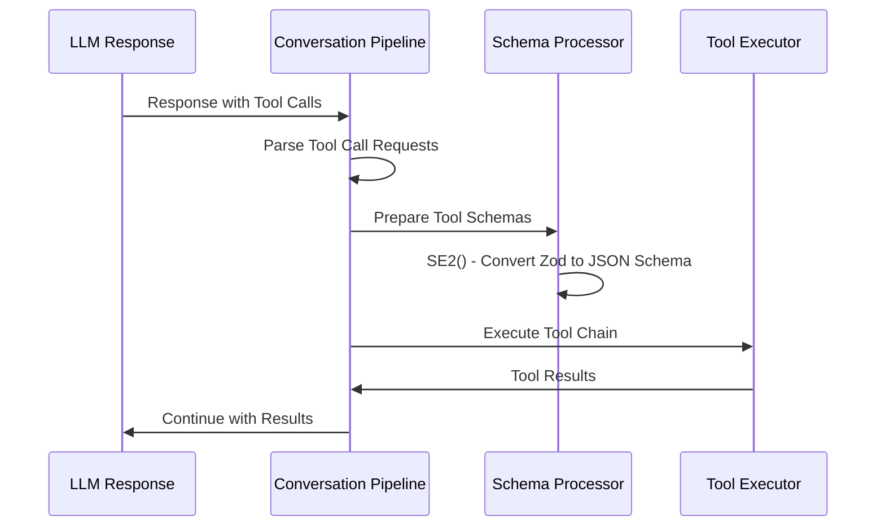
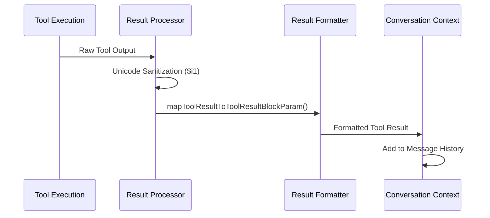
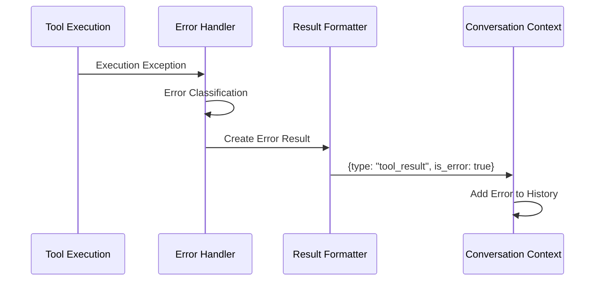
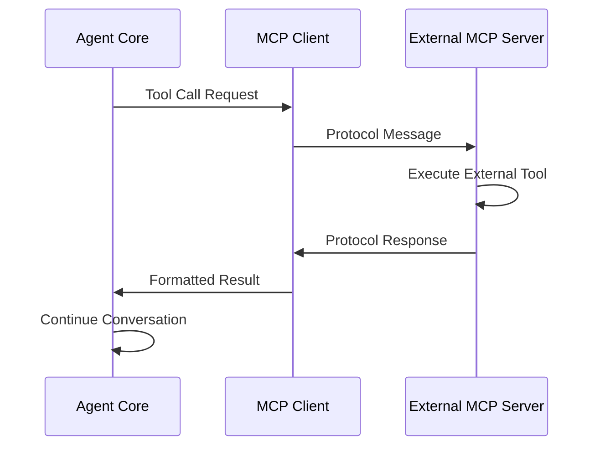

# H3: Tool Implementation and Execution Flow Analysis

## Executive Summary

Claude Code implements a sophisticated, enterprise-grade tool orchestration system with exceptional modularity, security, and performance characteristics. The system features dual execution paths for built-in and MCP (Model Context Protocol) tools, intelligent concurrency management, and comprehensive multi-layer security controls. However, the system faces a critical maintainability challenge due to pervasive code obfuscation throughout the tool execution pipeline.

## Tool Definition Architecture

### Standardized Tool Interface

All tools in Claude Code implement a consistent interface contract:

```javascript
{
  name: string,                    // Unique tool identifier
  description: () => Promise<string>,     // Human-readable description
  inputSchema: ZodSchema,          // Parameter validation schema
  call: (params) => Promise<result>,      // Core execution logic
  prompt: () => Promise<string>,          // Usage instructions
  mapToolResultToToolResultBlockParam: (result, tool_use_id) => ToolResult,
  isReadOnly: () => boolean,       // Data modification safety flag
  isConcurrencySafe: () => boolean,       // Parallel execution safety
  checkPermissions: (context) => Promise<PermissionResult>  // Security gate
}
```

### Identified Built-in Tools

#### File Operations
- **Read**: File content reading with security warnings
- **Write**: File creation/modification with permission checks
- **Edit**: Targeted file editing with validation
- **LS**: Directory listing with path validation
- **Glob**: Pattern-based file search
- **Grep**: Content search with regex support

#### Task Management
- **TodoRead**: 
  - `isReadOnly: () => true`
  - `isConcurrencySafe: () => true`
  - Safe for parallel execution
- **TodoWrite**:
  - `isReadOnly: () => false`
  - `isConcurrencySafe: () => false`
  - Requires sequential execution

#### Development Tools
- **Bash**: Command execution with timeout controls
- **NotebookRead**: Jupyter notebook inspection
- **NotebookEdit**: Notebook cell modification

#### Planning & Control
- **exit_plan_mode**: Workflow state management

#### MCP Integration
- **External Tools**: Prefixed with "mcp__" for namespace separation
- Dynamic tool registration from MCP servers

## Tool Execution Decision Logic

### Main LLM Integration Flow

The tool execution system is deeply integrated into the conversation pipeline through these key functions:

#### Core Conversation Pipeline
- **`wu(A, B, Q, I, G, Z)`**: Primary conversation generator with integrated tool support
- **`nE2(A, B, Q, I, G, Z)`**: Core conversation pipeline handling tool execution decisions
- **`SE2(A, B)`**: Tool schema preparation converting Zod schemas to JSON Schema

#### Decision Process


#### Schema Preparation (`SE2` Function)
- Converts Zod schemas to JSON Schema format using `Nm()` function
- Provides API-compatible tool definitions for LLM interaction
- Maintains validation consistency between definition and execution

## Tool Execution Mechanisms

### Dual Execution Paths

#### Built-in Tool Execution
```javascript
// Direct method invocation
const result = await tool.call(validatedParams);
const formattedResult = tool.mapToolResultToToolResultBlockParam(result, tool_use_id);
```

#### MCP Tool Execution
```javascript
// Protocol-based execution
const result = await mcpClient.callTool({
  name: toolName,
  arguments: parameters
}, timeout, { signal: abortSignal });
```

### Execution Pipeline

```mermaid
graph TD
    A[Tool Call Request] --> B[Tool Lookup by Name]
    B --> C[Tool Type Detection]
    C --> D{Built-in or MCP?}
    D -->|Built-in| E[Direct Call Execution]
    D -->|MCP| F[MCP Protocol Execution]
    E --> G[Parameter Validation]
    F --> H[MCP Client Communication]
    G --> I[Execute tool.call()]
    H --> J[Process MCP Response]
    I --> K[Format Results]
    J --> K
    K --> L[Return Tool Result]
```

### Parameter Validation

#### Zod Schema Validation
```javascript
// Input validation process
const validationResult = tool.inputSchema.safeParse(parameters);
if (!validationResult.success) {
  throw new Error(`Invalid parameters: ${validationResult.error.message}`);
}
```

#### Permission Checking
```javascript
// Security gate validation
const permissionResult = await tool.checkPermissions(context);
if (!permissionResult.allowed) {
  // Handle permission denial
}
```

## Result Processing System

### Standardized Result Format

All tool executions produce consistent result structures:

```javascript
{
  tool_use_id: string,        // Unique execution identifier
  type: "tool_result",        // Message type classification
  content: any,               // Actual tool output
  is_error?: boolean          // Error indication flag
}
```

### Result Processing Pipeline

#### Success Flow


#### Error Flow


### Unicode Sanitization
- **Function**: `$i1()` - Sanitizes tool output for safe LLM consumption
- **Purpose**: Prevents encoding issues and ensures clean text processing
- **Application**: Applied to all tool results before context integration

## Concurrency and Safety Management

### Safety Classification System

#### ReadOnly Tools (Safe for Concurrency)
```javascript
TodoRead: {
  isReadOnly: () => true,
  isConcurrencySafe: () => true
}
```

#### Destructive Tools (Sequential Execution Required)
```javascript
TodoWrite: {
  isReadOnly: () => false,
  isConcurrencySafe: () => false
}
```

### Concurrency Control Strategy

#### Parallel Execution (Safe Tools)
- Tools marked `isConcurrencySafe: true` execute concurrently
- Improves performance for I/O-bound operations
- No race condition risks for read-only operations

#### Sequential Execution (Unsafe Tools)
- Tools marked `isConcurrencySafe: false` execute sequentially
- Prevents data corruption and race conditions
- Maintains consistency for state-modifying operations

#### Plan Mode Protection
- Special mode preventing destructive operations
- Message: "you MUST NOT make any edits"
- Enables safe exploration without system modification

## Error Handling and Resilience

### Comprehensive Error Management

#### MCP Error Processing
```javascript
// MCP error result handling
{
  tool_use_id: "uuid",
  type: "tool_result",
  content: "Error calling tool: [specific error message]",
  is_error: true
}
```

#### Built-in Tool Error Processing
```javascript
try {
  const result = await tool.call(params);
  return formatSuccess(result);
} catch (error) {
  return formatError(error, tool_use_id);
}
```

### Error Recovery Strategies

#### Graceful Degradation
- Errors converted to tool results for LLM processing
- System continues operation despite individual tool failures
- Error context provided to LLM for intelligent handling

#### Tool Decision Logging
- **Function**: `D01()` - Tracks execution decisions for debugging
- **Purpose**: Audit trail for tool execution patterns
- **Application**: Performance optimization and error analysis

## MCP Integration Architecture

### Protocol-Based Tool Extension

#### MCP Tool Identification
- **Namespace**: All MCP tools prefixed with "mcp__"
- **Examples**: `mcp__ide__getDiagnostics`, `mcp__zen__thinkdeep`
- **Separation**: Clear distinction from built-in tools

#### MCP Execution Flow


#### Dynamic Tool Registration
- MCP servers can register new tools at runtime
- Tools inherit standard interface contracts
- Seamless integration with existing tool execution pipeline

## Critical System Functions

### Obfuscated Function Mapping
- **`wu`**: Primary conversation generator with tool support
- **`nE2`**: Core conversation pipeline handler
- **`SE2`**: Tool schema preparation (Zod to JSON Schema)
- **`D01`**: Tool decision logging and tracking
- **`$i1`**: Unicode sanitization for tool results
- **`Nm`**: Zod to JSON Schema conversion utility

### Configuration and Constants
- Tool timeout values and retry logic
- MCP client configuration and connection management
- Security policy definitions and permission defaults

## Security Architecture Deep Dive

### Multi-Layer Security Model

#### Input Validation Layer
```javascript
// Zod schema validation
const schema = z.object({
  file_path: z.string().min(1),
  content: z.string()
});
```

#### Permission Layer
```javascript
// Dynamic permission checking
const permissions = await getToolPermissionContext();
if (!permissions.allowFileWrite) {
  throw new PermissionError("File write not authorized");
}
```

#### Execution Isolation Layer
- Tool execution contained within try-catch blocks
- Error propagation controlled and sanitized
- System stability maintained despite tool failures

#### Plan Mode Safety Layer
- Prevents destructive operations during exploration
- Read-only mode for safe system analysis
- User-controlled safety override capabilities

## Performance Characteristics

### Optimization Strategies

#### Concurrent Execution
- Safe tools execute in parallel for performance
- I/O-bound operations optimized through concurrency
- CPU utilization improved through parallel processing

#### Efficient Tool Lookup
- Direct array.find() operations by tool name
- O(n) lookup complexity with small tool sets
- Cache-friendly access patterns

#### Schema Conversion Caching
- Zod to JSON Schema conversion cached
- Reduces repeated computation overhead
- Improves API response preparation speed

## Recommendations for Enhancement

### Critical Issues (Immediate Action Required)

#### 1. Code Obfuscation Resolution
- **Issue**: Function names like `wu`, `nE2`, `SE2` severely impact maintainability
- **Impact**: Debugging difficulty, knowledge transfer barriers, technical debt
- **Solution**: Systematic refactoring with descriptive names (e.g., `wu` → `conversationGenerator`)

#### 2. Documentation Gaps
- **Issue**: Limited inline documentation for complex tool execution logic
- **Impact**: Reduced developer productivity, increased onboarding time
- **Solution**: Comprehensive JSDoc documentation for all tool system functions

### Strategic Improvements (Medium Priority)

#### 1. MCP Ecosystem Development
- **Opportunity**: Formalize MCP specification documentation
- **Benefit**: Enable third-party tool server development
- **Implementation**: Create developer SDKs and starter kits

#### 2. Enhanced Concurrency Control
- **Opportunity**: Tool dependency declaration system
- **Benefit**: More sophisticated execution ordering
- **Implementation**: Dependency graph analysis for optimal scheduling

#### 3. Performance Monitoring
- **Opportunity**: Tool execution analytics and optimization
- **Benefit**: Identify bottlenecks and usage patterns
- **Implementation**: Metrics collection and performance dashboards

### Quality Improvements (Low Priority)

#### 1. Error Handling Enhancement
- **Opportunity**: More granular error classification
- **Benefit**: Better error recovery and user experience
- **Implementation**: Structured error taxonomy and recovery strategies

#### 2. Testing Infrastructure
- **Opportunity**: Comprehensive tool execution test suite
- **Benefit**: Improved reliability and regression prevention
- **Implementation**: Automated testing for all tool types and edge cases

## Conclusion

Claude Code's tool system represents a state-of-the-art orchestration platform with exceptional engineering quality in architecture, security, and performance. The dual execution model (built-in vs MCP) provides unlimited extensibility while maintaining robust safety controls through intelligent concurrency management and comprehensive security layers.

The system successfully balances:
- **Functionality**: Rich tool ecosystem with extensible MCP integration
- **Security**: Multi-layer validation and permission controls
- **Performance**: Intelligent concurrency and efficient execution pipelines
- **Safety**: Plan mode protection and controlled destructive operations

However, the critical code obfuscation issue requires immediate attention to ensure long-term maintainability and team productivity. With proper de-obfuscation and documentation, this system provides an excellent foundation for production AI agent applications and represents significant intellectual property value in the AI tooling space.